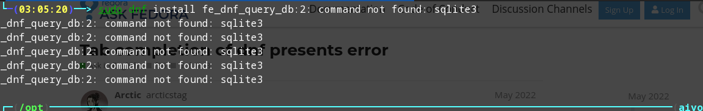

#### 使用更美观的 `greeter`
查看当前使用的桌面显示器：

    Debian/Ubuntu：`cat /etc/X11/default-display-manager`

    RedHat & Fedora：`cat /etc/sysconfig/desktop`

    OpenSuSe：`cat /etc/sysconfig/displaymanager`

xfce 默认的是 `LightDM` ，配置文件在 `/etc/lightdm`

`lightdm.conf` 是主配置文件，`greeter-session=slick-greeter`指定主题。

`slick-greeter`,`lightdm-gtk-greeter`则是主题。

主题中也可以修改配色主题（`ls /usr/share/themes` 查看拥有的主题配色），背景图，用户头像等。

一些参数例子：

```
theme-name=Adwaita-dark
icon-theme-name=Adwaita
background=/usr/share/backgrounds/2.jpg
```

查看有那些可用的 `greeter` ，`ls /usr/share/xgreeters`。也可以安装其他的。

#### dnf 包管理的一个强力功能
在尝试安装 kde-connect 的过程中使用的安装命令是`sudo dnf install  builddep kde-connect`，想要去卸载。

`dnf history`：会输出包管理器执行过的详细命令，并且前面会带有序号。如果想要回滚某个操作，可以执行`dnf history undo  <number>`进行回滚。

### 问题

#### kde-connect
直接尝试安装 `kde-connect` 有包但是安装之后能其他设备无法连接。

去仔细看了官方文档尝试安装，首先是补全依赖比较多，177 个包，400多M，安装给出的方式是编译安装，但是环境中 cmake 一个库的文件版本不符合要求，给放弃了。

#### dnf 安装 使用 tab 补全提示报错

错误：



`sudo dnf install sqlite`之后即可

#### 快捷键
xfce 的快捷键设置有两个地方，一个是设置里面，一个是窗口管理里面。

之前在设置里面想要设置切换到桌面的快捷键，没看到可设置的，可自己添加，但是不清楚命令。

通过查询成功在窗口管理里找到了。

或者可以在`~/.config/xfce4/xfconf/xfce-perchannel-xml/keyboards.xml`中去修改实现改变快捷键，有针对所有用户而非单用户的，有需要的自己查查。对于其他配置，也可以通过修改文件的形式完成，毕竟，linux 中一切皆`文件`。

修改文件实现改配置在所有桌面都是可行的，只不过难易不同，例如 gnome 在新版本中一些配置会进行打包，不再是直接明文件。

#### 空格键突然失效
在更改了 lightdm-gtk-greeter 的主题，背景图之后，重启系统空格键无效。

在再一次重启后还是失效，但是在多次尝试按触发之后恢复了正常。

#### 设置桌面的壁纸一段时间后随机切换 导致锁屏背景的也变动了
复盘下来导致这个问题的操作是，在设置屏幕壁纸的时候点选了设置里面的一段时间自动切换壁纸，并且开启了随机。

原因：

    桌面有四个工作空间，每个工作空间的桌面是可以单独设置的，他们的配置文件在`~/.config/xfce4/xfconf/xfce-perchannel-xml/xfce4-desktop.xml`，里面工作空间的命令是从 0 开始的。然后锁屏的设置是`workspace0`的。后面是不小心切换到了其他工作空间（开始设置了壁纸应用到所有工作空间，但是出现这个问题后取消了，但是一直以为自己在工作空间，切换到之后除非再切换回去，否则系统会保存状态，不管是重启，系统崩溃后重启都会保存），所以那会即使考虑到了是设置里面的问题去取消了设置还是没有解决问题，因为问题是在工作空间 0，直到查询到不通过设置而通过命令行修改的方式才找到了配置文件，看了配置文件才大致直到之前的问题所在。里面有两行`<property name="backdrop-cycle-enable" type="bool" value="true"/>`，`<property name="backdrop-cycle-random-order" type="bool" value="true"/>`，自己的当前桌面没有随机切换壁纸了，值却还是true，自己去修改为了 false，就没有问题了。

    在考虑到是壁纸设置的问题前做了一个确认，也是还好习惯将自己的配置单独文件夹，去修改了自己的壁纸文件夹名，去看锁屏变成异常单色幕布，也就是说明调用了桌面壁纸而不是背景图。

#### greeter theme 问题

    说到背景图又要提另一个就是`greeter`背景图。也就是进入系统前的 login 页面。这个现在自己还没整明白，举个例子，重启系统后的 greeter，即欢迎页面，相当于一大门，但推开这扇门可直接进入用户系统，因为有一个选择用户的过程（不选就默认的），但是进入个人系统后，锁屏，个人用户会关关闭自己的小门。这个会使用另一个`greeter`（其实不确定是不是这么叫，目前了解到的好象是系统调用一个锁屏程序，但是这个程序会调用`greeter`的部分配置），如果是 logout 则会退回到一门前，也就会注销系统运行的进程，而锁屏不会。
    自己使用了新的更美观的 greeter，在一门确实改变了主题，二门却没有，使用的背景图也是各自的。

    默认的`lightdm-gtk`程序即主题不能删除，涉及到窗口主题，卸载了不会影响系统的运行，但是窗口设置的主题会失效。比如我卸载后暗色主题变成白色。

#### lightDM greeter 和 lock greeter 的问题
*这个问题需要参考上两个问题*

lightDM greeter 默认使用的`lightdm-gtk-greeter`。

而 lock greeter 使用的是另一个程序`xfce4-screensaver` 管理的， 使用的也是`lightdm-gtk-greeter`，并且是在源码中就写死的，[xfce4-screensaver-dialog.ui](https://gitlab.xfce.org/apps/xfce4-screensaver/-/blob/master/src/xfce4-screensaver-dialog.ui)中明确写了`<class name="lightdm-gtk-greeter"/>`，应该是考虑到各个发行版自带的 greeter 的不同吧，Fedora 自带的有`lightdm-gtk-greeter` 和 `slick-grrter`。

`xfce4-screensaver`的源码中没有看到`lightdm-gtk-greeter`的拷贝，所以是在计算机本地调用了`lightdm-gtk-greeter`的静态文件，但是比如背景图、用户头像是在配置中增加的，`xfce-screensaver`并不会加载配置，所以就出现了两个不同的 greeter ，而如果 `lightDM`使用其他主题，这个问题就更明显。

`lightdm-gtk-greeter`的安装是编译的，所以如果不卸载然后自己修改源码再编译安装是无法解决两边背景图、用户头像不一样的。`xfce-screensaver`也是，并且没有提供接口去接受配置修改。

#### 安装`p7zip`包后无法使用`7z`命令
在网上搜索到的解压`7z`压缩包的包是`p7zip`,安装后无法像后面说的使用`7z`解压，测试后发现正确的解压命令是`7za`
