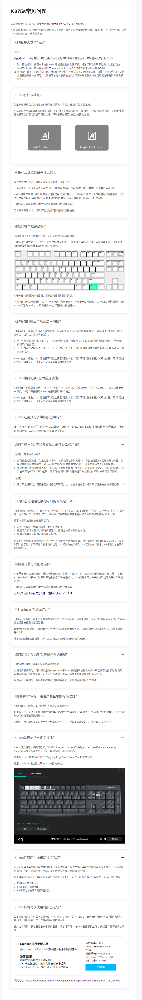
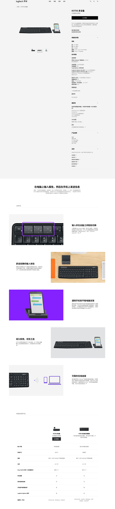

这款键盘是全尺寸键盘，且键位是没有压缩的。日常使用的话还是比较舒服的。再加上是薄膜键盘，声音小。

使用优联技术，唤醒更快。这与我另外一款不知名的无线 2.4G 的机械键盘对比。优连的几乎是瞬间响应没有延迟。即使长时间为使用进入休眠也是如此。不知道怎么实现的。但实际的耗电并没有那么多。普通的那个从休眠唤醒会有个 1-2 秒的延迟。

对脚撑要点名一下，用过两款，都是脚撑断。

对于 fn 功能键的锁定要说明一下。打开 fn 功能键的锁定后。f1-f12不再具有原来的功能，比如常见的 f5 刷新，f11 全屏等。其对应的是声音增大、声音减小等功能。这时候 f1、f2、f3 则是切换相应的设备。关闭是 `fn + esc`这时候要切换设备就是 `fn + f1` 这样了。

额外补充：

[k375s使用手册](./docs/k375s-multi-device.pdf)
 

常见问题的资料来自：[偶米DIY键盘](https://cmmk.oome.net/unifying/ic_k375s_faq/)

[罗技官网k375s键盘介绍](https://www.logitech.com/zh-cn/products/keyboards/k375s-multidevice-stand-combo.920-008249.html)

防丢失自截图:

