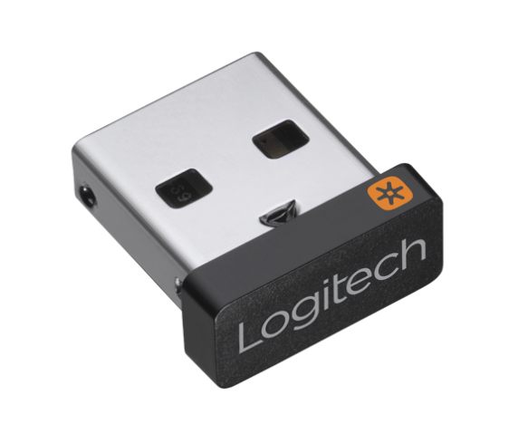

以下介绍来自官网：[UNIFYING 优联是什么？](https://www.logitech.com/zh-cn/resource-center/what-is-unifying.html)

```txt
1 个接收器 - 6 个设备
使用 Logi Options+ 实现更多功能

最多可以将六个罗技 Unifying™ 优联无线鼠标或键盘连接至一只小巧又节省空间的 Unifying™ 优联 USB 接收器。您现在可以使用功能强大的 Logi Options+ 应用程序个性化设置 Unifying™ 优联设备的使用体验，该应用程序还可以支持自定义 Logitech 设备，从而完成更多工作。

UNIFYING 优联的优势
最远 10 米的稳定无线连接范围。1无线接收范围依运行环境和电脑设置而异。  只需一个 USB 端口即可承载最多六个罗技 Unifying 优联无线鼠标和键盘。轻松移动使用，无需随身携带鼠标或键盘出入通勤。在公司、在家中或在电脑包中都准备好自己习惯使用的罗技 Unifying 优联无线鼠标和键盘。携带插有 Unifying 优联 USB 接收器的笔记本电脑来到有效连接范围内即可直接使用。
```

优联的特有标志是一个橙色太阳的标志。相应的键盘、鼠标、接收器上有这样的图标，说明这就是一个优联键盘、鼠标、接收器。




以下说明来自：[]()
```txt
优联特点介绍
罗技因为对2.4G无线进行了优化，且经过多年的产品验证，具有以下优势：

较强的抗干扰能力，强于蓝牙。有效连接距离可以远达10米，几乎无任何延迟或信号丢失。
续航超强，按照罗技的产品介绍，两节AAA电池（约1000mAh电量）用一到两年。
键盘唤醒速度快，从节能休眠状态中唤醒几乎感觉不到明显延迟，用户体验好。
支持硬件底层操作，即可以进入BIOS等进行操作，也可以选择操作系统（针对多系统用户）。
可以通过罗技的软件完成设备和接收器的配对，不怕接收器丢失（针对富豪^_^）。
```