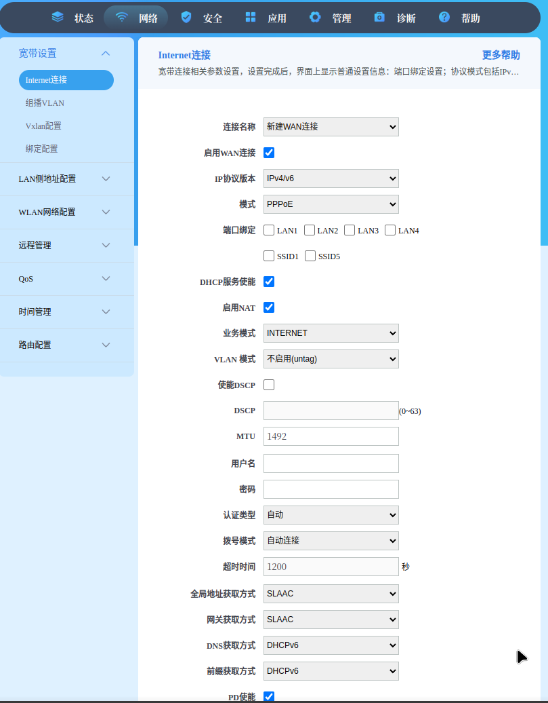

## 获取网关超级用户密码

老一些的账号是`CMCCAdmin` ，密码是`aDm8H%MdA` 如果这个不对可以试试下面的方法

1：安装 talnet

2：路由器打开talnet

访问链接 `http://192.168.1.1/usr=CMCCAdmin&psw=aDm8H%25MdA&cmd=1&telnet.gch` 提示`TelnetSet Success!`既是开启了服务。

3：命令行使用 `telnet 192.168.1.1` 进入光猫 

登录的账号：`CMCCAdmin` 密码：`aDm8H%MdA`

4: 连接上后执行命令 `sidbg 1 DB p DevAuthInfo` 可以看到网关的一些信息

```xml
<Tbl name="DevAuthInfo" RowCount="2">
        <Row No="0">
                <DM name="ViewName" val="IGD.AU1"/>
                <DM name="Enable" val="1"/>
                <DM name="IsOnline" val="0"/>
                <DM name="AppID" val="1"/>
                <DM name="User" val="******"/>
                <DM name="Pass" val="******"/>
                <DM name="Level" val="1"/>
                <DM name="Extra" val=""/>
                <DM name="ExtraInt" val="0"/>
        </Row>
        <Row No="1">
                <DM name="ViewName" val="IGD.AU2"/>
                <DM name="Enable" val="1"/>
                <DM name="IsOnline" val="0"/>
                <DM name="AppID" val="1"/>
                <DM name="User" val="******"/>
                <DM name="Pass" val="******"/>
                <DM name="Level" val="2"/>
                <DM name="Extra" val=""/>
                <DM name="ExtraInt" val="0"/>
        </Row>
</Tbl>
```

可以看到账号密码都被加密隐藏了

方法一：替换密码

有一行参数中的 `Level`，这行参数的意思是该账号的等级，

分为1:管理员等级 2:普通用户等级

所以我们只需要将我们知道密码的普通账号（普通账户密码就是送的网关背面写的哪个）更换为管理员账号就可以

1. `sidbg 1 DB decry /userconfig/cfg/db_user_cfg.xml` 将内容进行解密，解密后文件在`/tmp/debug-decry-cfg`

2. `sidbg 1 DB set DevAuthInfo 0 Pass admin` 更改密码

3. `sidbg 1 DB save` 保存后生效

方法二：解密文件查看密码

1. `sidbg 1 DB decry /userconfig/cfg/db_user_cfg.xml` 将内容进行解密，解密后文件在`/tmp/debug-decry-cfg`

2. `cat /tmp/debug-decry-cfg | grep User` 查看账户

```xml
<DM name="UserName" val="231010717764"/>
<DM name="MaxUser" val="4"/>
<DM name="UserName" val=""/>
<DM name="MaxUser" val="4"/>
<DM name="User" val="CMCCAdmin"/>
<DM name="User" val="user"/>
<Tbl name="UserIF" RowCount="1">
<DM name="TimerLogoutUser" val="0"/>
<DM name="UserName" val="cpe"/>
<DM name="ConnectionRequestUsername" val="RMS"/>
<Tbl name="TelnetUser" RowCount="2">
<DM name="ViewName" val="IGD.TelnetUser1"/>
<DM name="Username" val="CMCCAdmin"/>
<DM name="ViewName" val="IGD.TelnetUser2"/>
<DM name="Username" val="CMCCAdmin"/>
<DM name="UserAgentDoimain" val="0.0.0.0"/>
<DM name="UserAgentPort" val="5060"/>
<DM name="UserAgentTransport" val="UDP"/>
<DM name="UserPhoneType" val="0"/>
<DM name="Function" val="UserDefined1"/>
<DM name="Function" val="UserDefined2"/>
<DM name="Function" val="UserDefined3"/>
<DM name="Function" val="UserDefined4"/>
<DM name="AuthUserName" val=""/>
<DM name="DigestUserName" val=""/>
<DM name="RemoteUserCfgUrl" val=""/>
<DM name="UpgradeUserCfgEn" val="0"/>
<DM name="UserCfg" val="0"/>
<Tbl name="FTPUser" RowCount="1">
<DM name="ViewName" val="IGD.FTPUser1"/>
<DM name="Username" val=""/>
<DM name="LanUsername" val=""/>
<DM name="UserRight" val="3"/>
<DM name="MacAddrUser" val="00:00:00:00:00:00"/>
<DM name="MacAddrUser" val="00:00:00:00:00:00"/>
<DM name="MacAddrUser" val="00:00:00:00:00:00"/>
<DM name="MacAddrUser" val="00:00:00:00:00:00"/>
<DM name="MacAddrUser" val="00:00:00:00:00:00"/>
<DM name="MacAddrUser" val="00:00:00:00:00:00"/>
<DM name="MacAddrUser" val="00:00:00:00:00:00"/>
<DM name="MacAddrUser" val="00:00:00:00:00:00"/>
<DM name="MacAddrUser" val="00:00:00:00:00:00"/>
<DM name="MacAddrUser" val="00:00:00:00:00:00"/>
<DM name="MacAddrUser" val="00:00:00:00:00:00"/>
<DM name="MacAddrUser" val="00:00:00:00:00:00"/>
<DM name="MacAddrUser" val="00:00:00:00:00:00"/>
<DM name="MacAddrUser" val="00:00:00:00:00:00"/>
<DM name="MacAddrUser" val="00:00:00:00:00:00"/>
<DM name="MacAddrUser" val="00:00:00:00:00:00"/>
<DM name="MacAddrUser" val="00:00:00:00:00:00"/>
<DM name="MacAddrUser" val="00:00:00:00:00:00"/>
<DM name="MacAddrUser" val="00:00:00:00:00:00"/>
<DM name="MacAddrUser" val="00:00:00:00:00:00"/>
<DM name="MacAddrUser" val="00:00:00:00:00:00"/>
<DM name="MacAddrUser" val="00:00:00:00:00:00"/>
<DM name="MacAddrUser" val="00:00:00:00:00:00"/>
<DM name="MacAddrUser" val="00:00:00:00:00:00"/>
<DM name="MacAddrUser" val="00:00:00:00:00:00"/>
<DM name="MacAddrUser" val="00:00:00:00:00:00"/>
<DM name="CardMaxUserNum" val="128"/>
<DM name="CardMaxUserNum" val="128"/>
<DM name="MaxUserNum" val="40"/>
<DM name="EnableUserID" val="1"/>
<DM name="MaxUserNum" val="40"/>
<DM name="EnableUserID" val="1"/>
<DM name="MaxUserNum" val="40"/>
<DM name="EnableUserID" val="1"/>
<DM name="MaxUserNum" val="40"/>
<DM name="EnableUserID" val="1"/>
<DM name="MaxUserNum" val="40"/>
<DM name="EnableUserID" val="1"/>
<DM name="MaxUserNum" val="40"/>
<DM name="EnableUserID" val="1"/>
<DM name="MaxUserNum" val="40"/>
<DM name="EnableUserID" val="1"/>
<DM name="MaxUserNum" val="40"/>
<DM name="EnableUserID" val="1"/>
<DM name="MaxUserNum" val="40"/>
<DM name="EnableUserID" val="1"/>
<DM name="MaxUserNum" val="40"/>
<DM name="EnableUserID" val="1"/>
<DM name="MaxUserNum" val="40"/>
<DM name="EnableUserID" val="1"/>
<DM name="MaxUserNum" val="40"/>
<DM name="EnableUserID" val="1"/>
<DM name="AppUser" val="4"/>
<DM name="AppUser" val="5"/>
<DM name="Username" val="oraydefault"/>
<DM name="UserCfg" val="0"/>
<Tbl name="SambaUser" RowCount="1">
<DM name="ViewName" val="IGD.SambaUser1"/>
<DM name="Username" val="user"/>
<Tbl name="L2tpVPNServerUser" RowCount="0">
```

即第五行中的`CMCCAdmin`


3. `cat /tmp/debug-decry-cfg | grep Pass` 查看密码

```xml
<DM name="IPoEPassword" val=""/>
<DM name="Password" val="31704536"/>
<DM name="EnablePassThrough" val="0"/>
<DM name="PassThroughViewName" val=""/>
<DM name="Password" val=""/>
<DM name="EnablePassThrough" val="0"/>
<DM name="PassThroughViewName" val=""/>
<DM name="Pass" val="aDm8H%MdAJ#5Sd3Un"/>
<DM name="Pass" val="kxsc9bzq"/>
<DM name="Password" val="cpe"/>
<DM name="ConnectionRequestPassword" val="RMS"/>
<DM name="PassthroughLease" val="0"/>
<DM name="PassthroughCSP_MACAddress" val=""/>
<DM name="PassthroughLease" val="0"/>
<DM name="PassthroughLease" val="0"/>
<DM name="PassthroughLease" val="0"/>
<DM name="PassthroughLease" val="0"/>
<DM name="PassthroughLease" val="0"/>
<DM name="PassthroughLease" val="0"/>
<DM name="PassthroughLease" val="0"/>
<DM name="PassthroughLease" val="0"/>
<DM name="PassthroughLease" val="0"/>
<DM name="PassthroughLease" val="0"/>
<DM name="PassthroughLease" val="0"/>
<DM name="PassthroughLease" val="0"/>
<DM name="PassthroughLease" val="0"/>
<DM name="PassthroughLease" val="0"/>
<DM name="PassthroughLease" val="0"/>
<DM name="PassthroughLease" val="0"/>
<DM name="PassthroughLease" val="0"/>
<DM name="PassthroughLease" val="0"/>
<DM name="PassthroughLease" val="0"/>
<DM name="Password" val="aDm8H%MdA"/>
<DM name="Password" val="aDm8H%MdA"/>
<DM name="AuthPassword" val=""/>
<DM name="IVRPassword" val=""/>
<DM name="IVRPassword" val=""/>
<DM name="IVRPassword" val=""/>
<DM name="IVRPassword" val=""/>
<DM name="IVRPassword" val=""/>
<DM name="Password" val=""/>
<DM name="Password" val=""/>
<DM name="LanPassword" val=""/>
<DM name="KeyPassphrase" val="aiyoyo2729"/>
<DM name="KeyPassphrase" val="!@#$%12345"/>
<DM name="KeyPassphrase" val="!@#$%12345"/>
<DM name="KeyPassphrase" val="!@#$%12345"/>
<DM name="KeyPassphrase" val="aiyoyo2729"/>
<DM name="KeyPassphrase" val="!@#$%12345"/>
<DM name="KeyPassphrase" val="!@#$%12345"/>
<DM name="KeyPassphrase" val="!@#$%12345"/>
<DM name="Password" val="oraydefault"/>
<DM name="Name" val="ManagementServer.Password"/>
<DM name="Name" val="ManagementServer.ConnectionRequestPassword"/>
<DM name="Name" val="LANDevice.WLANConfiguration.KeyPassphrase"/>
<DM name="Name" val="WANDevice.WANConnectionDevice.WANPPPConnection.Password"/>
<DM name="Name" val="Services.VoiceService.VoiceProfile.Line.SIP.AuthPassword"/>
<DM name="Password" val="kxsc9bzq"/>

```

即第八行中的`aDm8H%MdAJ#5Sd3Un`

方法三：问安装的宽带师傅，一般会给

## 修改网关开启 IPv6
1. 使用上面获得的账户和密码,登录 `192.168.1.1`

2. 在页面的 `网络 > 宽带设置 > Internet连接`中，将`IP协议版本`由原来的`IPv4`修改为`IPv4/v6` ，其他的根据自己的情况修改，最后点击最下面的创建即可。



3. 访问链接 `https://test-ipv6.com/index.html.zh_CN` 如何提示`你已接入 IPv6，因此我们增加了一个标签页，显示你能否访问其他 IPv6 网站。`就表示设置成功了。当然这里面还有个`你的 DNS 服务器（可能由运营商提供）已经接入 IPv6 互联网了。`这样才能通过域名访问到其他 IPv6 网站。没有这个的话请对相应的 DNS进行设置。如果没有成功，请确保连接的是该网关的网络。如果是通过其他路由器再连接的。其路由器也需要设置。具体的每个品牌的路由器可能不一样。（如果之前的链接不能访问，可以试试`https://test-ipv6.com/`，但这个的结果是英文的）