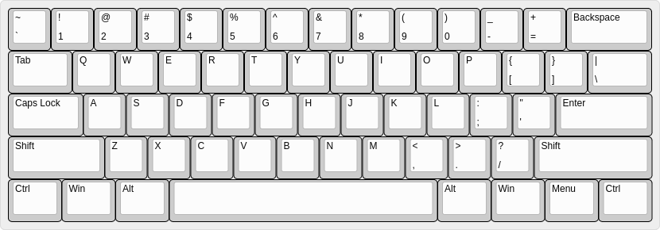
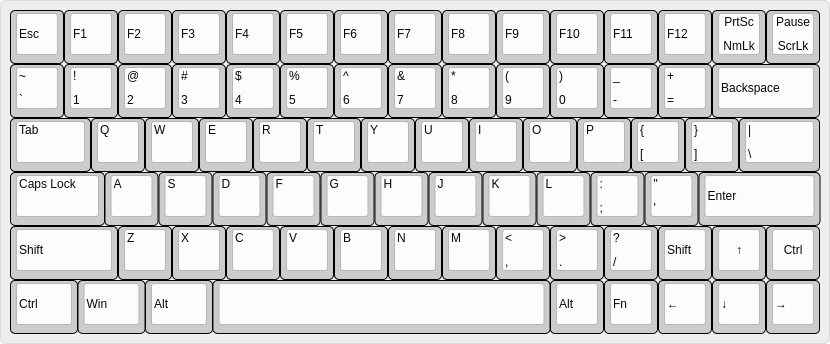
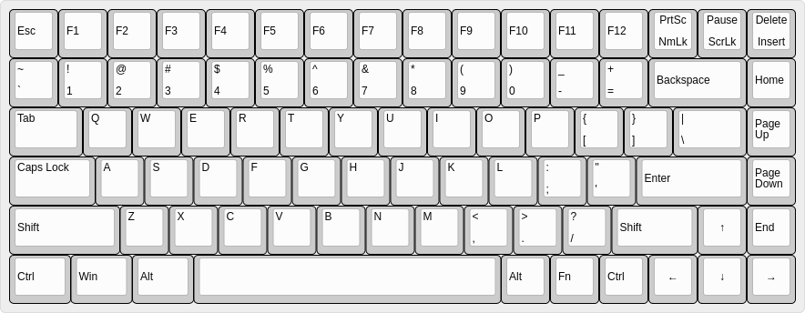
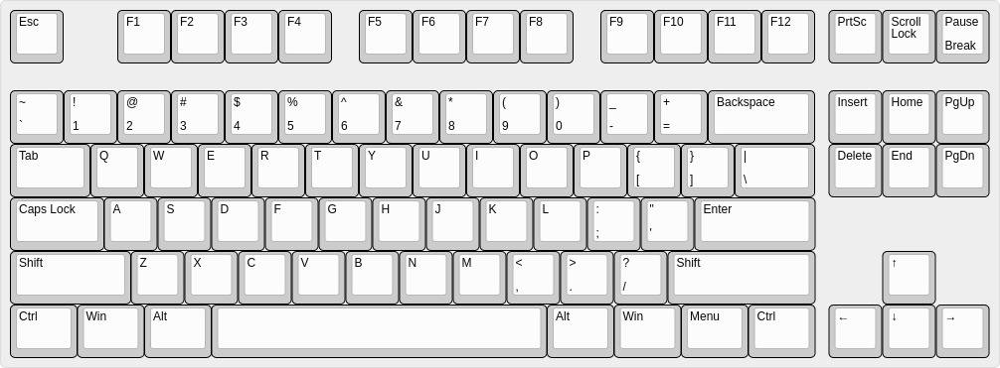
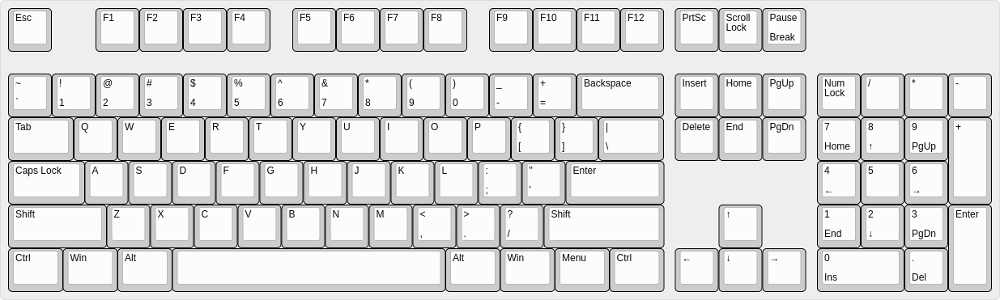

### 一些键盘知识及可选方案

    PCB 板：
        旧键盘的 PCB 板
        网上的自打板
        网上开源方案自己找人打印
    键盘配列：
        键位数量：104、84、78、61 等等。
        键位占比：100%、75%、60℀ 。
    键帽：
        材质：PBT、ABS、POM 等。
        配色：单一颜色、混搭主题配色。
        高度标准：
            原厂键帽、OEM、SA、DSA、XDA、DCS 等
            不太常见，但已经成为标准的还有 MIX、G20 等。
        印刷方式：
            正刻：字符刻到键帽正面朝上的方式，最常见的类型
            同刻，是阴刻 or 蚀刻，字符会凹陷，一般来说字符和键帽同色
            侧刻，把字符刻到键帽侧面、面朝人的方向，字在正对你身体的那一面
            无刻，就是键帽上完全没有字符
        印刷方式：
            1、镭雕：激光蚀刻技术， 使用激光刻字技术在键帽上进行激光烧灼，烧出黑色的凹槽。因刻写的笔画有点状也有线条状，仔细看印刷的笔画就会很容易发觉凹陷下去的并有烧焦痕迹的笔画。激光蚀刻出来的字迹颜色交淡，摸起来能够感觉到文字部分的刻痕。寿命长、成本低，最为常见
            2、丝印：丝网印刷技术，将一个特制的丝网覆盖在空白的键盘上，其中有字迹的地方被镂空，然后将油墨从上面刮过，这样在镂空的部分就会印上字迹
            3、热升华：通过高温将固态油墨印进键帽的内部。固体树脂类油墨（颜料）会在高温之下升华然后渗透进入键帽材质中，在光泽上以及牢固性上更出色，字符很不容易磨损
            4、镂空字体：最大的优点就是其本身自带的透光效果。常见于背光键盘，键帽表面易磨损
            5、二色成型： 利用模具将两种不同颜色的材质混合在一起，利用两种塑料颜色来显示字符，字符颜色十分的鲜艳，耐用能很好的保证键帽手感，字符不易磨损，成本较高
            6、UV覆膜：原理和丝印差不多，多了一道UV的工艺，字符上有一层薄薄的塑料膜，相较于丝印来说，字符的寿命要稍微长一些
            7、类肤涂层喷墨：将半透明的键帽素材喷黑，然后将需要显示的字体留白。类肤涂层键帽的字体大多比较好看，类肤涂层的手感也较为优异，问题是容易脏
            8、双色注塑：原理方面就是采用二色的模具，通过注塑机一次成型，相对来说工艺比较简单，成本也比较低，字符大多为开口
        字符类型：
            传统英文、日文、韩文、精灵文
    轴体 ：
        黑轴、红轴、茶轴、青轴。
        国产轴、品牌轴、个人作坊定制轴。
        三脚轴、五脚轴。
    轴安装方式：
        热插拔:
            套筒
            热插拔底座
        焊接轴。
    灯：
        安装方式：
            热插拔
            焊接
        灯位：
            上、下灯位。
        灯光：
            有灯：单色灯、RGB 灯、可编程。
            无灯。
        灯体：
            贴片灯。
            灯珠。
    连接方式：
        有线、键线分离。
        无线：
            2.4G:
                品牌厂固件
                罗技键盘拆卸固件
                私人固件。
            蓝牙。
        多模。
    线：
        接口：
            Mini-USB、Micro-USB、Type-C、PS/2。
        形状：
            直线
            螺旋线
    外壳：
        老键盘外壳
        根据品牌键盘自己用其他材料（亚克力板、金属、木头、其他材料）复刻的、
        完全自定义的外壳（这就需要搭配想对应的 PCB 板了）
    定位板：
        PC定位板：
            搭配4f线性轴手感较为舒适，材质较软，回弹很舒服，搭配强段落轴会稍微吸收缓解触底段落感，要注意一点就是安装需要稍微精心一点，不然很容易划伤表面，个人最喜欢的搭配。
        PC半钢定位板：
            字母区由于无钢，心理上有些感觉不稳，但实际上没有什么影响，相比PC手感更软一些，安装上比起PC要稍麻烦一些，个人不太喜欢。
        碳纤维定位板：
            整体手感依然偏软，但比PC手感要硬一些，回弹有力但不震手，定制价格较便宜，个人第二选择。
        FR4定位板：
            手感比PC和碳纤维要硬，主观感觉回弹上力度要大一些，尤其在墨玉黑大键上，声音也偏亮，个人不是很喜欢，但很多大佬喜欢，而且定制价格不贵，个人建议可以入手尝试。
        铝合金定位板：
            手感较为均衡，和碳纤维感觉很像，但不知为何感觉比碳纤维回弹要软，声音也偏闷一些，个人推荐第三选择。
        黄铜定位板：
            手感比较硬，感觉上就是一个字，震，由于gasket结构的特殊加上黄铜定位板的重量，导致这种震手感觉被放大，个人不是很推荐，适合习武之人搭配类HP等段落轴使用。
        卡纸定位板：
            卡纸定位板是突发奇想试试新材料X宝随便找的商家切的，实际上十分悲剧，由于卡纸边缘过于柔软，导致轴体不容易卡紧，且拔出轴体后很容易损伤定位板，整体手感偏软，弹性一般，也有可能是我安装不到位导致的，价格十分低廉，个人不推荐。
        榉木层板定位板：
            与卡纸定位板一样都是突发奇想的搞活定位板，整体回弹较强，声音也相对较为清脆，实际使用比卡纸要强，但是味道实在太大，接受不了，价格十分低廉，个人也不推荐。
    外观：
        喷漆
        贴纸
        原皮
    电池：
        传统电池
        锂电池
        钮扣电池
    其他配件：
        消音棉
        键盘托
        防尘盖
        喷漆（这个种类也多）
        贴纸
        数据线
        接口小板

### 个人经验
自己客制化并不会省钱，无论是买现成套件还是自己买基础配件。这些还都是在不考虑组装工具的情况下。

电烙铁买一定要买好一点的，那些便宜的小瓦数的，表面很容易氧化，然后就失去作用了，小瓦数的有的用的锡料熔点高，根本就融化不了。

空心针也是，买盒装的比如4种标准的一盒，实际能用且会使用到的只有一种，质量不好的不小心就折了，也废了。

吸锡器，便宜的那种铝加塑料的，密封性不好，简单来说就是没用。

剪线键盘，大多数的质量都很差，无论是什么轴，起码都要换掉一半以上。电路板一般都还好或者能抢救。期待使用原装键帽不现实。

拆解非热插拔的轴很麻烦，两三个小时是常事，带灯的化更甚，甚至感觉单是拔键帽都很麻烦。

焊接并不容易，实际焊接的点很小，不熟练完全操作不来，焊点的美观就别想了。如果是接口小板这类小零件要多备几个，不小心烫坏不是不可能。

自己尝试了三四把键盘，状况百出，最后只有一把情况好点的，换了几个轴，改了 Type-C 键线分离。其他的喷漆瑕疵，漆不匀，起泡，拆灯、轴弄断引脚，工具报废，实在弄不下去最后连同工具、配件打包便宜卖了。

### keyboard layout
留做备用，换洗键后安装的时候有个对照。

一个可以设置键盘布局的网站  : [keyboard-layout-editor](http://www.keyboard-layout-editor.com/)

自己有 json 文件可自己导入（比如[78keys](./images/78keyboard-layout.json)），页面不好调整，换成 json 模式调整会方便些。

[机械键盘键帽知识普及 OEM和原厂键帽有什么区别](https://baijiahao.baidu.com/s?id=1729690993744669106&wfr=spider&for=pc)

[【科普】配列、键帽高度以及常见的键帽倍数识别](https://www.zfrontier.com/app/flow/4okzKBndN774)

[有哪些跟机械键盘相关的「黑话」和术语？](https://www.zhihu.com/question/322898445)

[客制化键盘各部件介绍（客制化入门必看）](https://blog.csdn.net/SmallTeddy/article/details/120331949)
