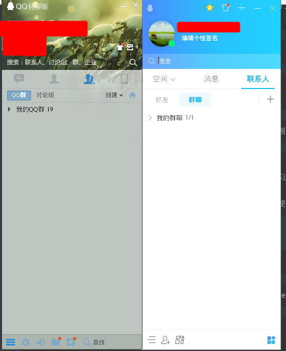
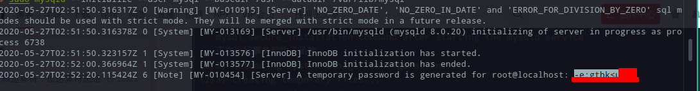
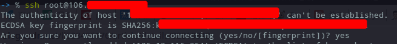
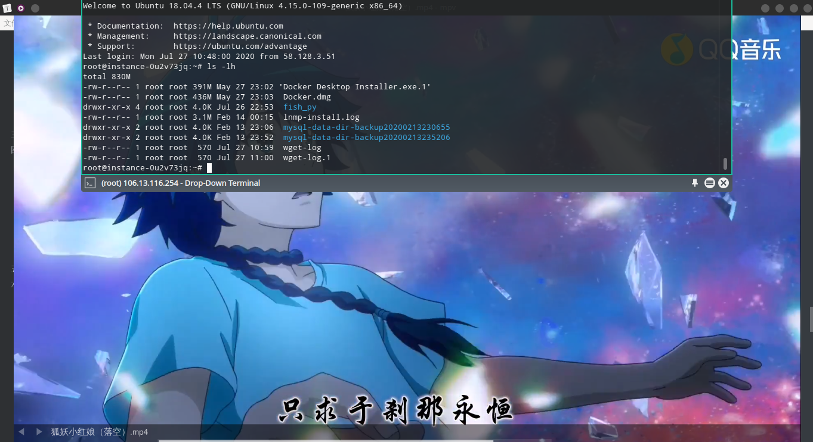
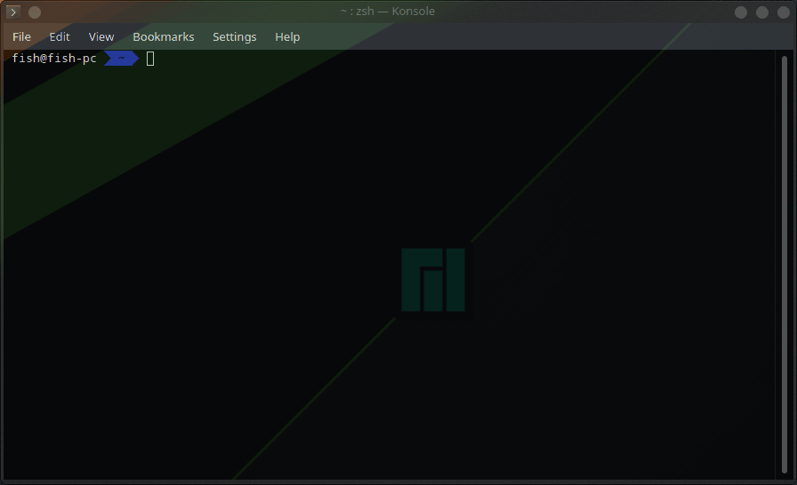
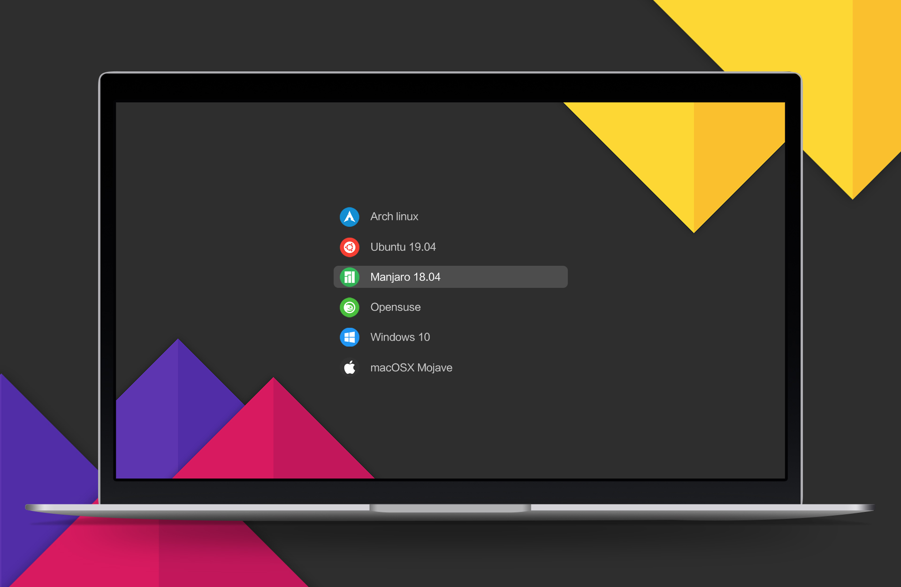
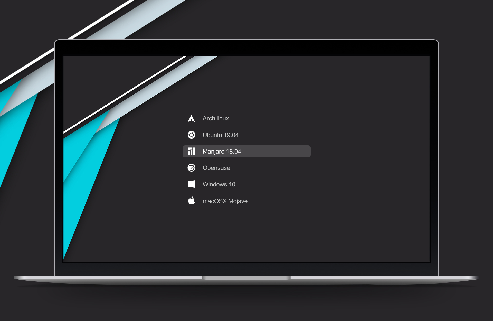

# Manajro-KDE

# 一、安装

1.启动盘制作使用的是官方网站推荐的写入软件 rufus 写入镜像。
分区和之前 ubuntu 的差不多，个人觉得几乎所有的 linux 分区都可以这样做。
以我自己的100G为例：

| boot/efi分区   | 300M   | fat32格式 |
| ---            | ---    | ---       |
| 交换分区(swap) | 8G     | ext4格式  |
| 主分区(/)      | 40G    | ext4格式  |
| home           | others | ext4格式  |

然后按照提示一步一步正常走完程序然后重启进行一些配置：

# 二、配置

## 1.更新源

1.配置国内源
`sudo  pacman-mirrors -i -c China -m rank`选择目前网络环境下最快的一个

2.增加 archlinuxcn 源
`sudo vim /etc/pacman.conf`添加如下内容：

    [archlinuxcn]
    Server = https://mirrors.tuna.tsinghua.edu.cn/archlinuxcn/$arch

3.安装签名秘钥和升级系统

    sudo pacman -S archlinuxcn-keyring
    sudo pacman -Syyu

## 2.安装 yay

yay 和 pacman 差不多，但是其软件资源要更丰富更新也更快。

    sudo pacman -S yay

## 3.安装软件

### (1)输入法

[typewriting](../Tools/Input_Method/Input_Method.md)

### (3)命令行利器

    yay -S htop  # 进程监控,top 命令的美化版
    yay -S screen  # 命令行终端切换
    yay -S tmux  # 和 screen 类似
    yay -S net-tools  # ifconfig、route、arp 和 netstat 等命令行工具
    yay -S iproute2  # 由于 manjaro 是基于 arch 的，所以自带了，但是没有 net-tools
    yay -S tree  # 以树状图列出目录的内容。执行 tree 指令，它会列出指定目录下的所有文件，包括子目录里的文件。

### (4)日常软件

#### 音乐

    yay -S netease-cloud-music # 网易云音乐
    yay -S spotify # 资源较少
    yay -S clementine  # 可以用做本地播放器，也可以对接 spotify,目前在用的
    yay -S cmus # 一个命令行播放音乐的小工具

#### 浏览器

    yay -S google-chrome  # 谷歌浏览器
    yay -S firefox  # 火狐浏览器(不过好像有自带，升级一下吧)
    # 注重隐私的可以自行搜索安装 Tor 浏览器

#### 视频

##### 1、VLC

`yay -S vlc`

不太习惯，已弃
1、首先是它的文件列表通过快捷键呼出后会将原画面缩小，跳转到其另一个界面，习惯了 potplayer 那样的悬挂式，不影响观看，且又能了解到具体的播放内容，在看课程的时候很有用。
2、用的时候打开多个文件后会卡住，无法打开新的文件，已经打开的窗口也无法在图形化的退出，只能通过命令行强行杀死进程才能结束。
3、而且打开一些视频播放不流畅，有花屏等等。

##### 2、MPV

    yay -S mpv  # 简单版本的视频播放器,简单播放的话功能够用

仅仅是作为 vlc 容易卡死的一个临时替代品，能播放的视频种类不是很清楚，但是只有很简单的功能，没有列表等其他的，打开一个视频后正常的播放，暂停，快进仅此而已。

##### 3、Qmplay2

界面设计很好看，功能也符合其要求，目前在使用的。

项目地址： [ QMPlay2 ](https://github.com/zaps166/QMPlay2)

#### 下载：

    yay -S  uget  # bt 下载工具
    yay -S xdman  # 类似于 idm，多线程下载工具，大大加速下载速度，有时候因为有些需要代理下载的，而代理速度不够好，或者本身源给的下载速度就不快的，比如用 sublime 的包测试，用xdm可以400-500k，而默认使用浏览器下载为10-20k

    yay -S axel
    ## 另外一个多线程下载工具，命令行的，相当于wget加强版，
    ## 使用wget命令下载容易断线，因为wget是单线程的
    ## 使用方法
    ## axel -n 100 http://download.sublimetext.com/sublime-text-3211-1-x86_64.pkg.tar.xz
    ## 注：-n 100 表示开100个线程数下载
    ## 还有其他参数可选，想要了解更多的自行搜索

<!---->

    yay -S aria2

下载利器,需要进行配置，配置方法见新篇,详情[aria2配置](../Tools/Aria2/Aria2.md)
轻型的，多协议支持的下载工具，而且还拥有很多实用的扩展工具

#### 编辑工具：

##### word、pdf、excel

    yay -S wps-office ttf-wps-fonts # WPS # 后面的为中文字体
    sudo pacman -S wps-office-mui-zh-cn # 中文字体包

#### 笔记：

    yay -S foxitreader  # pdf阅读器，但是感觉自带的Okular挺不错够用了，这个看个人喜好吧。
    yay -S mindmaster  # 思维导图工具

#### 其他

    yay -S deepin.com.qq.im  # QQ 安装后不能启动看后续问题归纳
    yay -S deepin.com.qq.im.light  # qq 轻聊版 （感觉就是老版的 qq，不过喜欢）
    yay -S electronic-wechat   # 微信
    yay -S telegram-desktop  # Telegram，电报需要做小小的配置才能使用，详见代理配置

qq 和 qq-lite 的对比图

    yay -S simplescreenrecorder # 录屏软件：SimpleScreenRecorder
    yay  -S flameshot # 截图工具：flameshot，截图后还有多种方式对图片简单处理
    yay -S peek  # 简单录制工具，可录制 gif
    yay -S deepin-screen-recorder  # 另一个简单录制工具，可录制 gif 后面的美化效果的 gif 就是分别用其录制的，效果都差不多，需要注意的是保存的文件名是有空格的，有些不太方便

区别： 
左为 peek，右为 deepin-screen-recorder
peek 是先打开一个窗口，通过拖动边缘可调节大小
deepin-screen-recorder 为打开像截图那样给出截选框先选择大小再录制

### (5)开发工具

#### \[ 1 ] 、JetBrains 全家桶系列

以下是基于版本2019.3
(1)、去官网 ( https://www.jetbrains.com/ ) 下载自己所需的 linux 的 tar,gz 压缩包，命令行移动到自己安装的目录，个人习惯选择 `/opt/`

(2)、解压包 解压全部命令参考：

    tar –xvf file.tar  解压 tar
    tar -xzvf file.tar.gz 解压tar.gz
    tar -xjvf file.tar.bz2   解压 tar.bz2
    tar –xZvf file.tar.Z   解压tar.Z
    unrar e file.rar 解压rar
    unzip file.zip 解压zip
    可能因为权限不够导致解压失败，建议以超级用户解压

(3)、把 `jetbrains-agent.jar` 破解包移动到其bin目录下。

(4)、修改`* .vmoptions` 和 `*64.vmoptions` 这两个文件， 在文件最后加入。`-javaagent:安装目录/jetbrains-agent.jar`

(5)、启动 切换到 bin 目录下或通过绝对路径启动相应的 `sh` 脚本。

(6)、进入正常配置界面，选择 Activation code 找到能用的从code添加注册即可破解。

(7)、可能会没有快捷方式： 附上快捷方式制作：
创建快捷方式：`sudo vim /usr/share/applications/Pycharm.desktop`

粘贴模板：
第一个是最基本的能够获取到工作目录以及添加图标的，以前在 ubuntu 可以正常使用，但是在 manjaro 的时候缺少一些东西，不能对图标进行编辑，而且用的是 svg 那个图，不能被识别，添加到桌面后图标为灰色，所以用的是第二个，

    [Desktop Entry]
    Version=1.0
    Type=Application
    Name=Pycharm
    Icon=/opt/pycharm-2019.3.1/bin/pycharm.svg
    Exec="/opt/pycharm-2019.3.1/bin/pycharm.sh" %f
    Comment=Lightning-smart Python IDE
    Categories=Development;IDE;
    Terminal=false
    StartupWMClass=jetbrains-pycharm

<!---->

    [Desktop Entry]
    Categories=Development;IDE;
    Comment[en_US]=The smartest Python IDE
    Comment=The smartest Python IDE
    Exec="/opt/pycharm-anaconda-2019.3.1/bin/pycharm.sh" %f
    GenericName[en_US]=
    GenericName=
    Icon=/opt/pycharm-anaconda-2019.3.1/bin/pycharm.png
    MimeType=
    Name[en_US]=Pycharm
    Name=Pycharm
    Path=
    StartupNotify=true
    StartupWMClass=jetbrains-pycharm
    Terminal=false
    TerminalOptions=
    Type=Application
    Version=1.0
    X-DBUS-ServiceName=
    X-DBUS-StartupType=
    X-KDE-RunOnDiscreteGpu=false
    X-KDE-SubstituteUID=false
    X-KDE-Username=

我们需要替换掉两个地方：`Exec="xx"` 和 `Icon=`,这里要替换掉我们的 pycharm 解压的目录， 然后保存退出之后 打开 搜索 找到图标 pycharm 然后将其拖到需要放置的位置即可。

后期有了更方便的方法，直接免费试用后将破解插件拖拽进去安装完成重启即可破解。

#### \[ 2 ] Python 开发环境

[Python\_Development\_Environment](../Python/development_envirnment.md)

#### \[ 3 ]、Sublime

[sublime 基础](../Tools/Sublime/sublime_base.md)
[sublime LSP](../Tools/Sublime/sublime_LSP.md)
[sublime  go](../Tools/Sublime/sublime_go.md)
[sublime python](../Tools/Sublime/sublime_python.md)
[sublime markdown](../Tools/Sublime/sublime_markdown.md)
[sublime 前端](../Tools/Sublime/sublime_frontEnd.md)

#### \[ 4 ] 、Mysql

    yay -Si mysql # 查看软件仓库版本
    yay -S mysql # 安装mysql

初始化数据库:`sudo mysqld --initialize --user=mysql --basedir=/usr --datadir=/var/lib/mysql`

这时会输出密码，记下: 

需要留意安装过程中的警告和报错，这次运气好没有遇到，不过看别人的有，留个链接吧，以备不时之需：https://blog.csdn.net/uniondong/article/details/98392738

    sudo systemctl status mysqld # 查看MySql状态
    sudo systemctl enable mysqld # 开机自启
    sudo systemctl start mysqld # 启动MySql服务

<!---->

    mysql -u root -p # 登录mysql
    # 如果报错：ERROR 1045 (28000): Access denied for user 'root'@'localhost' (using password: YES) 请再三检查是不是密码不对，或者用户名不对

<!---->

    alter user 'root'@'localhost' identified with mysql_native_password by '新密码';
    # 修改密码，密码必改，不改初始密码是随机的很难记，而且进入后不改密码也不让进行操作

<!---->

    yay -S mysql-workbench # 安装mysql可视化管理平台
    # 然后在连接的时候报错：Could not store password: The name org.freedesktop.secrets was not provided by any .service files，解决方案是安装 gnome-keyring包。
    yay -S gnome-keyring

#### \[ 5 ] 、Vim & Neovim

`yay -S vim`   # 编码利器
`yay -S neovim`   # 和 vim 差不多的命令行编辑器

#### \[ 6 ] 、SSH

    yay -S openssh

<!---->

    ssh username@server_ip  # 正常连接服务器

    ssh server_ip  # 如果客户机的用户名和服务器的用户名相同，登录时可以省略用户名。

    && SSH服务的默认端口是22，上面的都认为22，如果你不设置端口的话登录请求会自动送到远程主机的22端口。我们可以使用 -p 选项来修改端口号。
    ssh -p port ldz@192.168.0.1

第一次连接时会出现下面的情况，输入 yes 即可

##### 公钥登录(免密登录)

> 每次登录远程主机都需要输入密码是很不方便的，如果想要省去这一步骤，可以利用密钥对进行连接，还可以提高安全性。
>
> 1、在本机生成密钥对
>
> 使用 ssh-keygen 命令生成密钥对：
>
> `ssh-keygen -t rsa`   `[[-t表示类型选项，这里采用rsa]]加密算法`
> 然后根据提示一步步的按enter键即可（其中有一个提示是要求设置私钥口令passphrase，不设置则为空，这里看心情吧，如果不放心私钥的安全可以设置一下），执行结束以后会在 /home/username/ 目录下生成一个 .ssh 文件夹,其中包含私钥文件 id\_rsa 和公钥文件 id\_rsa.pub。
>
> 2、将公钥复制到远程主机中
>
> 使用 ssh-copy-id 命令将公钥复制到远程主机。ssh-copy-id 会将公钥写到远程主机的 ~/ .ssh/authorized\_key 文件中
>
> ssh-copy-id userbname@server\_ip
> 经过以上两个步骤，以后再登录这个远程主机就不用再输入密码了

#### \[ 7 ] 、Redis

    yay -S redis

    yay -S redis-desktop-maganer  # 数据可视化工具
    # 支持: Windows 7+, Mac OS X 10.10+, Ubuntu 14+
    # 特点： C++ 编写，响应迅速，性能好。但不支持数据库备份与恢复。

***

#### \[ 8 ] 、Dbeaver 企业版@破解

> 多平台数据库可视化工具，目前的 redis，mysql，mongodb等等都有
> 不要使用yay或者pacman安装，安装的是社区版，社区版的功能有限，比如不支持 mnongodb，redis
> DBeaverEE **7.0.0**及以下版本（理论上适用于目前所有新老版本）的破解
> 下载相应的包并安装，这里就不给出地址了，网上应该能找到。
> 破解方法:
> (1). 解压 DBeaverEE 到自己想要安装的位置。
> (2). 将下载压缩包解压后得到 dbeaver-agent.jar，把它放到你认为合适的文件夹内。为了方便管理，就放在解压的 /opt/dbeaver/ 目录下
> (3). 在 DBeaverEE 安装目录下找到 Eclipse\dbeaver.ini文件
> (4). 在打开的 dbeaver.ini 编辑窗口末行添加："-javaagent:/opt/dbeaver/dbeaver-agent.jar"，一定要自己确认好路径，填错会导致 DBeaverEE打不开！！！最好使用绝对路径。
> (5). 启动 DBeaverEE 即可。注意快捷方式里面的默认指定位置是不对的，所以打不开，自己去修改下复制到快捷方式所在的目录即可。
> (6). 如果提示错误:"Error opening zip file or JAR manifest missing : dbeaver-agent.jar"，这种情况请试着填上jar文件的绝对路径.

***

#### \[ 9 ] 、Git & Gitkraken破解

    yay -S git
    yay -S gitkraken  # github 桌面版（有说能破解，但我没破解成功，后面也几乎没用上这个软件）

#### \[ 10 ] 、Docker & Docker-compose

    yay -S docker
    yay -S docker-compose

# 三、美化

## 1、dock栏

    yay -S latte-dock
    (1) 去掉多余的图标
    (2) 背调节阴影效果（我觉得没有好看些）
    (3) 图标调节大小（可据显示器大小调节）
    (4) 光标移动到相应图标上时的放大效果
    (5) 设置自动隐藏

## 2、状态栏

（1）原来的状态栏是通栏且在下面，调节为在左边，因为有 dock 栏之后，dock 栏我是放在下面的，尝试把状态栏放在右边，但是鼠标滑动滚动条的时候会带出来，影响较大
（2）调节大小不为通栏且居中 

## 3、文件管理器半透明

 win + e 打开文件管理器-->定位到顶栏右键-->more actions-->configure special application setting-->appearance fixes-->active opacity-->force,我调到79%，感觉还不错

## 4、终端(konsole)半透明

 ctrl + alt + t 打开终端-->定位到顶栏右键-->more actions-->configure special application setting-->appearance fixes-->active opacity-->force 同样调到79

## 5、yakuake下拉终端

第一种是直接换一个透明的终端主题就可以了，比如 KDE-story
第二种是选中主题后点击编辑，去添加透明度 

## 6、终端内容美化(zsh)

    echo $SHELL # 查看当前使用的shell
    cat /etc/shells # 查看有哪些自带的shell，发现有了，没有的话下面命令安装，manjaro 自带了所以可以不用安装
    yay -S zsh
    sudo chsh -s /bin/zsh # 修改默认shell，这个是修改当前用户的终端，如果要修改root账户，需要切换到root用户
    # 这里遇到一个问题，在执行切换shell命令后显示失败，重启终端尝试也是失败，但是在重启后显示用的是zsh，也就是说切换成功了的

安装 oh-my-zsh

    curl https://github.com/robbyrussell/oh-my-zsh/raw/master/tools/install.sh | bash # 下载包并且完成安装

如果终端没有搞定代理的话上面的命令无法下载包，链接被墙。可以手动安装，方法下

    git clone git://github.com/robbyrussell/oh-my-zsh.git ~/.oh-my-zsh
    cp ~/.oh-my-zsh/templates/zshrc.zsh-template ~/.zshrc

上面的直接在浏览器打开那个链接去下载也行，然后再复制过去

查看可用的`Theme`：`ls ~/.oh-my-zsh/themes`

不确定安装的时候是否包含了所有的主题，但是查看还是有挺多的。[主题效果预览](https://github.com/ohmyzsh/ohmyzsh/wiki/Themes)

修改zsh主题，编辑`~/.zshrc`文件，将`ZSH_THEME="jonathan"`,即将主题修改为`jonathan`。

安装插件：zsh不仅可以美观还很强大，

    sudo pacman -S autojump
    git clone https://github.com/zsh-users/zsh-syntax-highlighting.git ${ZSH_CUSTOM:-~/.oh-my-zsh/custom}/plugins/zsh-syntax-highlighting
    git clone https://github.com/zsh-users/zsh-autosuggestions ${ZSH_CUSTOM:-~/.oh-my-zsh/custom}/plugins/zsh-autosuggestions
    sudo vim ~/.zshrc  # 编辑该文件添加入插件名称启用
    plugins=(其他的插件 zsh-autosuggestions zsh-syntax-highlighting)
    source ～/.zshrc
    # 重启

效果展示： 

关闭自动更新
在使用的过程中，如果最新的版本发生变更在新开的命令行窗口中会提示更新，但是往往因为网络问题（未使用代理）而导致更新失败，可以选择关闭自动更新。`cat ～/.zshrc` 查看配置文件，在文件中有`# DISABLE_AUTO_UPDATE="true"`，默认是注释的，取消注释`DISABLE_AUTO_UPDATE="true"`即可，如果想要体验新版可以开启代理后`omz update`更新即可

***

## 7、壁纸

进入图片目录将图片拖拽到桌面然后会有提示，设置即可，但当壁纸文件移动或者删除就会恢复为默认的壁纸。

预览： 

或者使用本地的壁纸其实也挺不错的。

## 8、字体

由于是用做开发环境，对于各个字符的区分就格外重要，像一些字体里面的 \[ I (大写的i) 、1、 l (小写的L) ]、\[ 0、O (大写的o) ] 等一度让人崩溃。
JetBrainsMono,下载后解压到 `/usr/share/fonts` 下重启即可。 

下载地址：[JetBrainsMono-2.001.zip](https://download.jetbrains.com/fonts/JetBrainsMono-2.001.zip)

## 9、其他

还有如放大缩小的标改为mac的样子、启动后加载等待的动画、登录页面的样式、图标的更换、整体系统的颜色样式等等、由于精力有限且电脑不太允许，喜欢的可以自行摸索。

# 四、时间设置

## 硬件时钟和系统时钟

系统用两个时钟保存时间：硬件时钟和系统时钟。

硬件时钟(即实时时钟 RTC 或 CMOS 时钟)仅能保存：年、月、日、时、分、秒这些时间数值，无法保存时间标准(UTC 或 localtime)和是否使用夏令时调节。

系统时钟(即软件时间) 与硬件时间分别维护，保存了：时间、时区和夏令时设置。Linux 内核保存为自 UTC 时间 1970 年1月1日经过的秒数。初始系统时钟是从硬件时间计算得来，计算时会考虑/etc/adjtime的设置。系统启动之后，系统时钟与硬件时钟独立运行，Linux 通过时钟中断计数维护系统时钟。

大部分操作系统的时间管理包括如下方面：启动时根据硬件时钟设置系统时间,运行时通过时间同步联网校正时间,关机时根据系统时间设置硬件时间,

## 时间标准

时间表示有两个标准：localtime 和 UTC(Coordinated Universal Time) 。UTC 是与时区无关的全球时间标准。尽管概念上有差别，UTC 和 GMT (格林威治时间) 是一样的。localtime 标准则依赖于当前时区。

时间标准由操作系统设定，Windows 默认使用 localtime，Mac OS 默认使用 UTC 而 UNIX 系列的操作系统两者都有。使用 Linux 时，最好将硬件时钟设置为 UTC 标准，并在所有操作系统中使用。这样 Linux 系统就可以自动调整夏令时设置，而如果使用 localtime 标准那么系统时间不会根据夏令时自动调整。

Linux方案：

    timedatectl set-local-rtc 1 --adjust-system-clock
    timedatectl set-ntp 0

# 五、启动项设置

## 1、refind（Win + Mac + Linux）

windows10 + manjaro 双系统，先有的 win10 后安装 manjaro，manjaro 的 grub 启动项会替代 win10 原来的并且能识别 win10,界面也不错，不挑剔的话改一下选择系统的等待时间就可以了

自己的笔记本有大神几乎完美安装了黑苹果，自己也学着黑了下，目前除蓝牙不能用以外其他的几乎完美，虽然不怎么用，但毕竟是一次大胆的探索，占用的空间也不是很大，就当做个纪念(主要看着牛啊😁)

然后就出现了很尴尬的情况，manjaro 的引导只能识别 windows 和 manjaro，黑苹果的 Clover 只能识别 Mac 和 windows，这时候 refind 就完美的解决了这个问题，把 manjaro 的启动选项固定时间设为0,就可以跳过选择进入manjaro，win10 本来就没有等待直接进入，Clover 也是一样跳过等待就可以。

## 2、grub主题修改（Win + Linux）

现在有很多好看的主题可以修改了，而且修改相对简单，如果没有 Mac 的话建议使用这个,下载的时候注意选择合适的分辨率(1080P、2K、4K)

### 下载：

在 <https://www.gnome-look.org/browse/cat/109/ord/rating/> 下载自己喜欢的主题，已经测试，墙内可以使用，但可能会慢些

#### 现在比较热门的两个主题:

Tela grub themeOriginal 
Grub-theme-vimixOriginal 

### 安装、

解压下载的文件，切换到解压的目录里面，查看文件会发现有一个 install.sh 文件，运行该文件即可

    tar -xvJf Tela-1080p.tar.gz
    cd Tela-1080p
    sudo ./install.sh

## Manjaro-Xfce

KDE 的大多数内容都是可以应用到这上面来的。

之前的 manajaro-kde 为18版本，当时分区`/boot/efi`并没有出错，但是在这次的 manjaro-xfce-20.1 如此分区时安装到后期报错，大概看后解释说是因为先安装有 win10, win10已经存在一个`/boot/efi`分区，因此造成冲突，将win10的分区挂载但是保持不格式化，然后分区`/boot`就可以了。
美化什么的就不要有太多期望了，可操作性很小，但是其本身虽然是很轻巧的，但是从同图标到整体风格都刚刚好，没有任何粗糙的感觉。安装的东西过程大多相同，但也有些差异。
代理的全局设置一直是一个很头疼的问题，以前在 ubuntu 没有解决，在 manjaro-kde 前期也一直在寻找合适的方法，后面在系统里面有设置全局代理解决了，但这个因为是轻量级所以没有了。

### 软件

    yay -S geeqie # 开源看图软件
    yay -S ark # 解压缩，自带的 engrampa 解压速度快但是解压的类型很少

之前配置过zsh，为了方便留了文件，直接本地安装吧
<https://github.com/ohmyzsh/ohmyzsh>下载oh-my-zsh:

    cp oh-my-zsh/ ~/.oh--my-zsh
    cp oh-my-zsh/templates/zshrc.zsh-template ~/.zshrc

插件：
[autojump:](https://github.com/wting/autojump)
[zsh-autosuggestions](https://github.com/zsh-users/zsh-autosuggestions)
[zsh-syntax-highlighting](https://github.com/zsh-users/zsh-syntax-highlighting)

#### qbittorrent

能添加trackers的磁力下载器

#### liferea

rss 阅读器，重要的是可以配置代理，这样就可以添加一些墙外的源了。