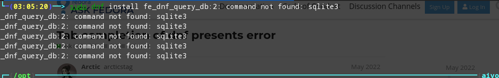
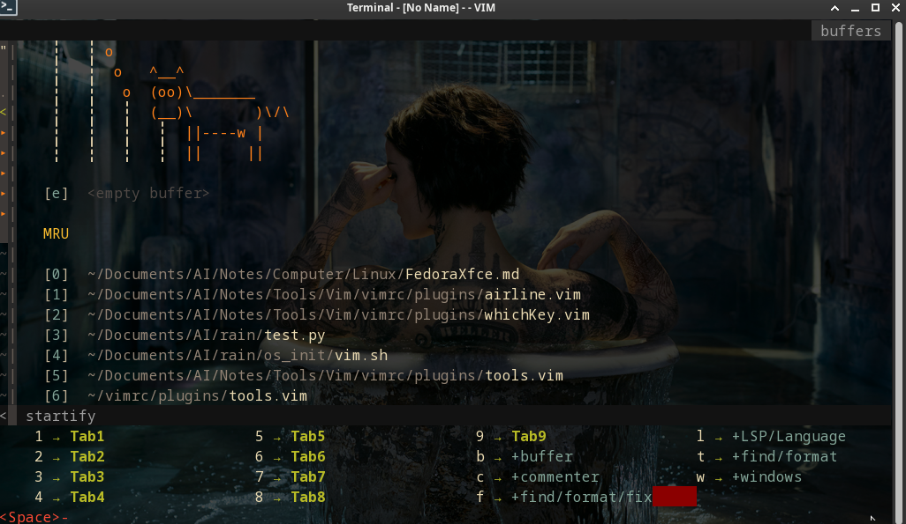
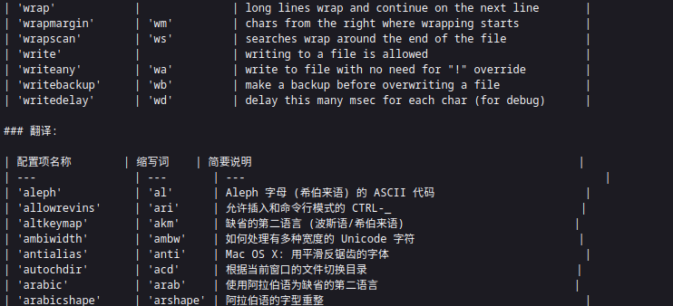
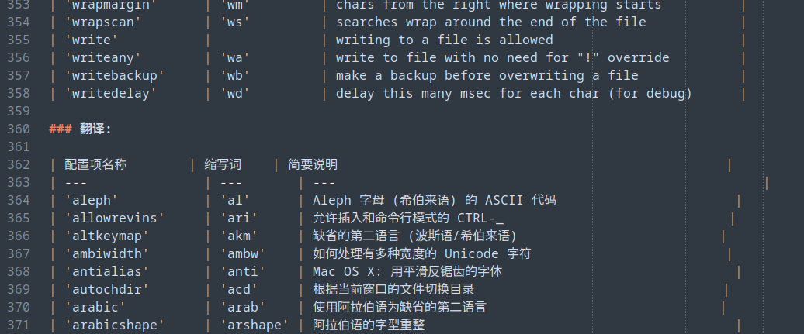
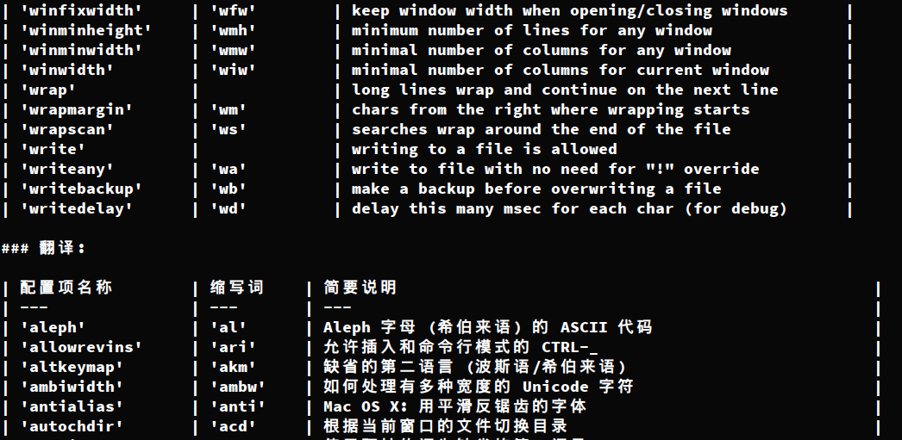
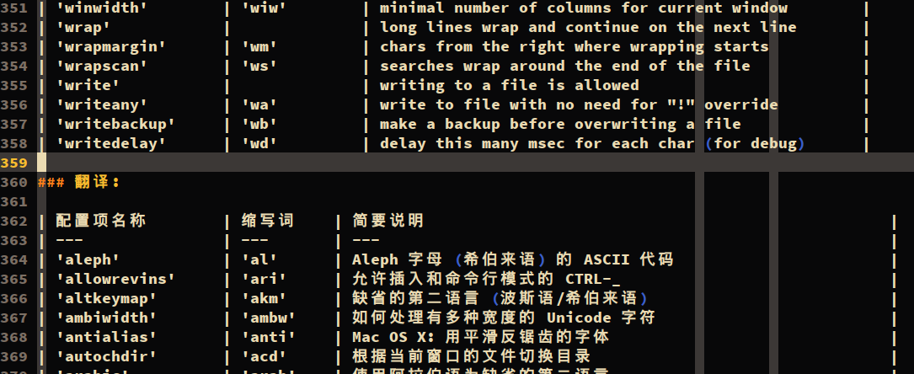

## Fodora-KDE

KDE-Connect 使用还是爽啊，但不确定是 Fedora 的 Linux 内核的问题还是硬件的问题，有时候正常关机重启会弹出很多的异常提示，看了下都是说关于内核的但没有详细的说明。而且一弹就是几百上千条，每条最低五秒的显示。很影响使用体验。而且提示了异常对正常的使用是不受影响的。

显示的问题，在切换或打开窗口的时候，底部会有部分有明显色差，出现一个断层，在关闭所有窗口再打开即恢复正常。

fcitx5 使用 rime 的问题，使用中文输入法的时候，上字有明显的丢帧。

源的问题。安装 MEGA 后会往系统里添加一个源文件。这个源文件在正常使用 dnf 包管理器安装、更新的时候会优先调度这个源，但这个源好像需要代理而且对于安装几乎没有用。在没有使用代理的时候会占用大量的时间去等待这个源响应，实际最后得不到响应，也就等到超出时间报异常再使用其他的源。可以进入 `/etc/yum.repos.d` 删除这个以 `mega` 开头的源。

## Fedora-Gnome 问题

### 安装问题

安装时选择了自主分区，但是一直提示一个 “biosboot error”，就是要创建一个新的`/boot/efi` 分区，无法像其他系统一样通过挂载现有的分区就行。千万不要创建类型biosboot的分区，那样重启时会什么启动项都读取不到，而直接进入bios或者从u盘启动。

### grub2 问题

manjaro的是grub管理，至少之前安装的是，安装的fedora是grub2管理，在前期是明确有两个系统的启动项的，但是后面因为grub2的分辨率问题更新了grub2,回头发现grub文件夹没了，自然也就无法启动了，资料也都备份了，新系统使用了一天也没有发现什么不合适的地方，就没有作引导的修复。也不太确定问题是不是两个grub的冲突导致的，但是如果下次遇到两个不同版本grub的系统，还是最好资料备份及引导修复重建合并的准备吧。

#### update-grub 命令

在 grub2 中不存在 update-grub 命令了，而 update-grub 实际也是二次包装的，`grub2-mkconfig -o /boot/grub2/grub.cfg`可实现相同的效果,更改 grub2 配置的文件还是`/etc/default/grub`

#### 分辨率问题

启动页面选择引导的分辨率模糊，被放大了，字体模糊，文字行超出显示屏，大概确定是分辨的问题，但是后期因为被查找到的资料的误导及自己经验不足失败了很多次。
过程
1、调小分辨率，既然有这种情况，那估计是默认的分辨率大于自己的显示器分辨率或者判断错了自己的分辨率导致分辨率不对，尝试指定GRUB\_GFXMODE为自己的`1366x768`，无效
2、自己的分辨率不被支持，某个 grub 资料说是一些分辨率不被支持，通过命令`vbeinfo` or `videoinfo`可以查看适配的分辨率。无赖进入 grub 命令行查看（非系统命令行），grub2 不存在这些命令，查文档也没有看到说有替换的。那尝试改为普遍支持的 `640x480`等等。无效。
3、在grub.cfg的构建文件中做修改，即`/etc/grub.d/00_header`，也无效。
4、尝试对grub.cfg 的分辨率的更改的所有操作都无效。一直没有去查看 grub.cfg 文件中的分辨率最初为什么，更改后为什么，或者有没有被修改，而是通过不断重启看有没有改变。想想简直哭死。`/etc/grub.d/00_header`文件中的构建过程是建立在一个判断结构下的。对比查看其与`/etc/default/grub`，又往这方面查。 ` /etc/default/grub`中`GRUB_TERMINAL_OUTPUT=console`是被注释着的，也就是模式是console，但是 gfx 相关的操作生效的前提是应该为`GRUB_TERMINAL_OUTPUT="gfxterm"`。

### Nautilus 文件管理排序，文件、文件夹变混合排序

个性化设置可以更改，包括要显示的内容，用户、创建时间，类型等等等等。

### sublime 3 主题异常

Gnome version : GNOME Shell 42.0

在换了系统后继续在就像使用原来的 sublime 3 时,在对 Fedora 系统设置了全局暗色主题的前提下，原本的暗色主题设置在标题栏无效。侧边栏和编辑区正常。尝试切换其他主题也是同样的结果。sublime 4 使用正常，尝试将 sublime 4 的默认主题包替换过去也没效果。查了一下可能是一些 gnome 的设置项参数在新版本调整导致的。

近期在vscode相同异常上看到vscode对标题栏有特有的设置，查看了；`sublime 3、4` 的配置，`sublime 4 `新增加了`"themed_title_bar": true,`,这个会对其有影响，而`sublime 3`没有类似的，可能也就无法通过简单设置去解决这个问题了。

### 状态栏不显示有后台运行的应用图标

Fedora 相对于 Ubuntu 桌面更简介，一些配置是没有的，可以通过添加 gnome-extensions 来扩充、补全自己的需求。

添加`AppIndicator and KStatusNotifierItem Support`插件可解决问题。

### vscode 标题栏白色（标题栏颜色不随主题更换变化）

打开设置，`Title Bar Style`,`native`更改为`custom`

### Chrome、Sbulime、Terminal 等软件崩溃、卡顿
在使用软件时界面常常崩溃，然后弹出提示页面无响应，有时候弹窗自动消失恢复，有时候整个软件崩溃，更有甚整个桌面系统崩溃，回到登陆界面。主要是 Chrome 浏览器引起的次数居多，可能不是 chrome,查的时候看到较早的版本有人是使用 firefox 经常有类似的问题，可能是内存资源的占用、gpu 驱动方面的问题吧，暂时没解决。

后面进行了一次整体升级，这个问题就没出现了。

升级后的一些信息`Kernel: 6.0.15-200.fc36.x86_64`，`DE: GNOME 42.6`，崩溃没有出现过。但是偶尔的卡顿会有，短的时候几秒，长的十几秒。

崩溃还是有，在软件启动的时候有时候会。

### 窗口切换问题
使用默认的快捷键切换窗口的使用，同个应用开启的多个窗口会被认为是一个，切换到的是最新使用的。这并不是快捷键的问题，而是整个系统的设计。

### Terminal 窗口切换问题
图形a化的终端开启单窗口后开多个项后然后全屏，不能使用鼠标进行切换。后面又能了，不知道为什么。

### 使用 zsh 后不读取原 bash 配置
可以理解为不同的应用，自然就不会引用对方的配置，不过可以在 `.zshrc` 中去主动引入 `.bashrc` 中的内容即可。但是不推荐，修改不方便，很容易混淆。根配置文件（`/etc`下的文件）会不会影响没测试，但是不建议去改动这里的文件，实在需要的话做好备份。

### 环境变量不包含 `/home/<name>/.local/bin`
接上个问题，一开始我以为是 zsh 的问题，后面去看了下原 bash 的配置，好像系统是不默认将其纳入默认环境变量的，有个代码端专门去判断后添加，添加即可。

```
if ! [[ "$PATH" =~ "$HOME/.local/bin:$HOME/bin:" ]]
then
    PATH="$HOME/.local/bin:$HOME/bin:$PATH"
fi
```

### fcitx 输入法

默认的是`ibus`框架，直接进入输入法配置添加了`Intelligent Pinyin `，每次配置 `fcitx` 挺麻烦，这次使用发现挺好的。

虽然麻烦但是后面还是换成了 `fcitx5`，但是不要卸载 `ibus`，`ibus` 是 `gnome` 内置的，可能会导致桌面系统崩溃。

换的原因是有时候会卡键，按一下后面连续输出该键的字母，敲击其他的键才会停下。


## Fodora-Xfce 问题

### kde-connect
直接尝试安装 `kde-connect` 有包但是安装之后能其他设备无法连接。

去仔细看了官方文档尝试安装，首先是补全依赖比较多，177 个包，400多M，安装给出的方式是编译安装，但是环境中 cmake 一个库的文件版本不符合要求，给放弃了。

### dnf 安装 使用 tab 补全提示报错

错误：



`sudo dnf install sqlite`之后即可

### 快捷键
xfce 的快捷键设置有两个地方，一个是设置里面，一个是窗口管理里面。

之前在设置里面想要设置切换到桌面的快捷键，没看到可设置的，可自己添加，但是不清楚命令。

通过查询成功在窗口管理里找到了。

或者可以在`~/.config/xfce4/xfconf/xfce-perchannel-xml/keyboards.xml`中去修改实现改变快捷键，有针对所有用户而非单用户的，有需要的自己查查。对于其他配置，也可以通过修改文件的形式完成，毕竟，linux 中一切皆`文件`。

修改文件实现改配置在所有桌面都是可行的，只不过难易不同，例如 gnome 在新版本中一些配置会进行打包，不再是直接明文件。

### 空格键突然失效
在更改了 lightdm-gtk-greeter 的主题，背景图之后，重启系统空格键无效。

在再一次重启后还是失效，但是在多次尝试按触发之后恢复了正常。

### 设置桌面的壁纸一段时间后随机切换 导致锁屏背景的也变动了
复盘下来导致这个问题的操作是，在设置屏幕壁纸的时候点选了设置里面的一段时间自动切换壁纸，并且开启了随机。

原因：

桌面有四个工作空间，每个工作空间的桌面是可以单独设置的，他们的配置文件在`~/.config/xfce4/xfconf/xfce-perchannel-xml/xfce4-desktop.xml`，里面工作空间的命令是从 0 开始的。然后锁屏的设置是`workspace0`的。后面是不小心切换到了其他工作空间（开始设置了壁纸应用到所有工作空间，但是出现这个问题后取消了，但是一直以为自己在工作空间，切换到之后除非再切换回去，否则系统会保存状态，不管是重启，系统崩溃后重启都会保存），所以那会即使考虑到了是设置里面的问题去取消了设置还是没有解决问题，因为问题是在工作空间 0，直到查询到不通过设置而通过命令行修改的方式才找到了配置文件，看了配置文件才大致直到之前的问题所在。里面有两行`<property name="backdrop-cycle-enable" type="bool" value="true"/>`，`<property name="backdrop-cycle-random-order" type="bool" value="true"/>`，自己的当前桌面没有随机切换壁纸了，值却还是true，自己去修改为了 false，就没有问题了。

在考虑到是壁纸设置的问题前做了一个确认，也是还好习惯将自己的配置单独文件夹，去修改了自己的壁纸文件夹名，去看锁屏变成异常单色幕布，也就是说明调用了桌面壁纸而不是背景图。

### greeter theme 问题

    说到背景图又要提另一个就是`greeter`背景图。也就是进入系统前的 login 页面。这个现在自己还没整明白，举个例子，重启系统后的 greeter，即欢迎页面，相当于一大门，但推开这扇门可直接进入用户系统，因为有一个选择用户的过程（不选就默认的），但是进入个人系统后，锁屏，个人用户会关关闭自己的小门。这个会使用另一个`greeter`（其实不确定是不是这么叫，目前了解到的好象是系统调用一个锁屏程序，但是这个程序会调用`greeter`的部分配置），如果是 logout 则会退回到一门前，也就会注销系统运行的进程，而锁屏不会。
    自己使用了新的更美观的 greeter，在一门确实改变了主题，二门却没有，使用的背景图也是各自的。

    默认的`lightdm-gtk`程序即主题不能删除，涉及到窗口主题，卸载了不会影响系统的运行，但是窗口设置的主题会失效。比如我卸载后暗色主题变成白色。

### lightDM greeter 和 lock greeter 的问题
*这个问题需要参考上两个问题*

lightDM greeter 默认使用的`lightdm-gtk-greeter`。

而 lock greeter 使用的是另一个程序`xfce4-screensaver` 管理的， 使用的也是`lightdm-gtk-greeter`，并且是在源码中就写死的，[xfce4-screensaver-dialog.ui](https://gitlab.xfce.org/apps/xfce4-screensaver/-/blob/master/src/xfce4-screensaver-dialog.ui)中明确写了`<class name="lightdm-gtk-greeter"/>`，应该是考虑到各个发行版自带的 greeter 的不同吧，Fedora 自带的有`lightdm-gtk-greeter` 和 `slick-grrter`。

`xfce4-screensaver`的源码中没有看到`lightdm-gtk-greeter`的拷贝，所以是在计算机本地调用了`lightdm-gtk-greeter`的静态文件，但是比如背景图、用户头像是在配置中增加的，`xfce-screensaver`并不会加载配置，所以就出现了两个不同的 greeter ，而如果 `lightDM`使用其他主题，这个问题就更明显。

`lightdm-gtk-greeter`的安装是编译的，所以如果不卸载然后自己修改源码再编译安装是无法解决两边背景图、用户头像不一样的。`xfce-screensaver`也是，并且没有提供接口去接受配置修改。

### 安装`p7zip`包后无法使用`7z`命令
在网上搜索到的解压`7z`压缩包的包是`p7zip`,安装后无法像后面说的使用`7z`解压，测试后发现正确的解压命令是`7za`

### vim 使用 vim-which-key 拓展行尾有空格问题
严格来说不是 vim-which-key 的问题。因为多个显示内容需要对齐，不足的就用空格填充。而我使用的另一个插件 vim-trailing-whitespace 默认会高亮显示行尾空格。所以就出现了视觉上的问题。

大概样子：



后续自己看能不能改改 vim-which-key 的填充代码，让尾部不是空格是一些像`|`容易忽视的字符。

### 系统卡死问题（网卡相关）
之前在使用 manjaro 的 xfce 版本的时候就有这个问题，那会是刚好对系统进行了大更新，以为是系统的驱动啊、某些环境啊改变了导致的，或者是长期的待机造成设备的老化（5年的笔记本，风扇不静音、时常高温等），随后就换了基于 gnome 的 fedora 系统，后面又换到现在的 xfce 桌面的，那个问题又出现了，这个比较巧合，插上网卡后就卡死了，但是是外接 usb 网卡，还是接在拓展坞上，一度没反应，也怀疑是不是接口不灵敏了。最后彻底放弃使用这个网卡。

后面有时间了又去查了下，怀疑是不是驱动不匹配的问题。最后也没发现什么。但是突然想起来，这个网卡是自带驱动的。后面把网卡又给安上，先是该网卡的连接断开，然后一段时间后就会出现系统卡死的情况。目前把原因定在这上面，后面有其他设备了再验证一下。

### 中英文混写的对齐问题

在 markdown 文档中写表格时，想要分割号对齐，在 vim 中写是正常对齐的，在终端输出也是，但是用其他编辑器打开，比如 JetBrains 系列的 IDE,sublime 等等，甚至是在浏览器中都是不对齐的。

大概情况如下：

firefox:


sublime:


终端输出：


vim：


主要是中英文的设计不同导致的，全英常用字符、字母的长是相同的，中文的与其有差别，所以无法对齐。

通过安装然后切换至换合适的等宽字体可以解决这个问题。

sublime 添加设置 `"font_face":"Sarasa Mono Slab SC"` 更换字体。

通常比例是 中：英文 = 2：1，但使用这种字体英文看起来会很费劲，建议只在特定的软件中使用。
vim 、终端不会受影响，是因为有个不明显的限制，当字符超出范围后会自动压缩，这也是为什么一些 linux 里面中文很怪异的原因（比如 ubuntu）

目前测试过三款字体，大多数字体都是不能对齐的。

`sarasa(更纱黑体)`，部分能

`Sauce Code Pro`，nerd 和 SourceCodePro 的整合，不能

`InconsolataGo`，nerd 和 InconsolataGo 的整合，部分能，其他的 inconsolata 的也应该可以

### asyncomplete.vim 插件在 markdown 中使用 Tab 上屏失效
在其他类型文件，甚至包括没有明确指定文件类似的文件都可以使用 <PageUp> 、<PageDown> 来上下选择然后使用 <Tab> 键来确认上屏，但是在 markdown 文件中能选择，但是 <Tab> 后成回车调到下一行，并没有内容填充。

去找来一圈没有找到资料，去作者的 github 下留言没有得到回复，去尝试看了下源码也没理清楚。

保留其中一段代码的解释：

```
function! asyncomplete#force_refresh() abort
    return asyncomplete#menu_selected() ? "\<c-y>\<c-r>=asyncomplete#_force_refresh()\<CR>" : "\<c-r>=asyncomplete#_force_refresh()\<CR>"
endfunction

function! asyncomplete#menu_selected() abort
    return pumvisible() && !empty(v:completed_item)
endfunction
```

原理:
这段代码是 Vim 插件 Asyncomplete 的一部分，它提供了自动完成功能。其中，第一个函数 asyncomplete#force_refresh() 用于强制刷新自动完成菜单，第二个函数 asyncomplete#menu_selected() 判断是否已经选择了某个自动完成项。

应用:
第一个函数 asyncomplete#force_refresh() 中，如果已经选择了某个自动完成项，则使用 Ctrl+y Ctrl+r 快捷键来强制刷新菜单；否则使用 Ctrl+r 快捷键来强制刷新菜单。第二个函数 asyncomplete#menu_selected() 用于判断是否已经选择了某个自动完成项，如果菜单可见并且已经选择了某个自动完成项，则返回真。

目前的解决方案是按照官方给的文档添加快捷键然后使用 `<Ctrl> + n`，这个快捷键会直接将结果上屏并滚动直到关闭浮动窗口。

原因不清楚，可能这个快捷键才是插件的本意。

### rustdesk 安装失败
缺少依赖，先`sudo dnf install libxdo`安装依赖后在安装 rpm 包即可

### zip 文件解压失败
unsupported compression method 99

windows和linux的加密算法不一致，原zip是在windows环境上设定密码压缩的。

在 window 加密压缩时，选用 zip 传统加密。

## Manjaro-KDE 问题

### 1、改快捷方式

去 system setting 里面修改 move to trash 的快捷方式时，一直报错：
\[ The key sequence Ctrl+D is ambiguous. Use 'Configure Shortcuts' from the 'Settings' menu to solve the ambiguity.  ]
解决方法：系统里面设置的和在文件管理器里面的不是同一个快捷键，可用于桌面，文件管理器里面的在文件管理器里面设置这样就不冲突了。

### 2、Yakuake

下拉命令行的快捷键原来是 f12,和浏览器的有冲突，记得修改。

### 3、kde-connect

中间在使用 kde-connect 传东西的时候传的不完整，会缺少文件，想着换一个类似的，在搜索后下载了一个 sendanywhere，然后自动给浏览器也添加了一个插件，然后系统就变得很卡很卡，其实也不确定是不是，明天测试一下。结果证明不是。详细原因看下面。

### 4、系统卡顿原因

在开机的时候挺流畅的，运行几分种后就特别卡，点击文件打开需要很长时间，鼠标移动也特别卡，去 htop 看了一下，最开始只关注 cpu 的情况，但是占用不是很大，就怀疑是不是硬盘的问题(硬盘是二手的)，尝试删除了一些新安装的软件，也没有用，去看了驱动的情况，也没有问题，后来再去仔细看了下 htop 的结果，结果发现了一个叫 baloo\_file\_extractor 的进程竟然占用着256G的磁盘空间，自己当初给 manjaro 的总空间都不足100G，kill 后速度明显恢复了，但是很快又卡了，再看，这个进程竟然又自己启动了，去网上查了下资料，没有的到一个很好的结果，有一个说法说这是 KDE 桌面留下来的bug，但是一直没有给解决，他会在你开机后疯狂的往磁盘里面写入，从而造成系统卡顿。网上解决的方法挺多的，但我采取了最简单的一种，立刻停止并禁止启用，不知道禁止启用会不会在一些方面造成影响，有的话后续再补充。

    balooctl suspend  # 立即停止
    balooctl disable  # 禁止启用

### 5、mysql问题


mysql服务没有启动。

### 6、qq安装后无法启动（deein-wine-tim）

Manjaro-KDE 桌面安装 TIM/QQ 的时候经常出现无法启动，其主要原因是 deein-wine-tim 打包了 Gnome 桌面部分内容，因此在 KDE 桌面环境下需要安装相应的 Gnome 桌面设置环境

安装gnome-settings-daemon：`yay -S gnome-settings-daemon`

依次进入system settings-->>autostar--->>add program 选择文件目录输入/usr/lib/gsd-xsettings 回车确定添加然后开启就可以了，如果没有 gsd-xsettings 就先重启一下就有了，然后再重启一下就可以打开了，第一次打开可能会提示更新wine，稍微等待一下就可以了

### 7、使用ping命令无法验证自己的socks代理是否正确启用

最常用的 `ping` 网络检测命令即是使用的 `ICMP` 协议，在 OSI 七层网络模型中，`ICMP` 协议工作在第三层 - **网络层**，`SOCKS`（非套接字 socket）协议工作在第五层 - **会话层**，`HTTP/HTTPS` 协议工作在第七层 - **应用层**，SSH 工作在第七层 - **应用层**，它们在模型中不同的层次位置，决定了 HTTP/HTTPS 和 SSH 协议可以直接走 SOCKS 代理，而 ICMP 无法直接走 SOCKS 代理。

模型中不同协议的位置如下图： 

### 8、deb包的安装

有时候去获得的软件源的得到的包不是 manajro 可以直接安装的而是 `deb` 的
法一：
、、、、 我在使用本方法的时候没有成功 、、、、

    yay -S debtap   # 安装第三方转换软件
    sudo debtap -u     # 更新，这步无法解决，挂代理还是不挂都失败
    debtap package_name.deb  # 对包进行转换
    sudo pacman -U packagename  # 安装


法二：
直接解压 deb 文件，然后再解压包到根目录下，或`/opt`下，快捷方式在正常快捷方式的`/usr/share/applications/`下，主要看包内部的结构。
后期实际使用情有的可行，有的不行，涉及到一些系统的依赖吧估计。

### 9、pycharm 的快捷键问题

设置无法通过以往习惯的（ctrl+alt+s）呼出，估计有其他应用占用了这个快捷键，尝试去查找具体是哪一个占用了，目前没有找到，先改为alt+s将就用着吧。

### 10、更新启动导致 grub 设置失效

前期把 manjaro 的启动时间设置为 0 了，然后一段时间又恢复成默认的10s了，以为是系统bug导致的，今天有一个大版本的更新，包括内核，更新完成之后没有重启，电脑特别卡，重启后发现启动时间又变回去了，大版本的更新会重置之前的设置。

### 11、启动器其找不到应用快捷方式

有些自己通过解压安装的软件在启动器找不到相应的快捷方式，有点类似于解压安装的没有去写入注册表那样，
大多数快捷方式是在‘/usr/share/applications/’下，第三方解压安装的也会解压到这，如果找不到，复制其快捷方式到‘/home/fish/.local/share/applications/’即可

### 12、大版本更新启动等待时间变为默认

这个没法解决，更新时会默认强制把boot/grub里面的文件更新，不能随便删除替换，只能更新一次去更改一次 /boot/grub/grub.cfg文件，而且是重启后更改。

### 13、Appimages 软件创建桌面图标

AppimagesLauncher 可以自动将 Appimages 应用程序快捷方式添加到桌面环境的应用程序中启动器/菜单。
下载地址：<https://github.com/TheAssassin/AppimagesLauncher/releases>

### 14、无法连接到 Tor

开始直接使用的是本地的网络，但是无法进入，后切换使用代理后成功进入，再根据查找的资料，大概原因可能是所用的网络可能存在封锁。如果本地网络没法进入请使用代理。

### 15 、.run文件的运行

下载后检查有没有权限，没有的话为其添加权限`chmod 755 test.run`然后双击或者命令行`./test.run`运行，避免后期权限问题报错，加 sudo 吧。

### 16、无意切换到终端模式

之前有在使用快捷键的时候摁错了导致进入了全命令行的终端模式，当时一点头绪都没有，只有强行关机重启。

今天在使用 ctrl + alt + f5 的时候进入了，就去查询了一下相关的：

> 终端模式又称作命令行模式或者字符模式，默认情况下linux提供六个终端，使用组合键ctrl+alt+F1进入第一个终端，使用组合键ctrl+alt+F2进入第二个终端，其他终端的组合键以此类推.

> 终端又叫做tty，linux定义了六个tty，分别从tty1到tty6，tty是teletype的简写。从tty1到tty6被称为虚拟终端，如果想要切换回桌面，只需要使用组合键ctrl+alt+F7即可。

> 注意，如果系统设定默认启动的时候不启动图形界面，则tty7是不可用的。
> 此时，若想从终端字符界面进入图形界面就需要使用命令startx
> 命令如下# startx
> '#'是一个提示符，表示当前登陆的用户是root用户，也就是超级用户
> $ 也是一个提示符，表示当前登陆的用户是一个普通用户。
> 超级用户拥有对系统的全部权限，可实现所有的功能。普通用户只有部分功能。这就是区别，看词就可以定义。

### 17、开机自动挂载windows分区

没有任何配置的话 linux 开机默认是不会挂载 windows 分区的，只有比如进入文件管理器点击相应的分区后才会挂载，并且只会在本次有效，重启后恢复默认，这就造成了例如上一次导入的 windows 分区内的歌曲，视频，文件等等都会显示文件不存在或者无法找到等情况。

KDE 暂时不清楚，在 XFCE 下无论是通过在 /etc/fstab 里写入挂载的盘还是通过开机即执行挂载命令均为成功。先这样吧。

### 18、Chrome 浏览器强制使用安全搜索模式

不清楚是自己使用的代理的问题还是说最近 google 在上次更新后加入了这项机制，在设置账户为中文的情况下会默认打开安全搜索模式且无法关闭（关闭保存退出后也会自动打开），解决方法是切换到其他语言如英语就可以关闭了。

### 19、Chrome更新后的Reading List 取消

自上次无意更新 Chrome 后在标签栏的位置增加了一个新条目（功能）Reading List，功能感觉像是之前使用的插件 onetab，在添加书签会多一个选择，在打开书签目录的时候由于最右边的位置被占用了，使用习惯就很别扭。

取消方法：地址栏输入：`chrome://flags/#read-later`,把 default 改为 disabled     后 relaunch 后即可

### 20、libcrypt.so.1 问题

进行了一次大更新，原来能使用的软件不同使用了，`libcrypt.so.1` 包也找不着，通过安装`libcrypt.so.1`可以了，多加一次，如果有`libcrypt.so.1` `libcrypt.so.1.1.0`文件，可直接制作一个软连接即可，`sudo  ln  -s  libcrypt.so.1 libcrypt.so.1.1.0`

### 21、zsh-autosuggestion 颜色变为白色

同样是更新后的问题，应该是更新到了zsh
问题是配置了zsh-autosuggestion插件，根据历史命令自动提示出要补全的命令，要补全的为灰色。但是现在全为白色，完全失去了效果。查了下本地的颜色配置没有问题，去修改zsh-autosuggestion插件底层的文件无效，在.zshrc中写入OZSH\_AUTOSUGGEST\_HIGHLIGHT\_STYLE='fg=yellow'也无效。

最后看到是 `zsh-syntax-highlighting` and `zsh-autosuggestions` 叠加使用产生的bug，都更新到最新版本可解除这个问题

## Manjaro-Xfce

### 1、.Appimages文件无法打开

不知道是不是动了什么东西，导致最开始能打开的 .Appimages 文件无法打开了，报错忘记截图了，大概意思是 linux 的 fuse 模块没有自动加载，

    sudo vim /etc/rc.moudules
    添加 modprobe fuse

### 2、快捷方式

在一开始的时候 win 键盘可以正常使用，但是后来可能是更新了还是什么的，不起作用了，而且之前设置的 xfce4-terminal 下拉终端也 不起作用了，去快捷方式里面找，直接不见之前的一些设置了，而且重置也和最开始配置的那会不一样，最后查询了终于补齐了，但是有新的问题，比如调用文件夹的是`WIN + E` ，会先打开开始模块再打开文件夹，相当于是个bug吧，只能用右边的 WIN 键，但是不方便，只好改一个键。

而且有两个设置快捷键的地方，都去改动一下。删除不需要的，以免是全局的影响了其他软件的使用


### 3、pycharm  中 md 文件预览乱码 & 一些中文字体的不正常(如门，画等)

方法来自<http://panqiincs.me/2019/06/05/after-installing-manjaro/>，应该大多数linux都可以用吧

    sudo pacman -S ttf-roboto noto-fonts ttf-dejavu
    # 文泉驿
    sudo pacman -S wqy-bitmapfont wqy-microhei wqy-microhei-lite wqy-zenhei
    # 思源字体
    sudo pacman -S noto-fonts-cjk adobe-source-han-sans-cn-fonts adobe-source-han-serif-cn-fonts

创建文件~/.config/fontconfig/fonts.conf，加入下面的配置：

    <?xml
    <!DOCTYPE fontconfig SYSTEM "fonts.dtd">

    <fontconfig>

        <its:rules xmlns:its="http://www.w3.org/2005/11/its" version="1.0">
            <its:translateRule translate="no" selector="/fontconfig/*[not(self::description)]"/>
        </its:rules>

        <description>Manjaro Font Config</description>

        <!-- Font directory list -->
        <dir>/usr/share/fonts</dir>
        <dir>/usr/local/share/fonts</dir>
        <dir prefix="xdg">fonts</dir>
        <dir>~/.fonts</dir> <!-- this line will be removed in the future -->

        <!-- 自动微调 微调 抗锯齿 内嵌点阵字体 -->
        <match target="font">
            <edit name="autohint"> <bool>false</bool> </edit>
            <edit name="hinting"> <bool>true</bool> </edit>
            <edit name="antialias"> <bool>true</bool> </edit>
            <edit name="embeddedbitmap" mode="assign"> <bool>false</bool> </edit>
        </match>

        <!-- 英文默认字体使用 Roboto 和 Noto Serif ,终端使用 DejaVu Sans Mono. -->
        <match>
            <test qual="any" name="family">
                <string>serif</string>
            </test>
            <edit name="family" mode="prepend" binding="strong">
                <string>Noto Serif</string>
            </edit>
        </match>
        <match target="pattern">
            <test qual="any" name="family">
                <string>sans-serif</string>
            </test>
            <edit name="family" mode="prepend" binding="strong">
                <string>Roboto</string>
            </edit>
        </match>
        <match target="pattern">
            <test qual="any" name="family">
                <string>monospace</string>
            </test>
            <edit name="family" mode="prepend" binding="strong">
                <string>DejaVu Sans Mono</string>
            </edit>
        </match>

        <!-- 中文默认字体使用思源宋体,不使用 Noto Sans CJK SC 是因为这个字体会在特定情况下显示片假字. -->
        <match>
            <test name="lang" compare="contains">
                <string>zh</string>
            </test>
            <test name="family">
                <string>serif</string>
            </test>
            <edit name="family" mode="prepend">
                <string>Source Han Serif CN</string>
            </edit>
        </match>
        <match>
            <test name="lang" compare="contains">
                <string>zh</string>
            </test>
            <test name="family">
                <string>sans-serif</string>
            </test>
            <edit name="family" mode="prepend">
                <string>Source Han Sans CN</string>
            </edit>
        </match>
        <match>
            <test name="lang" compare="contains">
                <string>zh</string>
            </test>
            <test name="family">
                <string>monospace</string>
            </test>
            <edit name="family" mode="prepend">
                <string>Noto Sans Mono CJK SC</string>
            </edit>
        </match>

        <!-- 把Linux没有的中文字体映射到已有字体，这样当这些字体未安装时会有替代字体 -->
        <match target="pattern">
            <test qual="any" name="family">
                <string>SimHei</string>
            </test>
            <edit name="family" mode="assign" binding="same">
                <string>Source Han Sans CN</string>
            </edit>
        </match>
        <match target="pattern">
            <test qual="any" name="family">
                <string>SimSun</string>
            </test>
            <edit name="family" mode="assign" binding="same">
                <string>Source Han Serif CN</string>
            </edit>
        </match>
        <match target="pattern">
            <test qual="any" name="family">
                <string>SimSun-18030</string>
            </test>
            <edit name="family" mode="assign" binding="same">
                <string>Source Han Serif CN</string>
            </edit>
        </match>

        <!-- Load local system customization file -->
        <include ignore_missing="yes">conf.d</include>
        <!-- Font cache directory list -->
        <cachedir>/var/cache/fontconfig</cachedir>
        <cachedir prefix="xdg">fontconfig</cachedir>
        <!-- will be removed in the future -->
        <cachedir>~/.fontconfig</cachedir>

        <config>
            <!-- Rescan in every 30s when FcFontSetList is called -->
            <rescan> <int>30</int> </rescan>
        </config>

    </fontconfig>

### 4、fcitx-googlepinyin 也就是谷歌输入法打不出顿号

前一次在 pycharm 编辑的时候记得就出现了，但是自己当时只不过是当作是一些小问题，没准重启能够解决，但是今天在编辑markdown文本的时候，迫切的需要，但是已经明确切换到中文输入法状态下，点击回车键上的反斜杠“\”，出来的还是反斜杆，一直查不出什么原因，无论是重启还是修改一些配置，最终在网上找到了解决方法。

使用中英文标点切换快捷键（ctrl+.）\[ 以前不知道这个快捷键]

估计是在pycharm使用快捷方式时不小心给触碰到了导致的。

### 5、Qv2ray代理突然无法使用

以前在代理失效时会有类似的情况，但是在更换了手机上测试可以使用的代理，确定其端口没有被占用，使用的网络没有问题，其 v2ray 启动成功 等等等等之后，还是无法使用代理。

最后想到自己在前一晚切换到 Win 环境下，而那时 Win 的时间被自己修改过，回想起自己最初使用 Linux 时候由于没有配置时间导致其使用斗鱼无法使用，于是乎去修改了自己的时间，重启代理，问题就解决了。

### 6、vim进入后行不会根据屏幕自动换行，以及左侧目录栏显示异常

关闭重新进入vim即可，估计是插件为完全加载的原因

### 7、Failed to register AppImage in AppImageLauncherFS: could not open map file

起因是双击打开了一个appimage文件，在设备了设置了appimagelauncher管理，然后退出后通过命令行启动，可能就无法通过appimagelauncher管理了，但是文件又关联了appimagelauncer，就冲突了，设备重启了下就解决了。

### 8、无故卡死

没有解决！！！
安装了某个软件自启动一段时间后导致卡死？
系统不断的升级某个驱动、库、依赖不兼容导致卡死？
硬件老化导致的问题？

而且有的软件本应在状态栏的显示不显示，实际应用未退出。
基于 arch，一些软件没有兼容到，无法安装，或者是不方便安装。
为了更好的开发，暂时换了系统。

## ubuntu-Gnome

### Failed to load module "xapp-gtk3-module"

Installing xapp installs the missing modules and removes the warning

`sudo apt install xapp`

### 某个命令平时能正常使用，加sudo或者进入root用户显示命令未找到

以node，npm为例，自己下载了包解压到/opt并且在当前用户`.bashrc`文件配置了环境变量，所以能使用，但是在root用户的环境下却是没有的，为其创建软链接（使用绝对路径）到`/usr/local/bin`,或者`/usr/bin`即可,建议前者吧，不用了要删除也方便分辨些

### AppImage文件无法正常启动

通过命令行./启动,发现是缺少相应的库，补全即可
`sudo apt install libfuse2`

### configure: error: glib-compile-schemas not found.

`apt-get install libglib2.0-dev`

### configure: error: Your intltool is too old.  You need intltool 0.40.4 or later.

`apt install intltool`

### ubuntu 字体异常

系统使用全英文时，默认字体Noto Sans CJK优先显示日文汉字，打开文件`/etc/fonts/conf.avail/64-language-selector-prefer.conf`将SC的优先级提到最高后重启电脑即可。

### ln 命令错误 Too many levels of symbolic links

原因在于生成软连接是没有写完整的路径，所以只要写绝对路径就行了

### 安装 python 后，使用`python`使用的不是系统的版本

`/bin` ,`/usr/bin`,`usr/local/bin`中的软链接指向的都是系统版本

因为在`.bashrc`或`.zshrc`中设置了环境变量，优先级覆盖了

崩溃了，早期那会不再使用 ubuntu，就是因为安装软件的依赖无法解决，现在看来还是太菜了，不适合我，新换的系统，一个星期，配置得七七八八了,从 grub 进登录页面也需要花一定时间，可能10秒左右，使用中也有一些卡顿，文件管理器在复制文件的时候会突然崩溃。


## 其他

fcitx 修改 luna\_pinyin.custom.yaml 可以对全半角符号进行修改且有效，但是在换到 fcitx5 后就无效了，建议先去看 user.yaml 文件的内容
比如内容为:

    var:
      last_build_time: 1655690864
      previously_selected_schema: luna_pinyin_simp
      schema_access_time:
        luna_pinyin_simp: 1647270274

则文件名为 `luna_pinyin_simp.custom.yaml`

### adb 没有权限

在以前的版本，那会应该是安卓 8、9，只要开启了开发者模式，设置了允许 usb 调试，数据线连上手机和电脑后手机端会弹出一个确认连接。但是这次手机是安卓 11，连接上后没有这个弹窗，去查看连接情况也报权限异常，记录下解决方案。

`adb devices` 会输出当前连接的设备号。但是这次的结果是`4f8595f2     no permissions; see [http://developer.android.com/tools/device.html]`

从结果看发现了设备，但是提示没有权限。去尝试比如查看包等操作也是提示权限不足。

解决方案：

    1、`lsusb` 命令查看当前的 usb 使用情况，会出现一堆这样的结果`Bus 001 Device 060: ID 2a70:4ee7 OnePlus Technology (Shenzhen) Co., Ltd. ONEPLUS A3010 [OnePlus 3T] / A5010 [OnePlus 5T] / A6003 [OnePlus 6] (Charging + USB debugging modes)`，这是选出的自己的一加手机的信息，如果信息不明不确定是哪一个最简单的方法就是把掉输出一次插上输出一次找不同就可以了。选出里面的关键信息，比如这条里面的 `2a70:4ee7` 记下，然后继续下一步。

    2、`sudo vim /etc/udev/rules.d/51-android.rules` 命令编辑文件，写入`SUBSYSTEM=="usb", ATTR{idVendor}=="2a70", ATTR{idProduct}=="4ee7", MODE="0666", GROUP="plugdev"`，里面的 idVendor 和 idProduct 就分别对应第一步骤中提取信息的前后段。写入后保存关闭。

    3、`sudo adb kill-server` 关闭之前的服务

    4、`sudo adb start-server` 重新开启服务

    这时候再去连接手机就会恢复弹窗，后面也正常使用了。


### 双（多）系统启动项修复

一般推荐的是先安装linux 系统再安装win系统，这样一般不会出现启动项被 win 强占的后果，因为win的启动项只支持自身的系统，不会检测启动其他启动项，回导致明明安装了多个系统，但是启动总是进入win。

也有的启动项因为启动项本事设置的问题，硬件的兼容问题，有时也会启动项失效，安装deepin时有这种情况出现过，ubuntu、mnajaro、kali都正常。

或者电脑维修、清灰等时启动盘未完全归位的开机也会导致启动项重置。并且这种情况是在bios中也找不到其他系统的启动项的。

在确定磁盘内的各文件都还在的情况下可通过软件DiskGenius的工具-`设置UEFI-BIOS启动项`，点击添加找到相应目录下的文件即可，然后调整linux的为第一位。如果安装混乱也可以通过这个工具删除多余的启动项。
