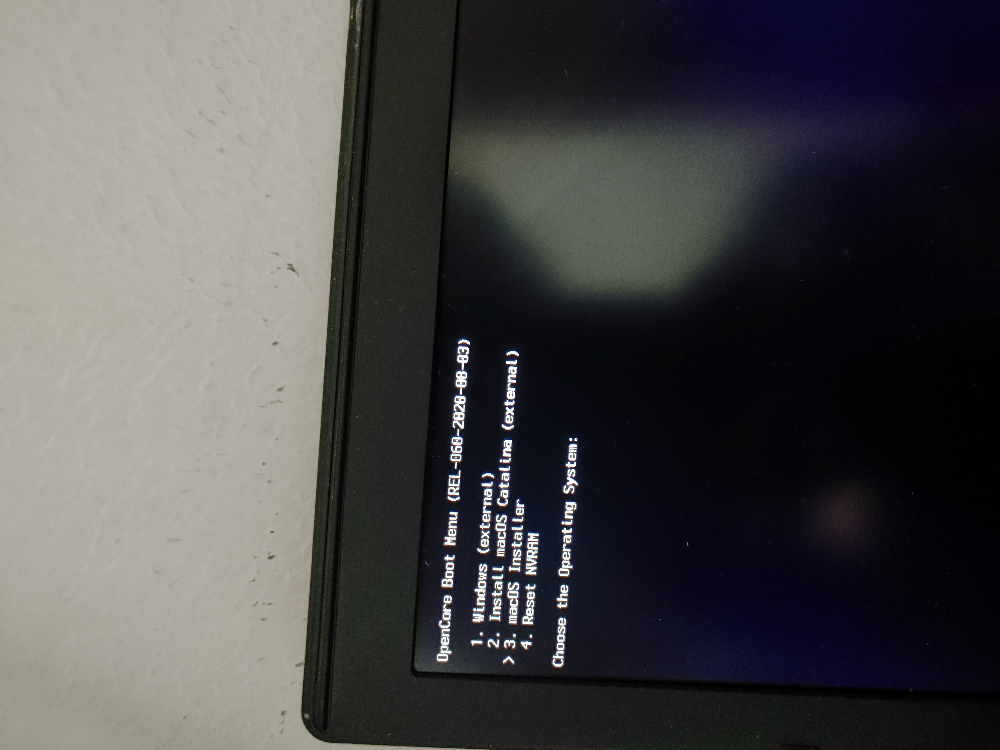

# 简介

型号：`K650D-i7-D3`

1. 硬件: 
	- CPU：`i7-4710MQ`
	- 内存：`12GB(三星DDR3 1600MHz 8G + 4G)`
	- 显卡：`核显`
	- 显存：`2GB`
	- 硬盘：`255GB SSD`
	- 声卡：`intel Dual Band Wireless-AC 3160`
	- 网卡：``
	- 屏幕：``

镜像：`macOS Catalina 10.15.6(19G2021)`  除了网卡没测试，其他都可以
	 
	 `macOS Catalina 10.15.7(19H2)`，折腾了下网卡能用了。

	 `macOS Big Sur 11.0.1 20B29` 在安装第二步中途重启，放弃了。

opencore：`0.6.0`

EFI:[opencore-efi源下载地址](https://bbs.pcbeta.com/viewthread-1867877-1-1.html)

## 安装过程

1. [镜像下载地址](https://mirrors.dtops.co/ISO/MacOS/)下载镜像

2. [etcher下载地址]https://etcher.balena.io/)下载刻录软件

3. 找到合适的 `opencore` 启动包或者自己制作的 `opencore` 启动包

4. 将刻录完成的的系统盘的 EFI 分区挂载到系统盘，删除里面的 EFI 目录，替换成刚刚制作的 EFI 目录

5. 关闭 bios 的快速启动等选项

6. 插入 U 盘选择从 U 盘启动

7. 选择安装：第一次安装

如图，第一步时不确定成功，忘了拍图。

第一中有没有第三个选项，且第二个选项后面没有`external`，这个单词表示已经安装了。这步应该选择第二个`Install macOS Catalina` 选项。

之后如其他教程那样，进入磁盘管理，选择盘，抹盘（这一步会要求设置一个名称，这个名称后面安装会选择到，最好不要起容易混淆的），退出磁盘管理，选择安装，选择安装的磁盘

然后开始进入黑屏 + LOG 的读条页面。最后会重启。这期间读条可能未完毕。别的不知道，但我的重启后是可以进行下一步的。

8. 第二次安装

如图中那样选择 `MacOS Installer` 选项。这步没有什么选项。等待完成即可。

9. 第三次安装

这一步还是从 `opencore` 启动的。但是在 `MacOS Installer` 下面会多个一个选项。这个选项的名称就是之前抹盘时设置的名称。

当出现选择国家的页面就代表已经安装完成。

之后就是根据自己的需求设置一些内容了，如用户名、密码、语言、键盘等等。

10. 验证完整性
	- 验证本身显示器是否正常，有无花屏、闪屏
	- 验证外接显示器接口是否可用
	- 验证显示器亮度是否可以调节
	- 验证有线网络连接
	- 验证声音播放并且是否可以调节
	- 验证外接麦克风、耳机是否可用
	- 验证摄像头是否可用
	- 确保所有USB 2.0/3.0 和 3.1 接口
	- 如果有无线网卡、蓝牙也要检测下
	- 验证自动睡眠、手动睡眠，并且能否唤醒
	- 验证关机/重启（在次之前最好先先执行后面一步，复制 EFI 到本地）
	- 安装 iStat Menus，查看系统资源监控，如CPU、内存、硬盘负载/温度可以展示
	- 安装 CPU-S，测试变频
	- 安装 VideoProc Converter，验证核显加速(打开软件> 选择视频 > 选择右侧有个很小的硬件设置即可查看)
	- 安装 Hackintool，在系统下面是否有显示：IGPU、GFX0 信息，如果没有 IGPU 则表示你核显没识别到。

这些都验证过了。并不一定要完美，只要所要求的功能都能正常就可以

11. 复制 EFI 到本地磁盘

这时候的系统启动还是依靠 U 盘的 `opencore` 启动的。U 盘不可能一直插着或者永远步重启系统。就需要把 U 盘的启动引导复制到本地磁盘。

方法有很多。使用命令或者使用软件都可以。

软件的话就需要下载或者是多准备一个 U 盘来存储（但这就先保证你的USB接口是可用的）。 其实在制作镜像完整后U盘一般是有一定空间的。可以把一些必备软件也放在启动盘里。

1. 使用命令：
	- `diskutil list` 查看磁盘列表，并且找出 EFI 分区所在的磁盘，记录下盘符
	- `sudo diskutil mount /dev/disk0s1` 把系统的EFI分区挂载到本地磁盘，`disk0s1`是我的分区，有多个磁盘可能有不同
	- `sudo diskutil mount /dev/disk1s1` 把 U盘的EFI分区挂载到本地磁盘，`disk1s1`是我的 U 盘的分区，同样也可能不同
	- 在文件管理器里面把 U 盘的 EFI 目录拷贝到本地磁盘的 EFI 目录

2. 使用 `Hackintool`
	- 选择磁盘会罗列分区，光标移动到相应的 EFI 分区右键选择挂载
	- 复制操作和之前的一样

3. 使用 OpenCore Configurator
	- 差不多类似，具体没尝试

4. 在 Windows 上使用 DiskGenius
	- 同样也是挂载后复制即可
	- 另外一种是如黑果小兵的镜像提供了WEPE，在没有Windows系统的时候，进WEPE后使用 DiskGenius 也是一样可以的

## 镜像制作失败

1. 使用软件`etcher`在写入完成后会对内容进行检验。但是这时提示异常。

最开始没在意。又重新制作了一遍。并且在检验过程中点击了跳过。这步可以选择跳过的，因为消耗的时间是比较长的。但前提是确保镜像的完整性和U盘是完好的。

2. 制作的 clover 镜像能正常启动并进入选择页面，但是选择安装没反应，去尝试调试，回车选择也没反应，这时候如果触碰其他键就会黑屏

之前的 U 盘问题导致的镜像未刻录完整。

## 安装过程中的问题
这部分内容是基于 `opencore` 的。

1. 没有可选的安装选项

将`ScanPolicy`的值修改为`0`。不用改类型。我修改类型为`string`反而无效。使用原来的类型可以。

如图，之前只有 `Reset NVRAM`  一个选项

2. 使用 `OCAT-Linux-x86_64.AppImage`(项目地址 <https://github.com/ic005k/OCAuxiliaryTools/releases>) 修改`prev-lang:kbd`后无法正常进入 `opencore` 引导

改用 `ProperTree`  修改的可以。[ProperTree项目地址](https://github.com/corpnewt/ProperTree)

3. 启动的语言为俄语

打开 `config.plist` 找到 `NVRAM -> 7C436110-AB2A-4BBB-A880-FE41995C9F82 -> prev-lang:kbd` ，将值修改为 `zh-Hans:252` 或 `7A682D48 616E733A 323532`。具体看 `prev-lang:kbd` 的类型，是 `string` 类型就修改为`zh-Hans:252`。是`Data` 类型就修改为`7A682D48 616E733A 323532`。

然后在进入 opencore 后先选择 `Reset NVRAM` 然后再选择安装镜像。

如果是已经进入了。不想退出修改。

从最顶部的任务栏从苹果图标开始算(苹果图标算第一个)。选择横向的第三个。在弹出的选项卡里面选择第一个。再弹出的选项卡里面往下划就有中文选项了。

但是这个方法在安装后最后进入系统的时候还是俄文。哪个选择语言全是俄语。没看懂我放弃退出修改重装了。

4. 安装提示 `应用程序副本已损坏,不能用来安装macOS`

是苹果证书过期的原因。

一次选择`使用工具` > `终端`。在打开的终端中输入 `data 072414102019` 后回车。没报错就是设置成功了。

在选择 `终端` > `退出终端`即可回到安装页面。

这个不同版本的 macOS 镜像会有些差异。但解决方案是这样，只是修改为不同的日期

## 非安装、驱动问题

1. mac 鼠标滚轮方向与windows、linux上相反

把`系统偏好设置` > `鼠标` > `滚动方向：自然` 前的勾取消掉即可。

2. 触摸板不能双击代替左键

把`系统偏好设置` > `触摸板` > `光标与点按` 中的`轻点来点按`前的勾选上即可。

## wifi 不能用

之前没注意，认为是另一个作者说的那个驱动。后来发现不是，去搜索了一下，可以驱动。

但是没注意看自己先去尝试使用 `AirportItlwm`。折腾了一遍发现仍然不行，去仔细看配置，发现居然已经内置了驱动 `itlwm` ，去下载软件 `HeliPort` 打开发现能使用

而且 `AirportItlwm` 的配置也说不能同时使用，不知道失效的原因是不是这个。

说是 `AirportItlwm` 的效果要比 `itlwm` 要好。稳定性等等，但实际使用还可以。而且本身这个网卡就一般，就将着用吧。

添加 `AirportItlwm` 需要配置 `强制加载` 驱动 `IO80211Family.kext`。低版本没有这个配置。

[HeliPort](https://github.com/OpenIntelWireless/HeliPort)

[itlwm itlwm的使用教程](https://openintelwireless.github.io/itlwm/Installation.html)

[itlwm AirportItlwm](https://github.com/OpenIntelWireless/itlwm)

[另一个itlwm itlwm的使用教程](https://github.com/daliansky/XiaoMi-Pro-Hackintosh/wiki/%E9%A9%B1%E5%8A%A8%E5%86%85%E7%BD%AE%E8%8B%B1%E7%89%B9%E5%B0%94%E6%97%A0%E7%BA%BF%E7%BD%91%E5%8D%A1)

itlwm 问题 ：启动直接联网成功。平时上网没有发现明显问题，但是系统一旦进入睡眠并唤醒后，网络就会失效。

`AirportItlwm`  在 `opencore 0.6.0` 版本没有 `强制加载` 如何使用。在目录`/Systems/Library/Extensions/`找到 `IO80211Family.kext` 文件，复制一份到 /EFI/OC/Kexts/下。然后先加载`IO80211Family.kext`再加载`AirportItlwm.kext`就可以正常使用了。

关于报错 `OC: Prelink injection AirportItlwm.kext () - Invalid Parameter`的原因就是找不到 `IO80211Family.kext`

一开始也是试了好几个版本，并且去把`Lilu.kext` 也更新了，都无效。更新 `opencore` 又折腾又有风险。好在是解决了。

如果使用新版本的编辑器或者打开文章修改的方式去添加 `Force` 会出现一些异常提示，但是不会影响启动和使用就是因为 `0.6.0` 版本没有这些内容。添加也是无效的。

遗憾的是睡眠唤醒后还是会失效。看来之前的不是驱动的问题。

## 其他

其他的一切正常，除了 wifi 不能使用（已解决）

CPU 温度在 50 °C 左右

HD4600 核显的 `HEVC` 解码不能使用，具体是驱动没装好还是本身就不支持，后续有空再研究

自带的键盘触摸板不能用于唤醒，但是外插的罗技鼠标 `M235` 可以用于唤醒

键盘的 command 键不能正常使用，后期`Karabiner-Elements`调整布局可解决

TODO:

	1. 有空研究下怎么升级 opencore

	2. 给 opencore 增加一个主题

`opencore 0.6.0` 版本太老，所使用的编辑器 `OpenCore Configurator` 很多功能都没有，比如`强制加载`。而且不能使用高版本的 `OpenCore Configurator` 编辑低版本的 `opencore` 配置。打开也会提示版本不同。

`OC Auxiliary Tools` 好像出现较晚。也没有对老版本的支持。

还有个异常 `Dependency com.apple.iokit.IOHIDSystem fallback to com.apple.iokit.IOHIDFamily succeeded. Please fix your kext!` 后续看看什么原因。