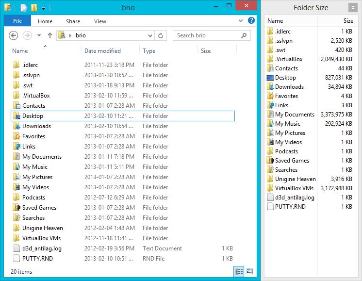
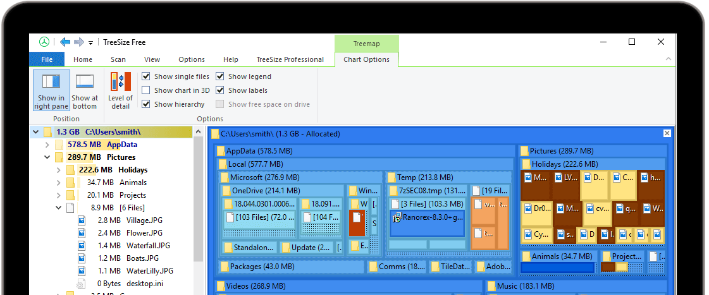

win10 只有通过右键查看属性的方式才能显示文件夹大小。除此之外还可以安装一些额外的软件来查看文件夹的大小。

folderSize：[官网地址](https://foldersize.sourceforge.net/)

在不影响原来的文件管理器的窗口的情况下，再右侧小窗展示文件的大小。

实际效果:

treeSize:[官网地址](https://www.jam-software.com/treesize)

treeSize 不同的是他是一个独立的软件。除了显示文件、文件夹的大小外还可以对文件进行分析，查看占比等

