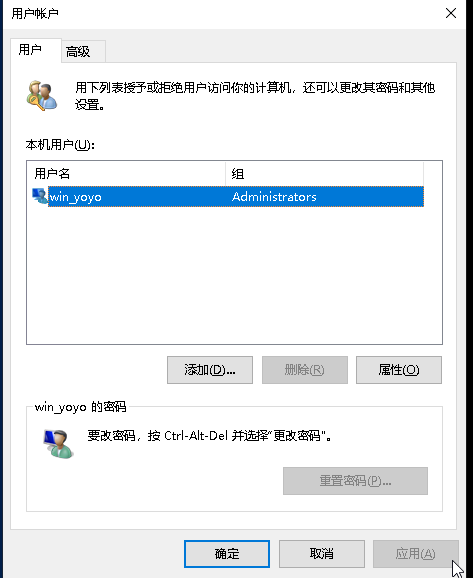
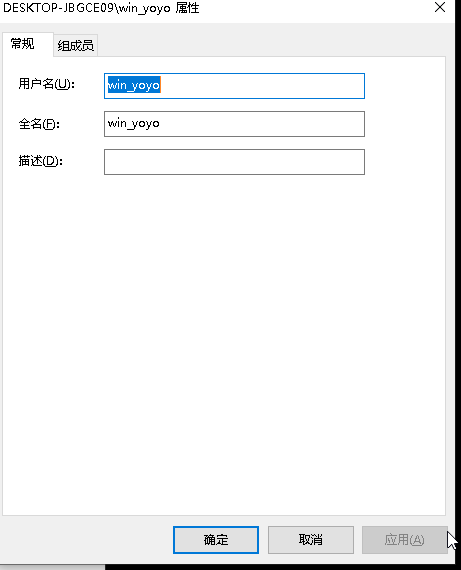

1. 通过控制面板

依次 `控制面板 > 用户帐户 > 用户帐户 > 更改名称` 输入新用户名点击确定即可

但如图中所提示的 `该名称将显示在欢迎屏幕和"开始"屏幕上`

当使用 `powershell` 时查看用户名，依旧是之前的用户名，并且根目录下`用户`目录下的用户名与之前的用户名也一致。

2.  使用 netplwiz 在 Windows 10 中更改用户名

使用 `WIN + R` 输入 `netplwiz` 或在 `powershell` 中 输入 `netplwiz`回车即可打开 `用户账户` 界面

点击`属性` 或者双击要修改的用户名会弹出另一个界面，修改即可。

而如果你在之前使用控制面板的方式修改过会发现这里的`全名`的内容和控制面板那设定的一样。真正的在终端中生效的是 `用户名`。这个也是远程连接时的用户名。

但这个也存在问题。根目录下的`用户`目录下的用户名依旧不会改变。

3. 命令 `control userpasswords2` 在 Windows 10 中更改用户名

这个和命令 `netplwiz` 一样。

4. 根目录下的`用户`目录下的用户名

前面的都只是修改用户名，但是用户目录的名称却不会改变。

相关的方法很多，懒得再一一尝试了。大概的思路都是修改注册表的内容。然后再注销当前用户然后登录其他的更高权限的用户，去修改相应的目录名。再登录之前的用户。

但是建议在修改前备份重要的内容。