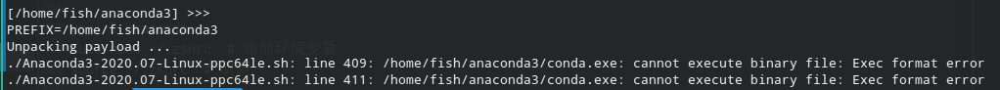
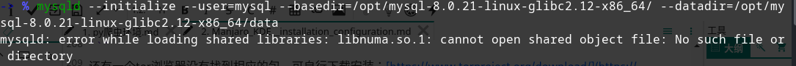
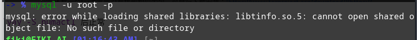
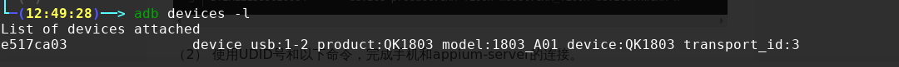
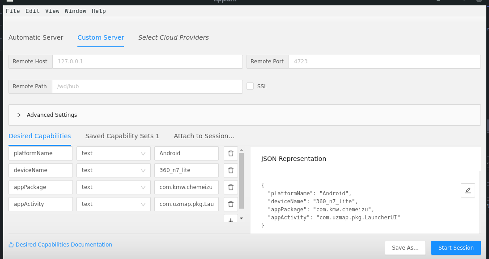
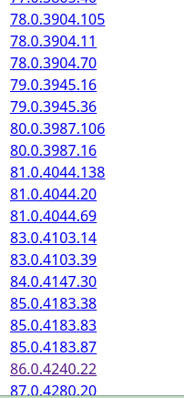
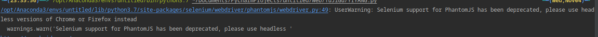

# operating environment
系统：manjaro-xfce-20.2
IDE：Pycharm

个人看法：
系统的话当然是Mac最好了，但是价格摆在那。
没有的话在 Linux 和 Win更推崇使用 Linux，能够对电脑有一个更好的了解，熟悉命令之后使用体验是绝佳的，并且哪怕是长时间的待机，以及系统运行了很长的周期也不会像 Win 那样变得卡顿，而不得不去做一些清理甚至是重装系统，哪怕是重装系统，Win的软件如果多的话一个一个的安装会很耗费时间，而 Linux 的话可以在空闲的时候去编写一个脚本，下次只需准备好包、环境、依赖，运行一下脚本即可慢慢等待安装，后期再根据不同的软件稍微调整一下就可以了。

IDE目前尝试了 Pycharm  和 Spyder ，一开始使用的是 Pycharm ，但是自己的笔记本在运行的时候有些吃力，想要换一个较为轻量级但是又无需过多配置的，就去尝试了 Spyder ，但是使用感受不是很好，打开的时候会花费很长的时间，使用中代码的提示有很长的延迟，运行的时候有些莫名奇妙的非代码运行错误的提示，创建文件夹及文件的时候，位置每一次都需要去进行选择，删除文件、文件夹的时候UI界面不会刷新，但其实已经删除了，只有重启才行，在做爬虫的时候很多时候需要复制其html、js代码进行格式化后详细分析， Spyder 无法做到，对于数据库的可视化不支持，最终，还是回到了 Pycharm。
准备：
```
yay -S pkg-config
yay -S gcc
yay -S make
```
# IDE  、Pycharm
以下是基于版本2019.3
(1)、去官网 ( https://www.jetbrains.com/ ) 下载自己所需的 linux 的 tar,gz 压缩包，命令行移动到自己安装的目录，个人习惯选择 /opt/

(2)、解压包 解压全部命令参考：

```
tar –xvf file.tar  解压 tar
tar -xzvf file.tar.gz 解压tar.gz
tar -xjvf file.tar.bz2   解压 tar.bz2
tar –xZvf file.tar.Z   解压tar.Z
unrar e file.rar 解压rar
unzip file.zip 解压zip
可能因为权限不够导致解压失败，建议以超级用户解压
```

(3)、把 jetbrains-agent.jar 破解包移动到其bin目录下。

(4)、修改* .vmoptions 和 *64.vmoptions 这两个文件， 在文件最后加入。
```
-javaagent:安装目录/jetbrains-agent.jar
```
(5)、启动 切换到 bin 目录下或写入绝对路径 cd /opt/soft_name/bin sh name.sh。

(6)、进入正常配置界面，选择 Activation code 找到能用的从code添加注册即可破解。

(7)、可能会没有快捷方式： 附上快捷方式制作：
创建快捷方式：
```
sudo vim /usr/share/applications/Pycharm.desktop
```
粘贴模板：
第一个是最基本的能够获取到工作目录以及添加图标的，以前在 ubuntu 可以正常使用，但是在 manjaro 的时候缺少一些东西，不能对图标进行编辑，而且用的是 svg 那个图，不能被识别，添加到桌面后图标为灰色，所以用的是第二个，
```
[Desktop Entry]
Version=1.0
Type=Application
Name=Pycharm
Icon=/opt/pycharm-2019.3.1/bin/pycharm.svg
Exec="/opt/pycharm-2019.3.1/bin/pycharm.sh" %f
Comment=Lightning-smart Python IDE
Categories=Development;IDE;
Terminal=false
StartupWMClass=jetbrains-pycharm
```

```
[Desktop Entry]
Categories=Development;IDE;
Comment[en_US]=The smartest Python IDE
Comment=The smartest Python IDE
Exec="/opt/pycharm-anaconda-2019.3.1/bin/pycharm.sh" %f
GenericName[en_US]=
GenericName=
Icon=/opt/pycharm-anaconda-2019.3.1/bin/pycharm.png
MimeType=
Name[en_US]=Pycharm
Name=Pycharm
Path=
StartupNotify=true
StartupWMClass=jetbrains-pycharm
Terminal=false
TerminalOptions=
Type=Application
Version=1.0
X-DBUS-ServiceName=
X-DBUS-StartupType=
X-KDE-RunOnDiscreteGpu=false
X-KDE-SubstituteUID=false
X-KDE-Username=
```

<p class='ind'>我们需要替换掉两个地方：Exec="xx" 和Icon= ,这里要替换掉我们的 pycharm 解压的目录， 然后保存退出之后 打开 搜索 找到图标 pycharm 然后将其拖到需要放置的位置即可</p>
后期有了更方便的方法，直接使用后将破解插件拖拽进去安装完成重启即可破解。

----

 [ 2 ] 、Anaconda

```
yay -S anaconda
sudo vim ~/.zshrc  # 添加环境变量
source ~/.zshrc  # 刷新
```

安装后需要在 .zshrc 或 .bashrc 里设置路径 `export PATH="/opt/anaconda/bin:$PATH"`
如果没用 zsh 就是在 .bashrc里设置，否则使用 conda命令无效

貌似安装的是 Anaconda 是默认2,3整合的，整体的大小1G多，而官网的才仅仅500多M，不过最开始自己安装的时候也没怎么留意
后面更新的时候一直报错，无法正常更新，虽然更新不是必要的，但是强迫症还是想更新下，索性换个安装方法吧
最开始下载了Anaconda3-2020.07-Linux-ppc64le.sh，安装报错，版本不对无法进行编译

下载了另一个版本Anaconda3-2020.07-Linux-x86_64.sh
切换到下载的目录下执行`./Anaconda3-2020.07-Linux-x86_64.sh`按照提示编译即可
同样安装之后也需要配置环境变量


# Virtual environment
##  Pyenv + Pyenv-Virtualenv
```
yay -S pyenv # 管理版本
yay -S pyenv-virtualenv # 是一个插件，管理环境
```
没怎么用过，

##  virtualenv +  virtualenvwrapper
```
$ sudo pip install virtualenv
$ mkdir my_venv_folder
$ cd  my_venv_folder

# 创建虚拟环境目录:这里起名为 venv_name
# 环境创建完成之后, 此目录下回新增 bin, include, lib 几个目录
$ virtualenv venv_name 

# 激活环境 (通常情况下, 激活环境后Linux提示符会有改变)
$ source bin/activate

# 查看当前环境下的 python 和 pip 的指向路径
(venv_name)...$ which python
(venv_name)...$ which pip

# 当前环境安装 requests 包
(venv_name)...$ pip install requests

# 脱离当前环境
(venv_name)...$ deactivate

# 再次查看python命令执行时, 已经是系统默认的了
$ which python
```
```
# 安装
# 使用 pip 进行安装 (记得是系统环境下哦)
$ sudo pip install virtualenvwrapper

# Mac自带的 six包 版本过低且不能自动更新时
$ sudo pip install virtualenvwrapper --upgrade --ignore-installed six

# 环境配置
# 查看 virtualenvwrapper.sh 路径
$ which virtualenvwrapper.sh
/usr/local/bin/virtualenvwrapper.sh

# 配置环境变量 (以后创建的环境目录都集中放在 $WORKON_HOME 目录下管理了)
# 配置文件位置: ~/.bashrc (bash) 或 ~/.zshrc (zsh)
export WORKON_HOME=$HOME/.virtualenvs
source /usr/local/bin/virtualenvwrapper.sh
```

```
# workon  进入|切换 环境
$ workon ENVNAME

# mkvirtualenv 创建环境
$ mkvirtualenv [-a project_path] [-i package] [-r requirements_file] [virtualenv options] ENVNAME

# lsvirtualenv 展示环境列表
$ lsvirtualenv [-b] [-l] [-h]

# rmvirtualenv 删除环境
$ rmvirtualenv ENVNAME

# cpvirtualenv 复制环境
$ cpvirtualenv ENVNAME [TARGETENVNAME]

# allvirtualenv 所有环境运行命令 (比如安装包)
$ allvirtualenv command with arguments
$ allvirtualenv pip install -U pip

# deactivate 退出当前环境
$ deactivate

# mkproject  创建项目
$ mkproject [-f|--force] [-t template] [virtualenv_options] ENVNAME
```

## 使用 conda
anaconda东西很多，但是目前不太需要，所以选择 miniconda，具体的选择看每个人的需求
但不管是anaconda 还是 miniconda 都能正常的使用 conda
### 列出所有的环境
```
conda info --envs
```
### 创建虚拟环境
这次让我们来创建并命名一个新环境，然后安装另一个版本的python以及两个包 Astroid 和 Babel。
```
conda create -n vit_name python=3 Astroid Babel
```

### 复制虚拟环境。
```
conda create -n new_vit --clone old_vit
```

### 删除虚拟环境
```
conda remove -n vit_name --all
```

### 注销该环境
当你完成了在snowflakes环境中的工作室，注销掉该环境并转换你的路径到先前的状态：
```
source deactivate
```

## Tox
先保留着，万一需要的话

>1、tox简介
tox是通用的虚拟环境管理和测试命令行工具。tox能够让我们在同一个Host上自定义出多套相互独立且隔离的python环境，每套虚拟环境中可能使用了不同的 Python 拦截器/环境变量设置/第三方依赖包。所以 tox 最典型的应用就是用于测试 Python 程序的兼容性了。tox是openstack社区最基本的测试工具，比如python程序的兼容性、UT等。
它的目标是提供最先进的自动化打包、测试和发布功能。
1）作为持续集成服务器的前端，大大减少测试工作所需时间；
2）检查软件包能否在不同的python版本或解释器下正常安装；
3）在不同的环境中运行测试代码。
一般 openstack 项目中的 tox 的功能包含了: 打源码包(sdist)、单元测试(UT)、测试覆盖率(coverage)、代码格式检查(pep8，flake) 等功能.
关键字解释：打源码包（sdist）、单元测试（UT）、测试覆盖率（coverage）、代码格式检查（pep8，flake）

项目地址 ： [https://github.com/tox-dev/tox](https://github.com/tox-dev/tox)

# Database
## Redis
### 安装
```
wget http://download.redis.io/releases/redis-6.0.8.tar.gz
tar xzf redis-6.0.8.tar.gz
cd redis-6.0.8
sudo make
sudo make install
```
运行完成后Redis会安装到/usr/local/bin目录下
### 启动redis
```
redis-server # 
```
### 连接
```
redis-cli 

```
## MongoDB
### 安装
下载：[https://fastdl.mongodb.org/linux/mongodb-linux-x86_64-4.0.9.tgz](https://fastdl.mongodb.org/linux/mongodb-linux-x86_64-4.0.9.tgz)
解压复制到/opt
添加环境变量
export PATH="/opt/mongodb-linux-x86_64-4.0.9/bin/:$PATH"

### 启动
```

mkdir -p /home/fiki/Data/mongodb
mongod --dbpath /home/fiki/Documents/Data/mongodb --logpath /home/fiki/Documents/Data/mongod.log --fork

--dbpath 指定数据目录
--dblog  指定日志位置
--fork  以守护进程的方式运行MongoDB，创建服务器进程
```

### 连接
```
mongo
```

## MySQL
### 下载解压
[https://cdn.mysql.com//Downloads/MySQL-8.0/mysql-8.0.21-linux-glibc2.12-x86_64.tar.xz](https://cdn.mysql.com//Downloads/MySQL-8.0/mysql-8.0.21-linux-glibc2.12-x86_64.tar.xz)下载包解压至/opt,解压至哪看个人喜好了
```
xz -d mysql-8.0.21-linux-glibc2.12-x86_64.tar.xz
tar -xv -f mysql-8.0.21-linux-glibc2.12-x86_64.tar
```
### 创建mysql用户
```
# 不需要创建HOME目录
useradd -r mysql -M
# 将MySQL安装目录的拥有者以及用户组修改为mysql
sudo chown -R mysql:mysql /opt/mysql-8.0.21-linux-glibc2.12-x86_64/
```

### 修改mysql配置文件/etc/my.cnf
```
[client]
# 设置 mysql 客户端 socket 文件位置
socket = /opt/mysql-8.0.21-linux-glibc2.12-x86_64/mysql.sock

[mysql]
# 设置mysql客户端默认字符集
default-character-set = UTF8MB4
socket = /opt/mysql-8.0.21-linux-glibc2.12-x86_64/mysql.sock

[mysqld]
innodb_buffer_pool_size = 128M

# mysql 安装目录
basedir = /opt/mysql-8.0.21-linux-glibc2.12-x86_64/

# mysql 数据存储目录
datadir = /opt/mysql-8.0.21-linux-glibc2.12-x86_64/data

# 端口
port = 3306

# 本机序号为1，表示master
server_id = 1

# 设置 mysql 服务端 socket 文件位置
socket = /opt/mysql-8.0.21-linux-glibc2.12-x86_64/mysql.sock

# 设置mysql最大连接数
max_connections = 20

# 服务端使用的字符集默认为8比特编码的latin1字符集
character-set-server = UTF8MB4

# 创建新表时将使用的默认存储引擎
default-storage-engine = INNODB

# 联合查询操作所能使用的缓冲区大小，和sort_buffer_size一样，该参数对应的分配内存也是每连接独享。
join_buffer_size = 128M

# MySQL执行排序使用的缓冲大小。如果想要增加ORDER BY的速度，首先看是否可以让MySQL使用索引而不是额外的排序阶段。
sort_buffer_size = 8M

# MySQL的随机读缓冲区大小。当按任意顺序读取行时(例如，按照排序顺序)，将分配一个随机读缓存区。
read_rnd_buffer_size = 4M 

# 一个事务，在没有提交的时候，产生的日志，记录到Cache中；等到事务提交需要提交的时候，则把日志持久化到磁盘。
# 默认binlog_cache_size大小32K
binlog_cache_size = 1M

# 这个值（默认8）表示可以重新利用保存在缓存中线程的数量，当断开连接时如果缓存中还有空间，那么客户端的线程将被放到缓存中，
# 如果线程重新被请求，那么请求将从缓存中读取,如果缓存中是空的或者是新的请求，那么这个线程将被重新创建,如果有很多新的线程，
# 增加这个值可以改善系统性能.通过比较Connections和Threads_created状态的变量，可以看到这个变量的作用。(–>表示要调整的值)
# 根据物理内存设置规则如下：
# 1G  —> 8
# 2G  —> 16
# 3G  —> 32
# 大于3G  —> 64
thread_cache_size = 8

# MySQL的查询缓冲大小（从4.0.1开始，MySQL提供了查询缓冲机制）使用查询缓冲，MySQL将SELECT语句和查询结果存放在缓冲区中，
# 今后对于同样的SELECT语句（区分大小写），将直接从缓冲区中读取结果。根据MySQL用户手册，使用查询缓冲最多可以达到238%的效率。
# 通过检查状态值'Qcache_%'，可以知道query_cache_size设置是否合理：如果Qcache_lowmem_prunes的值非常大，则表明经常出现缓冲不够的情况，
# 如果Qcache_hits的值也非常大，则表明查询缓冲使用非常频繁，此时需要增加缓冲大小；如果Qcache_hits的值不大，则表明你的查询重复率很低，
# 这种情况下使用查询缓冲反而会影响效率，那么可以考虑不用查询缓冲。此外，在SELECT语句中加入SQL_NO_CACHE可以明确表示不使用查询缓冲
# query_cache_size = 8M

# 指定单个查询能够使用的缓冲区大小，默认1M
# query_cache_limit = 2M

# 指定用于索引的缓冲区大小，增加它可得到更好处理的索引(对所有读和多重写)，到你能负担得起那样多。如果你使它太大，
# 系统将开始换页并且真的变慢了。对于内存在4GB左右的服务器该参数可设置为384M或512M。通过检查状态值Key_read_requests和Key_reads，
# 可以知道key_buffer_size设置是否合理。比例key_reads/key_read_requests应该尽可能的低，
# 至少是1:100，1:1000更好(上述状态值可以使用SHOW STATUS LIKE 'key_read%'获得)。注意：该参数值设置的过大反而会是服务器整体效率降低
key_buffer_size = 4M

# 分词词汇最小长度，默认4
ft_min_word_len = 4

# MySQL支持4种事务隔离级别，他们分别是：
# READ-UNCOMMITTED, READ-COMMITTED, REPEATABLE-READ, SERIALIZABLE.
# 如没有指定，MySQL默认采用的是REPEATABLE-READ，ORACLE默认的是READ-COMMITTED
transaction_isolation = REPEATABLE-READ

# 默认时区
default-time_zone = '+8:00'

sql_mode=NO_ENGINE_SUBSTITUTION,STRICT_TRANS_TABLES,NO_ZERO_DATE,NO_ZERO_IN_DATE,ERROR_FOR_DIVISION_BY_ZERO
```
### 添加环境变量
```
export PATH=/opt/mysql-8.0.21-linux-glibc2.12-x86_64/bin/:$PATH
```
### 初始化数据库
```
此命令将输出root的初始密码
sudo mysqld --initialize --user=mysql --basedir=/opt/mysql-8.0.21-linux-glibc2.12-x86_64/ --datadir=/opt/mysql-8.0.21-linux-glibc2.12-x86_64/data
```
#### 报错


`yay -S numactl`后正常

```
启动
没有添加环境变量
sudo /opt/mysql-8.0.21-linux-glibc2.12-x86_64/support-files/mysql.server start
关闭
sudo /opt/mysql-8.0.21-linux-glibc2.12-x86_64/support-files/mysql.server stop

添加后
sudo mysql.server start
sudo mysql.server stop 
```

### 连接测试


```
Manjaro默认有libtinfo.so.6而没有libtinfo.so.5，软件如果需要可执行以下命令安装：
sudo pacman -S ncurses5-compat-libs
#或
sudo pacman -S libtinfo5#这两条命令会安装一样的包
```

### 修改密码
```
alter user 'root'@'localhost' identified with mysql_native_password by '新密码'; 
&& 修改密码，密码必改，不改初始密码是随机的很难记，而且后期使用也会提示改密码的，无法使用初始密码
```


## Dbeaver(数据可视化工具)
本身安装不是很困难，不建议使用pacman安装，其他的软件也不建议使用pacman，里面很多的软件都不更新很久了，yay还可以，但是软件本身是收费的，不激活只能使用社区版(功能受限制)

>多平台数据库可视化工具，目前的redis，mysql，mongodb等等都有
不要使用yay或者pacman安装，安装的是社区版，社区版的功能有限，比如不支持mnongodb，redis
DBeaverEE **7.0.0**及以下版本（理论上适用于目前所有新老版本）的破解
下载相应的包并安装，这里就不给出地址了，网上应该能找到。
破解方法:
 >(1). 解压DBeaverEE到自己想要安装的位置。
 >(2). 将下载压缩包解压后得到dbeaver-agent.jar，把它放到你认为合适的文件夹内。为了方便管理，就放在解压的/opt/dbeaver/目录下
 >(3). 在DBeaverEE安装目录下找到dbeaver.ini文件
 >(4). 在打开的dbeaver.ini编辑窗口末行添加："-javaagent:/opt/dbeaver//dbeaver-agent.jar"
    一定要自己确认好路径，填错会导致DBeaverEE打不开！！！最好使用绝对路径。
 >(5). 启动DBeaverEE即可。注意快捷方式里面的默认指定位置是不对的，所以打不开，自己去修改下复制到快捷方式所在的目录即可。
> (6). 如果提示错误: 
    "Error opening zip file or JAR manifest missing : dbeaver-agent.jar"
    这种情况请试着填上jar文件的绝对路径.

注意！！！！
软件运行需要java环境，之前在manjaro-kde的时候不知是自带了还是不知不觉安装了运行的时候没有问题，这次换了manjaro-xfce，提示需要java环境，手动安装了jdk14,还是错，再安装jdk8还是错，无法找到环境，最后在网上找了了一个方法，找到dbeaver.ini文件，直接在里面写入安装的环境位置就可以了，留意换行不可缺少,位置的话最好按照现有的来吧，但是插入在最后是无效的
```
-vm 
/jdk_path/bin/
```

```
-startup
plugins/org.eclipse.equinox.launcher_1.5.700.v20200207-2156.jar
--launcher.library
plugins/org.eclipse.equinox.launcher.gtk.linux.x86_64_1.1.1100.v20190907-0426
-vm 
/opt/jdk1.8.0_221/bin/
-vmargs
-XX:+IgnoreUnrecognizedVMOptions
--add-modules=ALL-SYSTEM
-Xms128m
-Xmx2048m
-javaagent:/opt/dbeaver/dbeaver-agent.jar
```


# Others_tools
## JDK
目前主要是为了配置 Dbeaver 所需的环境，记录一下吧
[https://www.oracle.com/](https://www.oracle.com/)  官网下载老版本需要登录，而且不知道不使用代理的情况下速度能怎样，索性找了一个镜像  [https://mirrors.tuna.tsinghua.edu.cn/AdoptOpenJDK/](https://mirrors.tuna.tsinghua.edu.cn/AdoptOpenJDK/)

解压后配置环境变量就可以了，不知道是不是因为使用zsh替换了之前的bash，在/etc/profile里面配置的环境变量无效，在.zshrc里面的有效

## RedisDump 

## Charles 
抓包工具
官方网站：[https://www.charlespCharlesroxy.com](https://www.charlespcharlesroxy.com)
付费软件，第一次使用提示有免费30天的试用期限，过后据说会没过30分钟会强制关闭一次
破解：
网上提供的生成破解jar文件的网址已经无法生成，指向的github项目也提示侵权删除了，但是根据名字还能够在github找到相应的，下载了jar文件后，先正常打开一次软件，再关闭，替换原本安装文件的charles.jar文件再次打开就是破解激活的了

### PC端：
使用的话由于chrome使用了插件控制代理，占用了一些端口，而且插件、脚本过多，在打开网页的时候那些插件、脚本也会有网络请求，为了数据的干净利于分析，用firefox作为监控的浏览器。浏览器的代理、端口设置与软件一样，这样浏览器打开网页就可以捕获到相应的数据了

### 手机端：
1、需要保证PC 端 和 手机端在同一网络下
2、通过 Charles 的主菜单 Help | Local IP Address 或者通过命令行工具输入 ipconfig 查看本机的 IP 地址。
3、长按手机当前连接的wifi网络，这时会有弹窗，选择修改网络，进入网络详情，勾选【高级选项】，【代理】选择手动，【代理服务器主机名】填写第一步中得到的电脑的局域网ip，【代理服务器端口】填写8888。这个时候Charles会有一个弹窗，（没有的话手机断开wifi重连一下），选择ALLOW，这个时候Charles就会对手机的请求进行抓包。[这步根据不同手机会略有差异]
>对于Https的请求, 安装证书
Charles中选择【Help】-【SSL Proxying】-【Save Charles Root Certificate...】将一个证书charles-ssl-proxying-certificate.pem下载到本地，然后将charles-ssl-proxying-certificate.pem放到手机SD卡的某一个位置，进入手机，【设置】-【安全】-【从SD卡安装】，然后选择前面放置在SD卡的charles-ssl-proxying-certificate.pem证书，将这个证书安装到手机。这样对应Https的请求就不会提示证书的问题了。
>
>Charles抓取http和https的请求了，但是有的时候，我们发现还是有些包抓取不到或者显示为unknown，那就可能是APP使用了SSL强验证，也就是说APP对SSL证书进行了绑定，这个时候的解决版本就是使用Xposed+JustTrustMe关闭SSL证书验证，JustTrusMe是将APP中所用于校验的API进行HOOK从而达到绕过强验证的目的。
## mitmproxy
官方网站：[https://mitmproxy.org](https://mitmproxy.org)

## appium (appium -desktop) 
官方网站：[http://appium.io](http://appium.io)
这个需要的东西比较多,nodejs,npm,sdk,jdk等等
jdk之前有安装了Android Studio,再通过图形化的方式安装sdk
sdk安装
nodejs下载相应的包解压添加环境变量就可以了,目前我用的12.18.4,自带了npm
```
npm install -g appium-doctor [[用于检查待会是否配好了appium]]的环境
appium-doctor --android  # 检查环境
```
之前是有人提议使用 `npm install -g appium` 安装,但是已经提前下好了appium的包,所以检查的时候出了一些问题

' opencv4nodejs cannot be found '
' mjpeg-comsumer cannot be found的问题 '
```
cmake --version  提示不存在则安装,有跳过
yay -S cmake manjaro下安装cmkae
npm -g install opencv4nodejs 但是这样会有些慢,用的国外源,建议使用代理
npm i -g mjpeg-consumer
```

' bundletool.jar cannot be found '
>在https://github.com/google/bundletool/releases 下载bundletool.jar，
改名成这个bundletool
在android sdk目录下，创建bundle-tool目录，把jar包放入，
在终端切换到当前目录下
并执行chmod +655 bundletool.jar命令给jar包加权限
修改环境变量，path后追加，:$ANDROID_HOME/bundle-tool/，

连接手机:
手机连上电脑以后，打开手机开发人员选项。在电脑终端中运行以下命令查看手机的UDID

使用:

主要的四个参数:
```
{
  "platformName": "Android", # 设备平台。填Android或IOS
  "deviceName": "360_n7_lite", # 设备名。按上边adb查出的设备名填写即可
  "appPackage": "com.kmw.chemeizu", # 要启动的app的包名
  "appActivity": "com.uzmap.pkg.LauncherUI"  # 要启动的界面
}

```
获取 appPackag, appActivity 的方式:
使用sdk带的aapt工具
网上有很多的工具去提取已经安装的软件变成安装包,
```
~/Android/Sdk/build-tools/30.0.2/aapt dump badging /path/softpackage_name.apk | grep "package"
~/Android/Sdk/build-tools/30.0.2/aapt dump badging /path/softpackage_name.apk | grep "launchable-activity"
```

## tesseract


这里推荐一个可视化工具 RoboMongo/Robo 3T，它使用简单，功能强大，官方网站为 https://robomongo.org/，三大平台都支持，下载链接为 https://robomongo.org/download。
另外，还有一个简单易用的可视化工具 —— Studio 3T，它同样具有方便的图形化管理界面，官方网站为 https://studio3t.com，同样支持三大平台，下载链接为 https://studio3t.com/download/。


# Library
## requests
requests 库是一个阻塞式 HTTP 请求库，当我们发出一个请求后，程序会一直等待服务器响应，直到得到响应后，程序才会进行下一步处理。

## selenium
### ChromeDriver
Selenium 的对接 Chrome 的驱动 ChromeDriver
下载的时候需要看chrom浏览器的版本号选择相应的版本，不清楚的去官方网站看详细介绍，下载后要么移动到/usr/bin中要么添加环境变量，个人习惯为了系统的整洁选择添加环境变量

官方网站：[https://sites.google.com/a/chromium.org/chromedriver](https://sites.google.com/a/chromium.org/chromedriver)
下载地址：[https://chromedriver.storage.googleapis.com/index.html](https://chromedriver.storage.googleapis.com/index.html)

### GeckoDriver
Selenium 的对接 Firefox 的驱动 GeckoDriver。
下载地址：[https://github.com/mozilla/geckodriver/releases](https://github.com/mozilla/geckodriver/releases)

### PhantomJS
PhantomJS 是一个无界面的、可脚本编程的 WebKit 浏览器引擎，它原生支持多种 Web 标准：DOM 操作、CSS 选择器、JSON、Canvas 以及 SVG。

### 问题
使用会出一些问题：

大概意思是 selenium 经不支持 PhantomJS 了，解决方法有两个
一、使用较老版本的 selenium ，同时也要使用较老版本的 python3
二、使用 Selenium+Headless Firefox 或 Selenium+Headless Chrome

## aiohttp
aiohttp 是一个提供异步 Web 服务的库，从 Python 3.5 版本开始，Python 中加入了 async/await 关键字，使得回调的写法更加直观和人性化。aiohttp 的异步操作借助于 async/await 关键字的写法变得更加简洁，架构更加清晰。使用异步请求库进行数据抓取时，会大大提高效率。

## lxml
lxml 是 Python 的一个解析库，支持 HTML 和 XML 的解析，支持 XPath 解析方式，而且解析效率非常高

## BeautifulSoup
Beautiful Soup 是 Python 的一个 HTML 或 XML 的解析库，我们可以用它来方便地从网页中提取数据。

## pyquery
pyquery 同样是一个强大的网页解析工具，它提供了和 jQuery 类似的语法来解析 HTML 文档，支持 CSS 选择器，使用非常方便。

## pymysql
## pymongo
## redis-py

## Flask
Flask 是一个轻量级的 Web 服务程序，它简单、易用、灵活，这里主要用来做一些 API 服务。
## Tornado
Tornado 是一个支持异步的 Web 框架，通过使用非阻塞 I/O 流，它可以支撑成千上万的开放连接，效率非常高。    

## ~~pyspider~~
pyspider 是国人 binux 编写的强大的网络爬虫框架，它带有强大的 WebUI、脚本编辑器、任务监控器、项目管理器以及结果处理器，同时支持多种数据库后端、多种消息队列，另外还支持 JavaScript 渲染页面的爬取，使用起来非常方便

额，运行的时候很多问题，弄了很久没弄好，且不如scrapy，干脆放弃了

## Scrapy 
Scrapy 是一个十分强大的爬虫框架，依赖的库比较多，至少需要依赖的库有 Twisted 14.0、lxml 3.4 和 pyOpenSSL 0.14。在不同的平台环境下，它所依赖的库也各不相同，所以在安装之前，最好确保把一些基本库安装好。
 
## tesserocr
需要先安装tesseract，否则会安装不成功

## pillow（PIL）
tesserat识别的时候，大多图片是需要处理才能更准确的识别的