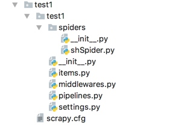

# scrapy 简介
下图显示了Scrapy架构及其组件的概述，以及系统内部发生的数据流的概要（以红色箭头显示）。下面提供了这些组件的简要说明以及有关它们的详细信息的链接。数据流也描述如下。

Scrapy中的数据流由执行引擎控制，如下所示：

这个 Engine 获取要从 Spider .

这个 Engine 在中安排请求 Scheduler 并请求下一个要爬行的请求。

这个 Scheduler 将下一个请求返回到 Engine .

这个 Engine 将请求发送到 Downloader ，通过 Downloader Middlewares （见 process_request() ）

一旦页面完成下载， Downloader 生成响应（使用该页）并将其发送到引擎，并通过 Downloader Middlewares （见 process_response() ）

这个 Engine 接收来自的响应 Downloader 并发送到 Spider 用于处理，通过 Spider Middleware （见 process_spider_input() ）

这个 Spider 处理响应并向 Engine ，通过 Spider Middleware （见 process_spider_output() ）

这个 Engine 将已处理的项目发送到 Item Pipelines ，然后将已处理的请求发送到 Scheduler 并请求可能的下一个爬行请求。

该过程重复（从步骤1开始），直到不再有来自 Scheduler .

## 各个组件介绍
### 爬虫引擎(ENGINE)
爬虫引擎负责控制各个组件之间的数据流，当某些操作触发事件后都是通过engine来处理。

### 调度器(SCHEDULER)
调度接收来engine的请求并将请求放入队列中，并通过事件返回给engine。

### 下载器(DOWNLOADER)
通过engine请求下载网络数据并将结果响应给engine。

### Spider
Spider发出请求，并处理engine返回给它下载器响应数据，以items和规则内的数据请求(urls)返回给engine。
spider是Scrapy用户编写的自定义类，用于解析响应和提取 items 从他们或其他要求跟随。

### 管道项目(item pipeline)
负责处理engine返回spider解析后的数据，并且将数据持久化，例如将数据存入数据库或者文件。
项目管道负责处理被蜘蛛提取（或 爬取 ）的项目。典型的任务包括清理、验证和持久性（如将项目存储在数据库中）

### 下载中间件
下载器中间件是位于引擎和下载器之间的特定钩子，当它们从引擎传递到下载器时处理请求，以及从下载器传递到引擎的响应。

如果需要执行以下操作之一，请使用下载器中间件：

在将请求发送给下载者之前处理该请求（即在Scrapy将请求发送到网站之前）；

变更在传递给spider之前收到响应；

发送新的请求，而不是将收到的响应传递给spider；

在不获取网页的情况下将响应传递给蜘蛛；

悄悄地放弃一些请求。

### spider中间件
蜘蛛中间件是位于引擎和蜘蛛之间的特定钩子，能够处理蜘蛛的输入（响应）和输出（项目和请求）。

如果需要，使用蜘蛛中间件

spider回调的后处理输出-更改/添加/删除请求或项；

后处理启动请求；

处理spider异常；

对一些基于响应内容的请求调用errback，而不是回调。

### 事件驱动的网络¶
Scrapy是用 Twisted 是一个流行的事件驱动的python网络框架。因此，它使用非阻塞（即异步）代码实现并发性。

# 简单使用(scrapy.Spider¶)

```
scrapy startproject test1  # 创建一个项目
cd test1  # 切换到项目目录下
scrapy genspider shSpider hshfy.sh.cn  # 创建一个爬虫，并指定项目的域名
```

items.py 负责数据模型的建立，类似于实体类。
middlewares.py 自己定义的中间件。
pipelines.py 负责对spider返回数据的处理。
settings.py 负责对整个爬虫的配置。
spiders目录 负责存放继承自scrapy的爬虫类。
scrapy.cfg scrapy基础配置

例子：
```
import scrapy

class MySpider(scrapy.Spider):
    name = 'example.com'
    allowed_domains = ['example.com']
    start_urls = [
        'http://www.example.com/1.html',
        'http://www.example.com/2.html',
        'http://www.example.com/3.html',
    ]

    def parse(self, response):
        for h3 in response.xpath('//h3').getall():
            yield {"title": h3}

        for href in response.xpath('//a/@href').getall():
            yield scrapy.Request(response.urljoin(href), self.parse)
```
start_urls 支持多个链接，scrapy 会自动读取然后利用自己定义的 start_requests() 方法发起请求然后再返回给 parse() 函数。
如果需要，可以在请求之前做一些处理，如对url的一些处理等等，可以重写父类的start_requests()方法
如下：
```
import scrapy
from myproject.items import MyItem

class MySpider(scrapy.Spider):
    name = 'example.com'
    allowed_domains = ['example.com']

    def start_requests(self):
        yield scrapy.Request('http://www.example.com/1.html', self.parse)
        yield scrapy.Request('http://www.example.com/2.html', self.parse)
        yield scrapy.Request('http://www.example.com/3.html', self.parse)

    def parse(self, response):
        for h3 in response.xpath('//h3').getall():
            yield MyItem(title=h3)

        for href in response.xpath('//a/@href').getall():
            yield scrapy.Request(response.urljoin(href), self.parse)
```
# CrawlSpider
```
scrapy genspider -t crawl shSpider hshfy.sh.cn  # 创建一个模板爬虫，并指定项目的域名
```

```
import scrapy
from scrapy.spiders import CrawlSpider, Rule
from scrapy.linkextractors import LinkExtractor

class MySpider(CrawlSpider):
    name = 'example.com'
    allowed_domains = ['example.com']
    start_urls = ['http://www.example.com']

    rules = (
        # Extract links matching 'category.php' (but not matching 'subsection.php')
        # and follow links from them (since no callback means follow=True by default).
        Rule(LinkExtractor(allow=('category\.php', ), deny=('subsection\.php', ))),

        # Extract links matching 'item.php' and parse them with the spider's method parse_item
        Rule(LinkExtractor(allow=('item\.php', )), callback='parse_item'),
    )

    def parse_item(self, response):
        self.logger.info('Hi, this is an item page! %s', response.url)
        item = scrapy.Item()
        item['id'] = response.xpath('//td[@id="item_id"]/text()').re(r'ID: (\d+)')
        item['name'] = response.xpath('//td[@id="item_name"]/text()').get()
        item['description'] = response.xpath('//td[@id="item_description"]/text()').get()
        item['link_text'] = response.meta['link_text']
        url = response.xpath('//td[@id="additional_data"]/@href').get()
        return response.follow(url, self.parse_additional_page, cb_kwargs=dict(item=item))

    def parse_additional_page(self, response, item):
        item['additional_data'] = response.xpath('//p[@id="additional_data"]/text()').get()
        return item
```

rules 中的 Rule() 可接收的参数解析

	link_extractor 是一种 Link Extractor 对象，该对象定义如何从每个爬网页面提取链接。每个生成的链接将用于生成 Request 对象，该对象将在其 meta 词典(在 link_text 密钥)。如果省略，将使用不带参数创建的默认链接提取器，从而提取所有链接。

	callback 是要为使用指定链接提取器提取的每个链接调用的可调用或字符串(在这种情况下，将使用来自具有该名称的爬行器对象的方法)。此回调接收一个 Response 作为其第一个参数，并且必须返回单个实例或 item objects 和/或 Request 对象(或其任何子类)。如上所述，收到的 Response 对象将包含生成 Request 在ITS中 meta 词典(在 link_text 密钥)

	cb_kwargs 是包含要传递给回调函数的关键字参数的dict。

	follow 是一个布尔值，用于指定是否从使用此规则提取的每个响应中遵循链接。如果 callback 没有 follow 默认为 True ，否则默认为 False .

	process_links 是一个可调用的，或一个字符串（在这种情况下，将使用具有该名称的蜘蛛对象中的方法），对于使用指定的 link_extractor . 这主要用于过滤目的。

	process_request 是一个可调用的(或字符串，在这种情况下，将使用来自具有该名称的爬行器对象的方法)，它将在 Request 按此规则提取。此可调用对象应将上述请求作为第一个参数，并且 Response 作为第二个参数从其发出请求。它必须返回一个 Request 对象或 None (用过滤发出请求)。

	errback 在处理规则生成的请求时引发任何异常时要调用的可调用或字符串（在这种情况下，将使用来自spider对象的具有该名称的方法）。它收到一个 Twisted Failure 实例作为第一个参数。


# Scrapy框架的命令行详解
全局的命令有：
	startproject
	genspider
	settings
	runspider
	shell
	fetch
	view
	version

项目命令有：
	crawl
	check
	list
	edit
	parse
	bench

startproject
这个命令没什么过多的用法，就是在创建爬虫项目的时候用

genspider
用于生成爬虫，这里scrapy提供给我们不同的几种模板生成 spider,默认用的是 basic,我们可以通过命令查看所有的模板

当我们创建的时候可以指定模板，不指定默认用的basic,如果想要指定模板则通过
scrapy genspider -t 模板名字

crawl
这个是用去启动spider爬虫格式为：
scrapy crawl 爬虫名字
这里需要注意这里的爬虫名字和通过scrapy genspider 生成爬虫的名字是一致的

check
用于检查代码是否有错误，scrapy check

list
scrapy list列出所有可用的爬虫

fetch
scrapy fetch url地址 
该命令会通过scrapy downloader 讲网页的源代码下载下来并显示出来

这里有一些参数：
--nolog 不打印日志
--headers 打印响应头信息
--no-redirect 不做跳转

view
scrapy view url地址
该命令会讲网页document内容下载下来，并且在浏览器显示出来
因为现在很多网站的数据都是通过ajax请求来加载的，这个时候直接通过requests请求是无法获取我们想要的数据，所以这个view命令可以帮助我们很好的判断

shell
这是一个命令行交互模式
通过scrapy shell url地址进入交互模式
这里我么可以通过css选择器以及xpath选择器获取我们想要的内容（xpath以及css选择的用法会在下个文章中详细说明）,例如我们通过scrapy shell http://www.baidu.com


settings
获取当前的配置信息
通过scrapy settings -h可以获取这个命令的所有帮助信息

runspider
这个和通过crawl启动爬虫不同，这里是scrapy runspider 爬虫文件名称
所有的爬虫文件都是在项目目录下的spiders文件夹中

version
查看版本信息，并查看依赖库的信息

