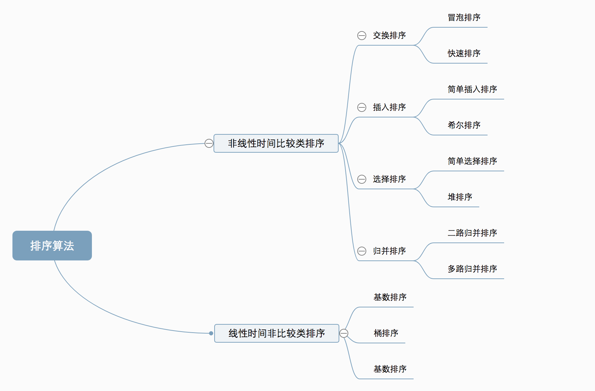

# 介绍
1. 分类
十种常见排序算法可以分为两大类：

非线性时间比较类排序：通过比较来决定元素间的相对次序，由于其时间复杂度不能突破 O(nlogn)，因此称为非线性时间比较类排序。

线性时间非比较类排序：不通过比较来决定元素间的相对次序，它可以突破基于比较排序的时间下界，以线性时间运行，因此称为线性时间非比较类排序。

2. 复杂度

3. 相关概念
稳定：如果 a 原本在 b 前面，而 a=b，排序之后 a 仍然在 b 的前面。

不稳定：如果 a 原本在 b 的前面，而 a=b，排序之后 a 可能会出现在 b 的后面。

时间复杂度：对排序数据的总的操作次数。反映当 n 变化时，操作次数呈现什么规律。

空间复杂度：是指算法在计算机内执行时所需存储空间的度量，它也是数据规模 n 的函数

# 1. 冒泡排序（bubble sort）
冒泡排序是一种简单的排序算法。它重复地走访过要排序的数列，一次比较两个元素，如果它们的顺序错误就把它们交换过来。走访数列的工作是重复地进行直到没有再需要交换，也就是说该数列已经排序完成。这个算法的名字由来是因为越小的元素会经由交换慢慢浮到数列的顶端。

1. 算法描述
比较相邻的元素。如果第一个比第二个大，就交换它们两个；
对每一对相邻元素作同样的工作，从开始第一对到结尾的最后一对，这样在最后的元素应该会是最大的数；
针对所有的元素重复以上的步骤，除了最后一个；
重复步骤 1~3，直到排序完成。

3. 什么时候最快
当输入的数据已经是正序时（都已经是正序了，我还要你冒泡排序有何用啊）。

4. 什么时候最慢
当输入的数据是反序时（写一个 for 循环反序输出数据不就行了，干嘛要用你冒泡排序呢，我是闲的吗）。

5. 代码实现

```
from typing import List

def bubble_sort(arr: List[int]):
    """
    冒泡排序(Bubble sort)
    :param arr: 待排序的List,此处限制了排序类型为int
    :return: 冒泡排序是就地排序(in-place)
    """
    length = len(arr)
    if length <= 1:
        return
    for i in range(1,length-1):
        is_made_swap = False  ## 设置标志位，若本身已经有序，则直接break
        for j in range(length - i):
            if arr[j] > arr[j + 1]:
                arr[j], arr[j + 1] = arr[j + 1], arr[j]
                is_made_swap = True
        if not is_made_swap:
            break
if __name__ == '__main__':
    import random
    random.seed(54)
    arr = [random.randint(0,100) for _ in range(10)]
    print("原始数据：", arr)
    bubble_sort(arr)
    print("冒泡排序结果：", arr)
```
# 2. 选择排序（selection sort）
选择排序 (Selection-sort) 是一种简单直观的排序算法。它的工作原理：首先在未排序序列中找到最小（大）元素，存放到排序序列的起始位置，然后，再从剩余未排序元素中继续寻找最小（大）元素，然后放到已排序序列的末尾。以此类推，直到所有元素均排序完毕。

1. 算法描述
n 个记录的直接选择排序可经过 n-1 趟直接选择排序得到有序结果。具体算法描述如下：

初始状态：无序区为 R[1..n]，有序区为空；

第 i 趟排序 (i=1,2,3…n-1) 开始时，当前有序区和无序区分别为 R[1..i-1] 和 R(i..n）。该趟排序从当前无序区中 - 选出关键字最小的记录 R[k]，将它与无序区的第 1 个记录 R 交换，使 R[1..i] 和 R[i+1..n) 分别变为记录个数增加 1 个的新有序区和记录个数减少 1 个的新无序区；

n-1 趟结束，数组有序化了。

3. 代码实现
```
def sele(arr):
    for i in range(len(arr)-1):
        min_ind = i
        for j in range(i+1,len(arr)):
            if arr[j]<arr[min_ind]:
                min_ind = j
        arr[i],arr[min_ind]= arr[min_ind],arr[i]

if __name__ == '__main__':
    import random
    random.seed(53)
    arr = [random.randint(0,100) for _ in range(10)]
    print("原始数据：", arr)
    sele(arr)
    print("排序结果：", arr)
```

选择排序和冒泡排序很相似，不同于冒泡排序的是，选择排序无需在每次判断的时候进行交换，而是以一个新变量记录最小数的位置，一次完毕后再交换位置。

# 3. 插入排序（insertion sort）
插入排序（Insertion-Sort）的算法描述是一种简单直观的排序算法。它的工作原理是通过构建有序序列，对于未排序数据，在已排序序列中从后向前扫描，找到相应位置并插入。

1. 算法描述
一般来说，插入排序都采用 in-place 在数组上实现。具体算法描述如下：

从第一个元素开始，该元素可以认为已经被排序；
取出下一个元素，在已经排序的元素序列中从后向前扫描；
如果该元素（已排序）大于新元素，将该元素移到下一位置；
重复步骤 3，直到找到已排序的元素小于或者等于新元素的位置；
将新元素插入到该位置后；
重复步骤 2~5。

3. 代码实现
```
def insertionSort(arr):
    for i in range(len(arr)):
        preIndex = i-1
        current = arr[i]
        while preIndex >= 0 and arr[preIndex] > current:
            arr[preIndex+1] = arr[preIndex]
            preIndex-=1
        arr[preIndex+1] = current
    return arr
```

4. 算法分析
插入排序在实现上，通常采用 in-place 排序（即只需用到 O(1) 的额外空间的排序），因而在从后向前扫描过程中，需要反复把已排序元素逐步向后挪位，为最新元素提供插入空间。

#4. 希尔排序（shell sort）
希尔排序属于插入排序的一种。也称缩小增量排序，是直接插入排序算法的一种更高效的改进版本, 该方法的基本思想是：先将整个待排元素序列分割成若干个子序列 （由相隔某个“增量”的元素组成的）分别进行直接插入排序， 然后依次缩减增量再进行排序，待整个序列中的元素基本有序（增量足够小）时， 再对全体元素进行一次直接插入排序。因为直接插入排序在元素基本有序的情况下 （接近最好情况），效率是很高的，因此希尔排序在时间效率比直接插入排序有较大提高。

1. 算法描述
先将整个待排序的记录序列分割成为若干子序列分别进行直接插入排序，具体算法描述：

选择一个增量序列 t1，t2，…，tk，其中 ti>tj，tk=1；

按增量序列个数 k，对序列进行 k 趟排序；

每趟排序，根据对应的增量 ti，将待排序列分割成若干长度为 m 的子序列，分别对各子表进行直接插入排序。仅增量因子为 1 时，整个序列作为一个表来处理，表长度即为整个序列的长度。

简单理解：
选择一个增量序列t1，t2，…，tk，其中ti>tj，tk=1 (增量的取法：第一次增量的取法为： d=count/2; 第二次增量的取法为: d=(count/2)/2; 最后一直到: d=1;)；
按增量序列个数k，对序列进行k 趟排序；
每趟排序，根据对应的增量ti，将待排序列分割成若干长度为m 的子序列，分别对各子表进行直接插入排序。仅增量因子为1 时，整个序列作为一个表来处理，表长度即为整个序列的长度。

3. 代码实现
```
from typing import List

def shell_sort(arr:List[int]):
    """
    希尔排序
    :param arr: 待排序的List
    :return: 希尔排序是就地排序(in-place)
    """
    length = len(arr)
    dist = length // 2

    while dist > 0:
        for i in range(dist, length):
            temp = arr[i]
            j = i
            while j >= dist and temp < arr[j-dist]:
                arr[j] = arr[j-dist]
                j -= dist
            arr[j] = temp
        dist //= 2
```
```
def shellSort(arr):
    import math
    gap=1
    while(gap < len(arr)/3):
        gap = gap*3+1
    while gap > 0:
        for i in range(gap,len(arr)):
            temp = arr[i]
            j = i-gap
            while j >=0 and arr[j] > temp:
                arr[j+gap]=arr[j]
                j-=gap
            arr[j+gap] = temp
        gap = math.floor(gap/3)
    return arr
```

# 5. 归并排序（marge sort）
算法原理：
1、把长度为n的输入序列分成两个长度为n/2的子序列；
2、对这两个子序列分别采用递归的进行排序；
3、将两个排序好的子序列排好的元素拿出来，按照顺序合并成一个最终的序列，即可完成排序

代码实现：
```
from typing import List

def merge(arr1:List[int], arr2:List[int]):
    result = []
    while arr1 and arr2:
        if arr1[0] < arr2[0]:
            result.append(arr1.pop(0))
        else:
            result.append(arr2.pop(0))
    if arr1:
        result += arr1
    if arr2:
        result += arr2
    return result

def merge_sort(arr:List[int]):
    """
    归并排序
    :param arr: 待排序的List
    :return: 排好序的List
    """
    if len(arr) <= 1:
        return arr
    mid = len(arr) // 2
    return merge(merge_sort(arr[:mid]), merge_sort(arr[mid:]))
if __name__ == '__main__':
    import random
    random.seed(54)
    arr = [random.randint(0,100) for _ in range(10)]
    print("原始数据：", arr)
    arr_new = merge_sort(arr)
    print("归并排序结果：", arr_new)
```
# 6. 快速排序（quick sort）

