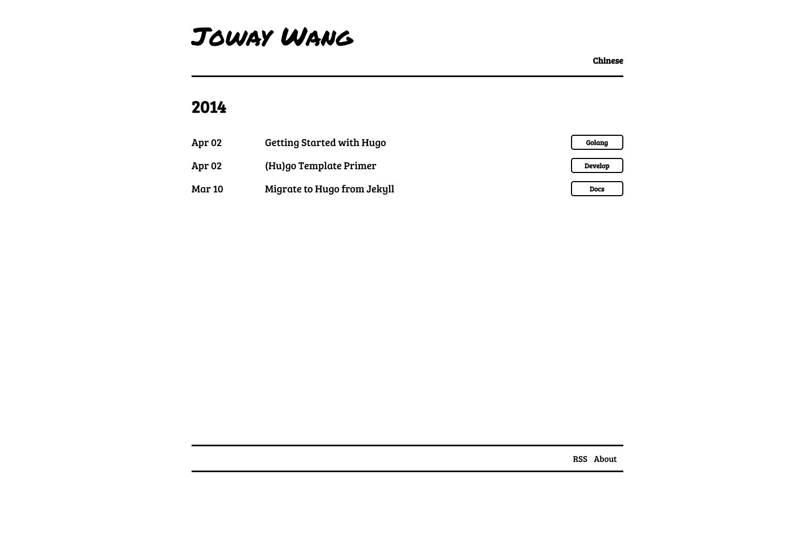

### Hugo 的使用
需要 go 环境

```
sudo dnf install hugo # 安装框架
hugo new site aiyoyo  # 生成站点,aoyoyo 是站点名，也就是文件夹名
```

查看`aiyoyo`文件夹，已经生成了简单配置，主要介绍几个文件夹或文件，

    `config`文件夹或`config.yaml、config.toml`,都是项目的其实配置，使用文件夹可以将配置拆分，更容易浏览。
    `content`文件夹: 这时自己 markdown 文章的存放地，编译是以这里面的文件为源，并不会影响到该文件夹的文件。里面的结构根据主题提供的配置或者自己的配置可更改。
    `public`:这是文件编译后输出的目录，如果使用像 `github page` 这样的静态服务，只需要复制这里面的所有文件到项目即可。
    `themes`:主题存放地址，主题一般会有一个`exampleSite`文件夹，里面有配置（配置也可能在主题的第一层文件夹），`content`的大概目录结构。对于主题的使用，根据主题的负责程度，使用的方法也不太一样，有的应该是其他主题转的，需要 `node` 编译后在使用，有的能直接使用，有的比较偷懒，什么介绍没有，想用的话就得自己研究下主题和 hugo 官方文档了。

换主题，只保留`themes`,`content`,其他的都可以删除。其他主题需要会自己再生成的。

`hugo new post/example.md` ,`post` 是`content`下的一个初始文件夹，并不是固定的，也可指定多级文件夹。创建一个新文件，这个文件可以使用其他编辑器编辑，实际用的不多。这样创建的好处是会自动添加一些元信息。我的是又一个 python 脚本，markdown 文本是没有元信息的纯净版本，复制过来再插入元信息。

```
hugo new test/test/test.md
──(Mon,Jan16)─┘
Content "/home/aiyoyo/Documents/AI/DEEP/Lalafell/content/test/test/test.md" created
```

`hugo`: 将文本根据主题编译，非常快，自己的 100 来篇文章，瞬间完成。

`hugo server`：hugo 提供了一个简版的 web 服务器, 用于预览静态网站。

`hugo server --buildDrafts`：开启服务器，但是支持动态加载，文件、配置的变更会实时的更新到网页。

下面给出一些常用的参数.

```
|参数|意义|
|---|---|
|-h –help | 查看特定命令的帮助信息|
|-D –buildDrafts | 在生成静态网站, 或预览网站时, 草稿内容也会被展示出来|
|–config string  | 指定新的配置文件, 在网站骨架根目录下面有一个默认的配置文件config.yaml|json|toml. hugo默认加载这个配置文件, 通过--config 配置文件路径可以指定新的配置文件|
|-c, –contentDir string | hugo默认的存放内容文件的目录为content目录, -c 新的存放内容文件的目录路径 |用于修改默认的存放路径. 也可以用新的内容文件目录生成网站|
```

### 主题

主题个人比较挑剔，目前有 200 多个主题，只有8、9个比较中意的，这里面的有些又没有很详细的文档说明，使得有问题了几乎就只能换一个了。只有极少的能够开箱即用。

对配置文件做了自己的调整，保存的`tar`包是自己调整过的，自己想要更换或者以后安装会方便些。

### yinyang

一个极简主题，黑白配色。文章按照时间排序，一次全排列，无分页。相对来说就是配置简单。

有标签及搜索，这样查找方便些。


[yinyang github 地址](https://github.com/joway/hugo-theme-yinyang)


#### fuji

日夜两种模式可切换。目前在用的。


[fuji github 地址](https://github.com/dsrkafuu/hugo-theme-fuji)


#### hugo-theme-next

这个主题的布局形式是比较常见的，内置了评论系统，不过需要自己去注册帐号再使用。

还有浏览人数统计、友链、文章的一些信息统计等。

做了多端适应。


[github 地址](https://github.com/elkan1788/hugo-theme-next)
