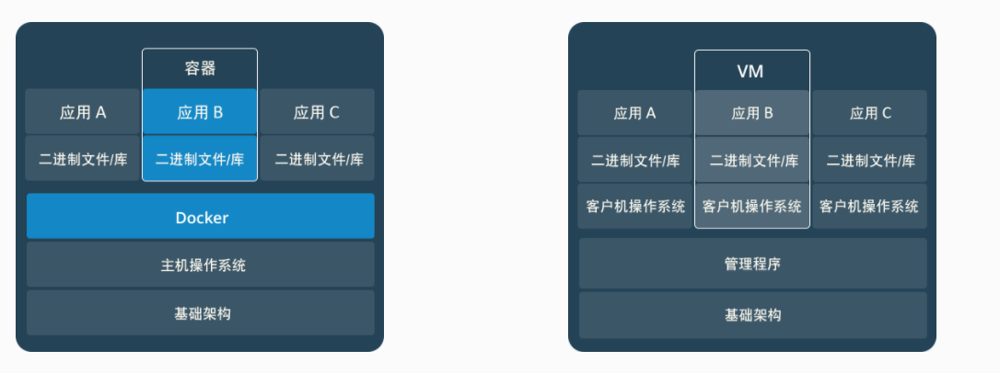

# 什么是容器？
先来看看容器较为官方的解释：

一句话概括容器：容器就是将软件打包成标准化单元，以用于开发、交付和部署。
容器镜像是轻量的、可执行的独立软件包 ，包含软件运行所需的所有内容：代码、运行时环境、系统工具、系统库和设置。
容器化软件适用于基于Linux和Windows的应用，在任何环境中都能够始终如一地运行。
容器赋予了软件独立性，使其免受外在环境差异（例如，开发和预演环境的差异）的影响，从而有助于减少团队间在相同基础设施上运行不同软件时的冲突。

# 容器 VS 虚拟机
简单来说： 容器和虚拟机具有相似的资源隔离和分配优势，但功能有所不同，因为容器虚拟化的是操作系统，而不是硬件，因此容器更容易移植，效率也更高。
两者对比图
传统虚拟机技术是虚拟出一套硬件后，在其上运行一个完整操作系统，在该系统上再运行所需应用进程；而容器内的应用进程直接运行于宿主的内核，容器内没有自己的内核，而且也没有进行硬件虚拟。因此容器要比传统虚拟机更为轻便。



容器是一个应用层抽象，用于将代码和依赖资源打包在一起。 多个容器可以在同一台机器上运行，共享操作系统内核，但各自作为独立的进程在用户空间中运行 。与虚拟机相比， 容器占用的空间较少（容器镜像大小通常只有几十兆），瞬间就能完成启动 。
虚拟机（VM）是一个物理硬件层抽象，用于将一台服务器变成多台服务器。 管理程序允许多个VM在一台机器上运行。每个VM都包含一整套操作系统、一个或多个应用、必要的二进制文件和库资源，因此占用大量空间。而且VM启动也十分缓慢 。

通过Docker官网，我们知道了这么多Docker的优势，但是大家也没有必要完全否定虚拟机技术，因为两者有不同的使用场景。虚拟机更擅长于彻底隔离整个运行环境。例如，云服务提供商通常采用虚拟机技术隔离不同的用户。而Docker通常用于隔离不同的应用 ，例如前端，后端以及数据库。

# 什么是Docker
Docker是世界领先的软件容器平台。
Docker使用Google公司推出的Go语言进行开发实现，基于Linux内核的cgroup，namespace，以及AUFS类的UnionFS等技术，对进程进行封装隔离，属于操作系统层面的虚拟化技术。 由于隔离的进程独立于宿主和其它的隔离的进程，因此也称其为容器。Docke最初实现是基于LXC。
Docker能够自动执行重复性任务，例如搭建和配置开发环境，从而解放了开发人员以便他们专注在真正重要的事情上：构建杰出的软件。
用户可以方便地创建和使用容器，把自己的应用放入容器。容器还可以进行版本管理、复制、分享、修改，就像管理普通的代码一样。

# Docker原理是什么？
Docker 技术使用 Linux 内核和内核功能（例如 Cgroups 和 namespaces）来分隔进程，以便各进程相互独立运行。这种独立性正是采用容器的目的所在；它可以独立运行多种进程、多个应用，更加充分地发挥基础设施的作用，同时保持各个独立系统的安全性。

容器工具（包括 Docker）可提供基于镜像的部署模式。这使得它能够轻松跨多种环境，与其依赖程序共享应用或服务组。Docker 还可在这一容器环境中自动部署应用（或者合并多种流程，以构建单个应用）。

此外，由于这些工具基于 Linux 容器构建，使得 Docker 既易于使用，又别具一格——它可为用户提供前所未有的高度应用程访问权限、快速部署以及版本控制和分发能力。

# Docker思想
集装箱
标准化： ①运输方式、②存储方式、 ③API接口
隔离

# Docker容器的特点
轻量，在一台机器上运行的多个Docker容器可以共享这台机器的操作系统内核；它们能够迅速启动，只需占用很少的计算和内存资源。镜像是通过文件系统层进行构造的，并共享一些公共文件。这样就能尽量降低磁盘用量，并能更快地下载镜像。
标准，Docker容器基于开放式标准，能够在所有主流Linux版本、Microsoft Windows以及包括VM、裸机服务器和云在内的任何基础设施上运行。
安全，Docker赋予应用的隔离性不仅限于彼此隔离，还独立于底层的基础设施。Docker默认提供最强的隔离，因此应用出现问题，也只是单个容器的问题，而不会波及到整台机器。

# 为什么要用Docker
Docker的镜像提供了除内核外完整的运行时环境，确保了应用运行环境一致性，从而不会再出现“这段代码在我机器上没问题啊”这类问题；——一致的运行环境
可以做到秒级、甚至毫秒级的启动时间。大大的节约了开发、测试、部署的时间。——更快速的启动时间
避免公用的服务器，资源会容易受到其他用户的影响。——隔离性
善于处理集中爆发的服务器使用压力；——弹性伸缩，快速扩展
可以很轻易的将在一个平台上运行的应用，迁移到另一个平台上，而不用担心运行环境的变化导致应用无法正常运行的情况。——迁移方便
使用Docker可以通过定制应用镜像来实现持续集成、持续交付、部署。——持续交付和部署

# Docker基本概念
Docker包括三个基本概念：
	镜像（Image）
	容器（Container）
	仓库（Repository）

## 镜像（Image）——一个特殊的文件系统
操作系统分为内核和用户空间。对于Linux而言，内核启动后，会挂载root文件系统为其提供用户空间支持。而Docker镜像（Image），就相当于是一个root文件系统。

Docker镜像是一个特殊的文件系统，除了提供容器运行时所需的程序、库、资源、配置等文件外，还包含了一些为运行时准备的一些配置参数（如匿名卷、环境变量、用户等）。 镜像不包含任何动态数据，其内容在构建之后也不会被改变。

Docker设计时，就充分利用Union FS的技术，将其设计为分层存储的架构。 镜像实际是由多层文件系统联合组成。

镜像构建时，会一层层构建，前一层是后一层的基础。每一层构建完就不会再发生改变，后一层上的任何改变只发生在自己这一层。比如，删除前一层文件的操作，实际不是真的删除前一层的文件，而是仅在当前层标记为该文件已删除。在最终容器运行的时候，虽然不会看到这个文件，但是实际上该文件会一直跟随镜像。因此，在构建镜像的时候，需要额外小心，每一层尽量只包含该层需要添加的东西，任何额外的东西应该在该层构建结束前清理掉。

分层存储的特征还使得镜像的复用、定制变的更为容易。甚至可以用之前构建好的镜像作为基础层，然后进一步添加新的层，以定制自己所需的内容，构建新的镜像。

## 容器（Container）——镜像运行时的实体
镜像（Image）和容器（Container）的关系，就像是面向对象程序设计中的类和实例一样，镜像是静态的定义，容器是镜像运行时的实体。容器可以被创建、启动、停止、删除、暂停等 。

容器的实质是进程，但与直接在宿主执行的进程不同，容器进程运行于属于自己的独立的命名空间。前面讲过镜像使用的是分层存储，容器也是如此。

容器存储层的生存周期和容器一样，容器消亡时，容器存储层也随之消亡。因此，任何保存于容器存储层的信息都会随容器删除而丢失。

按照Docker最佳实践的要求，容器不应该向其存储层内写入任何数据 ，容器存储层要保持无状态化。所有的文件写入操作，都应该使用数据卷（Volume）、或者绑定宿主目录，在这些位置的读写会跳过容器存储层，直接对宿主（或网络存储）发生读写，其性能和稳定性更高。数据卷的生存周期独立于容器，容器消亡，数据卷不会消亡。因此， 使用数据卷后，容器可以随意删除、重新run，数据却不会丢失。

## 仓库（Repository）——集中存放镜像文件的地方
镜像构建完成后，可以很容易的在当前宿主上运行，但是， 如果需要在其它服务器上使用这个镜像，我们就需要一个集中的存储、分发镜像的服务，Docker Registry就是这样的服务。

一个Docker Registry中可以包含多个仓库（Repository）；每个仓库可以包含多个标签（Tag）；每个标签对应一个镜像。所以说：镜像仓库是Docker用来集中存放镜像文件的地方类似于我们之前常用的代码仓库。

通常，一个仓库会包含同一个软件不同版本的镜像，而标签就常用于对应该软件的各个版本 。我们可以通过<仓库名>:<标签>的格式来指定具体是这个软件哪个版本的镜像。如果不给出标签，将以latest作为默认标签。

这里补充一下Docker Registry公开服务和私有Docker Registry的概念：

Docker Registry公开服务是开放给用户使用、允许用户管理镜像的Registry服务。一般这类公开服务允许用户免费上传、下载公开的镜像，并可能提供收费服务供用户管理私有镜像。

最常使用的Registry公开服务是官方的Docker Hub ，这也是默认的Registry，并拥有大量的高质量的官方镜像，网址为：hub.docker.com/ 。在国内访问Docker Hub可能会比较慢国内也有一些云服务商提供类似于Docker Hub的公开服务。

除了使用公开服务外，用户还可以在本地搭建私有Docker Registry 。Docker官方提供了Docker Registry镜像，可以直接使用做为私有Registry服务。开源的Docker Registry镜像只提供了Docker Registry API的服务端实现，足以支持Docker命令，不影响使用。但不包含图形界面，以及镜像维护、用户管理、访问控制等高级功能。


## Build，Ship，and Run

	Build（构建镜像）：镜像就像是集装箱包括文件以及运行环境等等资源。
	Ship（运输镜像）：主机和仓库间运输，这里的仓库就像是超级码头一样。
	Run （运行镜像）：运行的镜像就是一个容器，容器就是运行程序的地方。

# Docker容器的好处
## 模块化
Docker 容器化方法非常注重在不停止整个应用的情况下，单独截取部分应用进行更新或修复的能力。除了这种基于微服务的方法，您还可以采用与面向服务的架构（SOA）类似的使用方法，在多个应用间共享进程。

## 层和镜像版本控制
每个 Docker 镜像文件都包含多个层。这些层组合在一起，构成单个镜像。每当镜像发生改变时，就会创建一个新的镜像层。用户每次发出命令（例如 run 或 copy）时，都会创建一个新的镜像层。

Docker 重复使用这些层来构建新容器，借此帮助加快流程构建。镜像之间会共享中间变化，从而进一步提升速度、规模以及效率。版本控制是镜像层本身自带的能力。每次发生新的更改时，您大都会获得一个内置的更改日志，实现对容器镜像的全盘管控。

## 回滚
回滚也许是层最值得一提的功能。每个镜像都拥有多个层。举例而言，如果您不喜欢迭代后的镜像版本，完全可以通过回滚，返回之前的版本。这一功能还支持敏捷开发方法，帮助持续实施集成和部署（CI/CD），使其在工具层面成为一种现实。

## 快速部署
启动和运行新硬件、实施部署并投入使用，这在过去一般需要数天时间。投入的心力和成本往往也让人不堪重负。基于 Docker 的容器可将部署时间缩短到几秒。通过为每个进程构建容器，您可以快速将这些类似进程应用到新的应用程序中。而且，由于无需启动操作系统即可添加或移动容器，因此大幅缩短了部署时间。除此之外，得益于这种部署速度，您可以轻松无虞、经济高效地创建和销毁容器创建的数据。

因此，Docker 技术是一种更加精细、可控、基于微服务的技术，可为企业提供更高的效率价值。

# docker 使用
首先要在宿主机上安装Docker，Docker安装参考官方安装文档。 Docker命令也比较类似Git，支持push以及pull操作上传以及下载Docker镜像。 查看当前Docker的版本
`docker version
`

查看当前系统Docker信息
`docker info`

查看宿主机上的镜像，Docker镜像保存在/var/lib/docker目录下:
`docker images`

从Docker hub上下载某个镜像:
```
docker pull ubuntu:latest
docker pull ubuntu:latest
```

执行`docker pull ubuntu`会将Ubuntu这个仓库下面的所有镜像下载到本地repository。

启动一个容器使用`docker run`:
```
docker run -i -t ubuntu /bin/bash                       启动一个容器
docker run -i -t --rm ubuntu /bin/bash                  --rm表示容器退出后立即删除该容器
docker run -t -i --name test_container ubuntu /bin/bash --name指定容器的名称，否则会随机分配一个名称
docker run -t -i --net=host ubuntu /bin/bash            --net=host容器以Host方式进行网络通信
docker run -t -i -v /host:/container ubuntu /bin/bash   -v绑定挂在一个Volume，在宿主机和Docker容器中共享文件或目录
```

查看当前有哪些容器正在运行，使用 ``docker ps`:
```
xzs@host:~(0)$ docker ps
CONTAINER ID     IMAGE                COMMAND        CREATED         STATUS          PORTS    NAMES
50a1261f7a8b     docker_test:latest   "/bin/bash"    7 seconds ago   Up 6 seconds             sleepy_ptolemy
#目前只有一个container id为50a1261f7a8b的容器正在运行
```

启动或停止某个 container 使用 docker start/stop container_id:
```
xzs@host:~(0)$ docker stop 50a1261f7a8b
50a1261f7a8b

xzs@host:~(0)$ docker ps -a | grep 50a1261f7a8b
50a1261f7a8b   docker_test:latest   "/bin/bash"   2 minutes ago   Exited (0) 14 seconds ago   sleepy_ptolemy
#执行docker stop后，该容器的状态变更为Exited
```

使用`docker commit`可以将 container 的变化作为一个新的镜像，比如:
```
xzs@host:~(0)$ docker commit -m="test docker commit" 50a1261f7a8b docker_test
55831c956ebf46a1f9036504abb1b29d7e12166f18f779cccce66f5dc85de38e

xzs@host:~(0)$ docker images | grep docker_test
docker_test                            latest              55831c956ebf        10 seconds ago      290.7 MB
```

除了从 Docker hub 上下载镜像，也可以写 Dockerfile 创建一个镜像，以创建一个Django程序为例，Dockerfile 如下所示：
```
xzs@host:/tmp/docker(0)$ cat Dockerfile
FROM ubuntu:12.04
MAINTAINER Your Name

RUN apt-get update
RUN apt-get install -y python-software-properties python-pip

ADD myproject /opt/code

RUN pip install -r /opt/code/requirement.txt
```

写完 Dockerfile，在 Dockerfile 所在目录执行`docker build`创建镜像:
```
docker build -t docker_test .
docker run -i -t docker_test /bin/bash -c "cd /opt/code;python manage.py runserver 0.0.0.0:8080"
```

将制作的镜像上传到private registry:
```
docker tag test docker.example.com/test
docker push docker.example.com/test
```

经过长时间使用，主机上存储了很多已无用的镜像，想将它们删除则用`docker rm`或者`docker rmi`，比如:
```
docker rm container_id
docker rmi image_id
```


[可能是把Docker的概念讲的最清楚的一篇文章](http://dockone.io/article/6051)
[什么是Docker？原理，作用，限制和优势简介](https://www.redhat.com/zh/topics/containers/what-is-docker)
[Docker系列之一：入门介绍](https://tech.meituan.com/2015/01/27/docker-introduction.html)