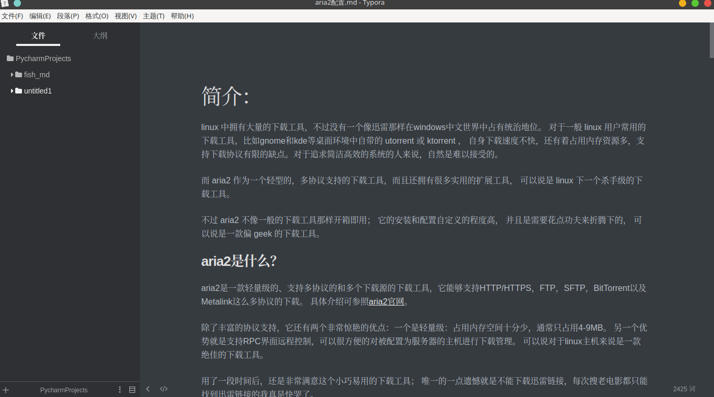
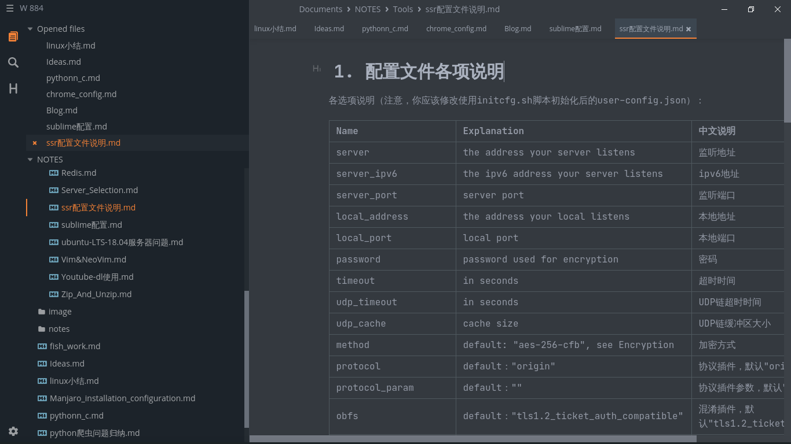
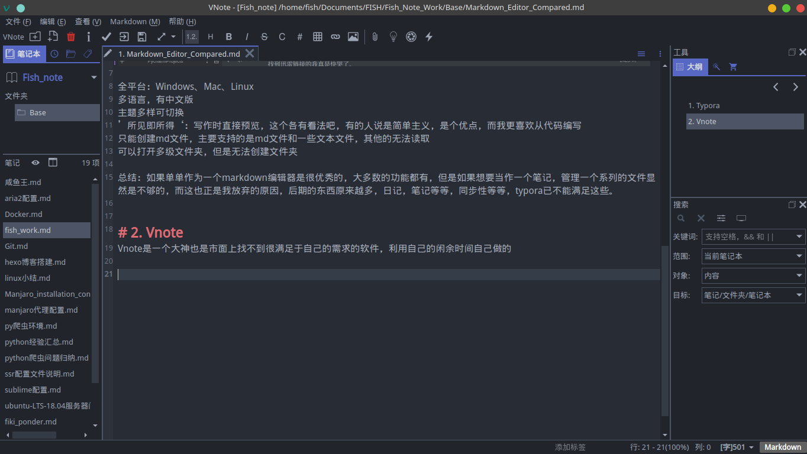
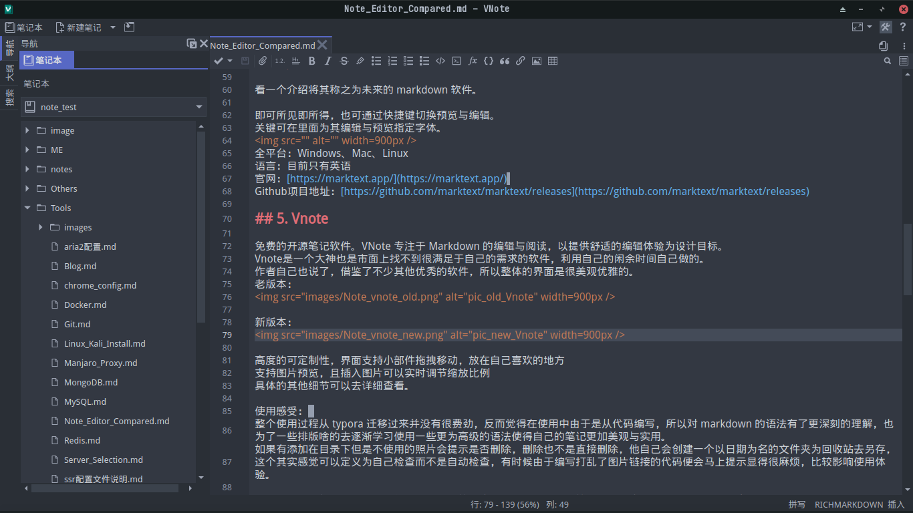
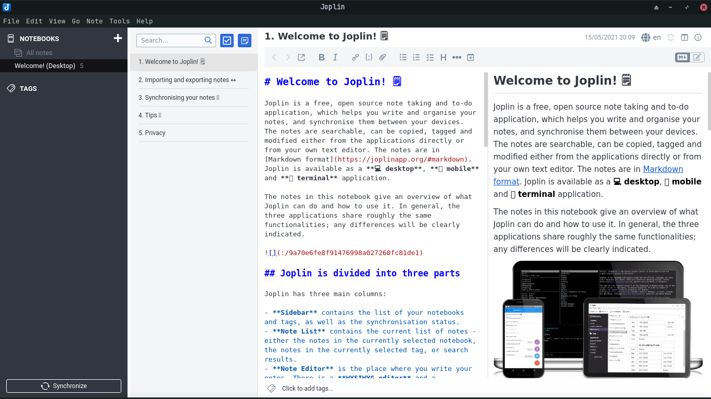
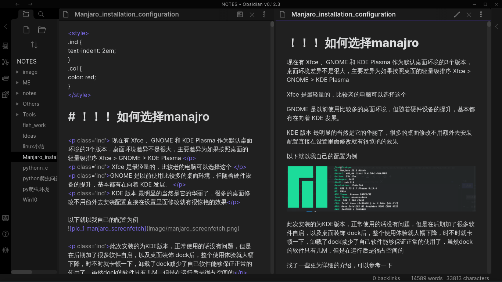
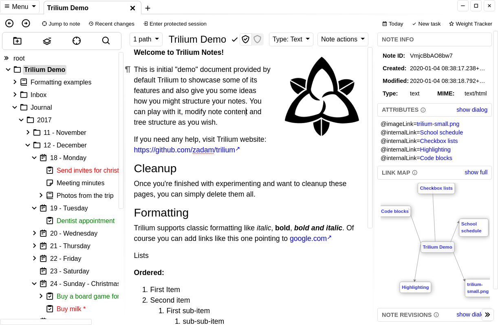
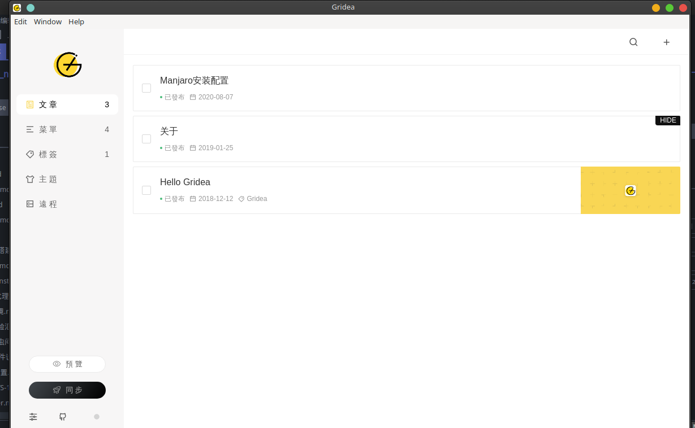

陆陆续续使用了不少软件记录笔记，从最初的记事本，word 再到现在用过的各种 markdown 软件，各有特色，做个总结吧，希望对没有接触过的有个直观的了解。

有的软件是早期的时候使用的，所以可能会出现上面写的一些问题在下载的最新版本中解决了优化了的情况。仅为自己当时的主观感受，不代表产品的实际，毕竟，每个人的喜好不一样。

###  Basic Markdown Editor

专注于 Markdown 的编辑器，

#### Typora

使用的第一款 markdown 编辑器，使用过程还是挺舒适的，在最开始不太熟悉 markdown 语法又想要 markdwon 格式的时候使用的，但也由于这样，在较长一段时间内才完全熟练 markdwon 的语法，可以说在一定程度上的依赖反而造成了拖累。

使用感受：

	1. 主题多样可切换，
	2. '所见即所得'，写作时直接预览，这个各有看法吧，有的人说是简单主义，是个优点，而我更喜欢从代码编写。
	3. 只能创建 md 文件，主要阅读的是 md 文件和一些文本文件，其他的无法读取或打开为乱码。
	4. 可以打开多级文件夹，但是无法在软件内创建文件夹。

总结：

	如果单单作为一个 markdown 编辑器是很优秀的，大多数的功能都有，但是如果想要当作一个笔记，管理一个系列的文件显然是不够的，而这也正是我放弃的原因，后期的东西原来越多，日记，笔记等等，同步性等等，typora 已不能满足这些。

	2023.1.13 新增，之前的一些问题后期应该是解决了的，当时写这个评价的时候是 2019 年，这么多年了后续好像还发展成收费的了，实际的应用体验应该有提升。

	全平台：Windows、Mac、Linux
	语言：多语言，中英日等
	官网：<https://typora.io/>

#### Marktext

有人将其称之为未来的 markdown 软件。

总结：

	即可所见即所得，也可通过快捷键切换预览与编辑。
	关键可在里面为其编辑与预览指定字体。

	初使用是不错的，但是在 mac 和 windows 上没有测试，在现在的 linux 上会有卡顿的情况，快捷键的延迟很高，甚至于没有响应。只能期待于以后的优化了再使用。

	全平台：Windows、Mac、Linux
	语言：目前只有英语
	官网：<https://marktext.app/>
	Github 项目地址：<https://github.com/marktext/marktext/releases>

#### Vnote

免费的开源笔记软件。VNote 专注于 Markdown 的编辑与阅读，以提供舒适的编辑体验为设计目标。

老版本： 

新版本： 

总结：

	1. 可定制性较强，界面支持小部件拖拽移动，放在自己喜欢的地方，调整为自己喜欢、习惯的布局。
	2. 支持图片预览，且插入图片的图片可以通过内定的方式设置大小。方式为在写入图片地址后添加一个空格后写上设置的大小，如（=900x），但是这种方式仅仅对于使用了相同内置环境的编辑器有效，为了更兼容，在后期将所有需要设置大小的图片都改为了使用``标签去设置。但是需要注意这种方式不是它的默认检测图片的范围内，所以修改完之后提示有图片不再使用，是否放入回收站，而实际上是使用的。

	3. 整个使用过程从 typora 迁移过来并没有很费劲，反而觉得在使用中由于是从代码编写，所以对 markdown 的语法有了更深刻的理解，也为了一些排版啥的去逐渐学习使用一些更为高级的语法使得自己的笔记更加美观与实用。
	4. 如果有添加在目录下但是不使用的照片会提示是否删除，删除也不是直接删除，他自己会创建一个以日期为名的文件夹为回收站去另存，这个其实感觉可以定义为自己检查而不是自动检查，有时候由于编写打乱了图片链接的代码便会马上提示显得很麻烦，比较影响使用体验。

	5. 在后期版本更新的时候对界面做了大改，精简很多，但是这时自己的笔记已经较多了，最最最明显的一个问题暴露出来，早期的版本不支持目录，当较多的时候需要分类就不够用了，后期的版本可以了，但是在导入其他的笔记时，没有办法导入目录中的目录。

	6. 新版本修复了这个问题。所以又回来使用了。

	7. 在 2021 年就停止了使用，有个个人觉得很不妥的问题，他的一些文件的配置文件、生成的项目的辅助文件（多是json类，感觉json），我的项目是有关联 git ,这些新生成的文件在提交的时候很麻烦，而且自己查看的时候也别扭。就没有继续使用了。

	8. 这次添加新的编辑器的使用也去看了这个编辑器的更新，以及支持 PDF Viewer and MindMap Editor。
	9. 还引入了语法片段，并且可自定义，这个我看有不少编辑器用作热点，通过比如 `dd` 快速插入时间日期。提升效率完全感受不到，编程中用倒是方便不少。
	10. 标题前会自动生成、补全、修正序号，排版那种序号，比如三级标题 `1.1.2`。这个怎么说呢，个人不太喜欢这个功能，在大纲里面还行，实际嵌入源码中不习惯。不过好在可关闭。
	11. 源码、预览的同步有但是有明显延迟。
	12. 全局搜索有。
	13. 目前的版本的暗示主题在 Gnome 环境的暗示环境下标题栏和菜单栏无效。
	14. 会在原项目文件夹中生成文件的问题还在。

	全平台：Windows、Mac、Linux
	语言：中、英、日三种语言可选择
	官网:  <https://tamlok.github.io/vnote>
	Github 项目地址:  <https://github.com/tamlok/vnote>

#### vim、sublime 等编辑器
vim、sublime 通过插件和设置能够实现较为完美的编辑、预览环境。主要是够轻量级。即开即关。IDE 切换项目麻烦且耗费时间。

### Better Editor
介绍的这些编辑器都有向下兼容 markdown，此外对其可添加的内容进行了大幅度的拓展，有的是 Multimedia notes （多媒体笔记），能够保存更多格式的文件，有的支持 bi-directional link（双向链接）并且提供了 graph view（关系图谱）。

#### Joplin

> Joplin 是一款全平台的开源且完全免费的笔记应用，同时也是一个高效的 To-Do 待办事项工具和生产力工具。你可以用标签或笔记本进行分类整理，笔记支持 Markdown，可实现全文搜索。

总结：

	1. 多个主题可切换，支持多种云，保存更方便。
	2. 可大纲、源码、效果预览三栏显示，源码和预览同步滚动。
	3. 有个笔记附件功能不错，能够快速的管理文章内添加的图片等附件，如果文章内进行了删除，在软件内就可进行删除操作，无需进入文件管理。这个功能蛮实用的，自己的文章有时候很长，改动后有不用的附件忘记删除是常有的事，为此还自写了一个脚本用于查找项目内不再使用的附件及删除。
	4. 有个切换外部编辑功能，个人感觉多余了。点击图标或者使用快捷键调用该功能会在保留当前窗口的情况下启用默认文本编辑器编辑。
	5. 目前的版本的暗示主题在 Gnome 环境的暗示环境下标题栏和菜单栏无效。
	6. 使用Chrome和Firefox上的web clipper扩展，可以保存网页或截图作为笔记。具体的使用情况也没有实际测试。
	[插件](https://github.com/joplin/plugins/blob/master/README.md#plugins): 有不少的插件，不过没有尝试。

	多平台：Windows、macOS、Linux、iOS、Android 等主流桌面平台和手机平台都提供有客户端，甚至还提供了命令行版本
	语言：很多，包含中文
	官网：<https://logseq.com/>

#### Logseq
>A privacy-first, open-source platform for knowledge management and collaboration (一个隐私至上、开源的知识管理和协作平台)

	1. 同样也是带有关系图谱功能的双向链编辑器。但是不是基于文本，但是可以从目录（文件）导入。但是并不是创建指向到文件夹（文件），而是读取然后单独保存，更像是数据库保存，并且原来的文件会被“智能拆分”成片段，之所以是引号，是因为效果并不理想。
	2. 也同样支持插件，197 个插件 39 个主题可选择。
	3. 可配置 Git 自动 commit，不过没测试。
	4. 有日记和记忆卡片功能。
	5. 目前的版本的暗示主题在 Gnome 环境的暗示环境下标题栏和菜单栏无效。

	多平台：Windows、macOS、Linux、iOS、Android 等主流桌面平台和手机平台都提供有客户端，甚至还提供了命令行版本
	语言：很多，包含中文
	官网：<https://logseq.com/>
	Github 项目地址:  <https://github.com/logseq/logseq/>

#### Obsidian

> Obsidian 是一个功能强大的知识管理软件,是一款功能强大的带有关系图谱功能的双向链笔记。

总结：

	1. 可以安装一些插件，比如字数统计啥的。近期看到了很多文章对该编辑的推荐，去看了下，这段时间发展很快，已经积累了很多很多功能各异的插件。
	2. 建立了社区进行交流，所以主题很多，各种使用也是满意的。
	3. 关键在同时打开代码模式和预览模式的时候，滑动是同步的，需要修改的话很方便。
	4. 之前在系统设置代码可视更友好的字体，但是软件内无效，也没有发现可以自定义的地方，就放弃了。现在的版本好像没有这个异常了。不过也不确定，这次是换了系统，这个系统自带的字体依旧足够友好所以就没有安装字体了。
	5. 同样也可以实现源码、预览、大纲三栏同框，但是不同步。
	6. 支持全局搜索。

	插件网站:[plugins](https://obsidian.md/plugins),用 xpahth 工具提取了一下，已经有 814	个了。应该是包含主题类插件，但是这么多我是没想到的。
	插件的种类很丰富，太多了看不过来了。比如 markdown 文本的美化格式化，代码片段、计算器、进从图像 (OCR) 和 PDF 中提取文本、找到所有外部图片的链接，然后将图片下载并保存到本地、从图像中提取文本并使其可用于搜索等。

	全平台：Windows、Mac、Linux
	语言：语言挺多的，主要的语言都有
	官网：<https://obsidian.md/>
	Github 项目地址：<https://github.com/obsidianmd/obsidian-releases/releases>

#### 几种开源双向链编辑器对比

|软件|包大小|内存占用|github star|
|---|---|---|---|
|Joplin|205M|233M|34k|
|Logseq|151M|219M|19.7k|
|Obsidian|94M|164M|3.9k|

#### Trilium

超高自由度的个人知识库。

	1. 可加密，轻盈简洁，能让信息不受阻碍直接呈现在眼前，高自由度。
	2. 并且有一个配套的插件可以在网页中截图保存、保存整个网页、即时创建文本写入想要记下的。
	3. 另外有一个服务器端的，有需要的可以布置到自己的服务器或者自己额外的电脑设备上，就可以通过网页访问了，在保障同步性的情况下完全不用担忧隐私安全问题。

	插件地址：<https://github.com/zadam/trilium-web-clipper/>

总结：

	全平台：Windows、Mac、Linux
	语言：目前只有英文的，有个人用户对 win64 的做了简单的汉化并打包了的，可以自行搜索
	Github 项目地址:  <https://github.com/zadam/trilium>

### Other

#### Gridea

>Gridea 是一个静态博客写作客户端，帮助你更容易地构建并管理博客或任何静态站点。
想要体验博客那种感觉？没有服务器？懒得在本地搭建环境？这个软件可以让你在客户端写作然后在本地网页可以预览效果。

>Markdown：知道你钟爱 Markdown 写作，我们也是
>快且安全：Gridea 所有文件都在你的本地，构建为更快更安全的静态网站，无需管理数据库，向 Wordpress 说拜拜
>简而不凡：简单几步即可搭建网站。无论博客抑或企业站点，强大的自定义能力，轻松驾驭

总结：
	简单使用了一下，官方介绍的 `简单几步即可搭建网站` 并没有去实践。

	全平台：Windows、Mac、Linux
	语言：中英两种语言
	Github项目地址:  <https://github.com/getgridea/gridea/>
	官网地址:  <https://gridea.dev/docs/>
