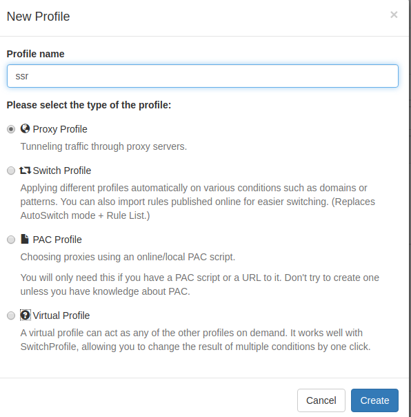
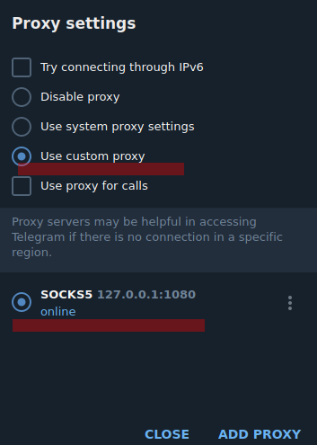

# 一、（图形化软件）Qv2ray
全平台： linux、win 、mac 都可有可使用的版本
是开源的的第三方图形化界面，可以直接使用v2ray，在而且在添加插件后可使用 ssr、torjan 等其他，现在在使用的就是这个，还可以查看速度以及使用量，但是其默认监听端口不是1080,需要的可以自己改动一下。
项目地址：  [https://github.com/Qv2ray/Qv2ray/releases
](https://github.com/Qv2ray/Qv2ray/releases%0A)

## 1、安装：
直接去项目地址下载 AppImage 包， 直接双击打开就能使用，但是会提示缺少核心文件


去查看核心文件的所在位置，两种解决方法，一是去安装v2ray后更改路径，二是把去下载相应的vcore文件复制移动到其默认路径下

去 [https://github.com/v2ray/v2ray-core/releases/](https://github.com/v2ray/v2ray-core/releases/)下载v2ray-linux-64.zip文件，解压位置自定，然后改路径


## 2、注意：

留意这个设置，该客户端的默认端口不是1080，需要改的自己修改下才能使用


# 二、代理的应用：

## 1、Firefox


填入代理端口：（例如：1080）
然后可以正常爬墙，不过是全局代理

## 2、Chrome （插件）（ SwitchOmega ）

(1)、把情景模式下的 proxy 和 auto switch 都删除  

(2)、新建情景模式：
1 )名称：Proxy；类型：代理服务器。

 2) 名称：Auto；类型：自动切换模式。

3). 设置 Proxy  
   代理协议：HTTP；代理服务器：127.0.0.1；代理端口：1080
    
4). 设置 Auto 
个人感觉：实际应用中并不是很好用。所以自己在后期都不设置这项了。就直接连接和使用代理总有一个是能用的。

在上面规则列表规则的情景模式里选择 proxy
规则列表格式选 AutoProxy 
在 **添加规则列表** 里面输入如下网址 

   ```
https://raw.githubusercontent.com/gfwlist/gfwlist/master/gfwlist.txt
   ```

并点击下载链接里面的内容到本地

 

5). 应用选项，测试
   **上面有一个细节，在点击下载文件的时候需要事先去SwitchOmega切换到代理，链接是被墙的，没有先开代理的话会一直提示下载失败（无法连接到网络）**

## 3、Telegram的使用：

telegram 也是需要手动去配置代理，上面说的什么方法对它都不管用，使用是必须使用代理的。



这样就可以正常的使用了。

## 4、终端代理
终端需要额外配置：
以上面的 qv2ray 为例，该客户端有两种方法，一个是 socket 通信,一个是 http 通信,两个方式对应的端口不同

### (1)一次性的：

如果有想要 http 通信，http 的代理端口设置 12333，想执行 wget 或者 curl来下载国外的东西，可以使用如下命令：

```
export http_proxy="http://127.0.0.1:12333"
export https_proxy="http://127.0.0.1:12333"
或者直接：
export ALL_PROXY=http://127.0.0.1:12333 
```

或者走 socket5 协议的话，代理端口设置 1080

```
export http_proxy="socks5://127.0.0.1:1080"
export https_proxy="socks5://127.0.0.1:1080"
或者：
export ALL_PROXY="socks5://127.0.0.1:1080"
```

### (2)永久的：

把代理服务器地址写入shell配置文件.bashrc或者.zshrc 直接在.bashrc或者.zshrc添加下面内容

```
export http_proxy="http://127.0.0.1:12333"
export https_proxy="http://127.0.0.1:12333"
```

或者走socket5协议的话，代理端口是1080

```
export http_proxy="socks5://127.0.0.1:1080"
export https_proxy="socks5://127.0.0.1:1080"
```

然后刷新设置

```
source ~/.bashrc
或者：
source ~/.zshrc
```

### (3)自动开启关闭：

或者通过设置 alias 简写来简化操作，每次要用的时候输入setproxy，不用了就unsetproxy。

```
alias setSocks="export ALL_PROXY=socks5://127.0.0.1:1080" 
alias setHttp="export ALL_PROXY="http://127.0.0.1:12333"
alias unsetproxy="unset ALL_PROXY"
```

或在~/.zshrc中添加如下脚本后刷新

```
[[设置socks5]]代理
function setsocks5() {
    export ALL_PROXY="socks5://127.0.0.1:1080"
}

[[设置http]]代理
function http() {
    export ALL_PROXY="http://127.0.0.1:12333"
}

# 取消终端代理
function unsetProxy() {
    unset ALL_PROXY
}
# 测试终端代理
function testProxy() {
    curl -i 'http://ip.cn'
}


```

#通常端口号是固定的，不过如果有需要随时变换的参考如下脚本
```

function setProxy() {
    export ALL_PROXY="socks5://127.0.0.1:${1}"
}

启动为：
setProxy <port>   # 启动终端代理连接
```


可以使用`curl -i httpbin.org/get`来查看自己的 ip，如果确实发生了改变，那应该就是成功地设置代理了。
## 5、git加速

git很明显是被墙的额而且经常使用，直接配置git的命令。使用 ss/ssr ( socks5 类的都可以)来加快 git 的速度
分辨需要设置的代理

- HTTP 形式：
  > git clone https://github.com/owner/git.git
- SSH 形式：
  > git clone git@github.com/owner/git.git

###  一、HTTP 形式
#### 法一：
走 HTTP 代理
```
git config --global http.proxy "http://127.0.0.1:12333"
git config --global https.proxy "http://127.0.0.1:12333"
```

走 socks5 代理（如 Shadowsocks）
```
git config --global http.proxy "socks5://127.0.0.1:1080"
git config --global https.proxy "socks5://127.0.0.1:1080"
```

取消设置
```
git config --global --unset http.proxy
git config --global --unset https.proxy
```

#### 法二：
在 ~/.gitconfig 文件中加入以下配置:
```
[http]
	proxy = socks5://127.0.0.1:1080
```

注意，上明配置等同于命令 `git config --global http.proxy 'socks5://127.0.0.1:1080'`

Git不认https.proxy，设置http.proxy就可以支持 https 了。

### 二、SSH 形式
在 ~/.ssh/config 文件中加入以下配置:
```
Host github.com
HostName github.com
User git
Port 22
ProxyCommand /usr/bin/ncat --proxy 127.0.0.1:1080 --proxy-type socks5 %h %p
```

### 端口被占用解决方法：
有时候会出现弹窗警告1080端口被占用提示：
manjaro的端口管理工具：net-tools是

```
yay -S net-tools
```
查看相应的端口号占用的程序：

```bash
netstat -lnp|grep 1080
```


关闭应用：

```
kill -9 [42058]
```
不知道这个原因的出现是bug还是什么的吧，切换节点但是端口释放不成功需要像上面那样，有时候退出后也会有端口释放不成功，被长期占用的情况，而且使用会导致电脑卡，在退出的时候尤为明显，有个3、5秒的卡顿。

# 二、 脚本安装
# 1、ssr

```
cd /opt
# 下载
curl https://raw.githubusercontent.com/the0demiurge/CharlesScripts/master/charles/bin/ssr -o "ssr"
# 或者
wget https://raw.githubusercontent.com/the0demiurge/CharlesScripts/master/charles/bin/ssr -O "ssr"
# 添加执行权限
chmod a+x ssr
# 为脚本创造软链接
sudo ln -s /home/fish/opt/ssr /usr/bin/ssr
# 安装依赖
yaourt -S jq tsocks
# 安装ssr客户端
ssr install
# 配置
ssr config  # 详细配置见ssr配置文件说明
# 启动
ssr start
# 停止
ssr stop
# 重启
ssr restart
# 卸载
ssr uninstall
```

# 2、v2ray