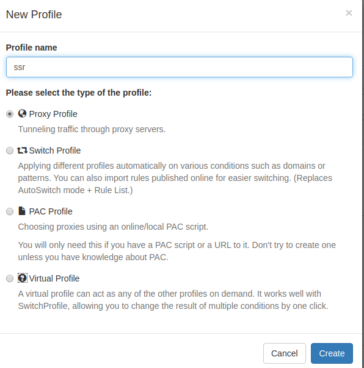
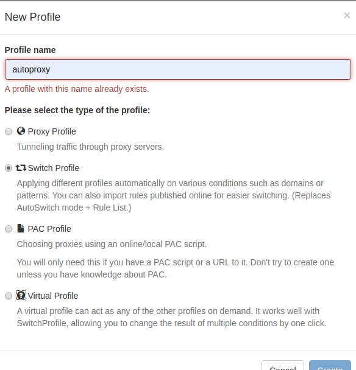

# 简介

使用代理的目的是为了实现以下几个方面的需求：

1. 绕过网络审查和封锁：在某些国家或地区，政府或互联网服务提供商（ISP）可能对特定网站或服务进行封锁或限制访问。通过使用代理，用户可以绕过这些封锁，访问被屏蔽的内容，保护自己的网络自由。

2. 提高网络安全性：代理通过加密用户数据流量，提供了更高层次的安全性。这对于那些关注网络隐私和安全的用户来说很重要，尤其是在使用公共Wi-Fi网络时，可以防止他人窃取敏感信息。

3. 保护个人隐私：通过使用代理，用户的真实IP地址和位置可以被隐藏起来，从而增加了在线匿名性和隐私保护。这对于那些不希望被追踪或监视的用户来说尤为重要。

4. 改善网络速度和稳定性：在某些情况下，使用代理可以改善网络连接的速度和稳定性。例如，如果用户所在的地区有网络限制或流量控制，使用代理可以绕过这些限制，提供更快的网络连接。

代理是如何发挥作用的：

以SSR为例：

1. 数据加密和解密：SSR使用加密算法对用户的数据进行加密，以确保数据在传输过程中的安全性。客户端将要传输的数据进行加密后，发送给代理服务器，代理服务器解密数据并将其发送到目标服务器。目标服务器的响应数据也经过代理服务器加密后再发送给客户端，客户端解密后得到最终的响应数据。

2. 混淆和伪装：SSR引入了混淆技术，使网络流量看起来更像是正常的HTTPS或其他协议，从而增加了网络阻断和审查的困难度。通过混淆，SSR可以使代理流量更难以被检测到，提高了代理的稳定性和可用性。

3. 代理服务器的选择：SSR用户可以自由选择使用哪个代理服务器来建立连接。这些代理服务器可以位于不同的地理位置，用户可以根据自己的需要选择最佳的服务器。选择距离用户物理位置较近的服务器可能会提高网络连接的速度和稳定性。

## proxy protocol
1. Shadowsocks（SS）
2. ShadowsocksR（SSR）
3. V2Ray
4. VrayX
5. Trojan
6. Trojan-Go

详细的就不累赘了，我了解的也不是很完全，墙内目前也有些介绍，但是只要能翻出去，资料就很多了。这里给出几篇文章，里面有详细介绍，防止失效，自己留了PDF文件。

[科学上网的主流协议大对比！这里面有你在使用的吗？](./images/科学上网的主流协议大对比.pdf): 文章来自[](https://www.techfens.com/posts/kexueshangwang.html)

[一次搞懂Xray/V2ray/Trojan/Trojan-go/SSR/SS的区别，不再选择困难症](./images/d0e0b912-88d6-4066-9cfa-e69dc894c888.pdf): 文章来自[](https://www.lbtlm.com/archives/167)

[SS、SSR、V2ray、Trojan、Xray 这五种翻墙协议与 VPN 对比有何不同？](./images/057c79d0-6f08-4cab-87b7-2d11483ed21f.pdf): 文章来自[](https://topvpn.wiki/vpn-ssr-v2ray-trojan-xray/)

## 可连接代理软件

### Qv2ray

**由于软件项目的暂停，前期很多bug也一直没修复，比如添加的代理较多的情况下显示的行会有冲突，点击上一个实际响应的是下一个，有时候还会无故卡死，更不用说后面协议的升级软件的支持了**

跨平台 V2Ray 客户端，支持 Linux、Windows、macOS，可通过插件系统支持 SSR / Trojan / Trojan-Go / NaiveProxy 等协议

是开源的的第三方图形化界面，可以查看速度以及使用量，但是其默认监听端口不是1080,需要的可以自己改动一下。

项目地址： [https://github.com/Qv2ray/Qv2ray/releases](https://github.com/Qv2ray/Qv2ray/releases)

1、安装：

直接去项目地址下载安装包， 直接双击打开就能使用，但是会提示缺少核心文件


去查看核心文件的所在位置，两种解决方法，一是去安装v2ray后更改路径，二是把去下载相应的 vcore 文件复制移动到其默认路径下

[vcore 下载地址](https://github.com/v2ray/v2ray-core/releases/)，解压位置自定，然后改路径


2、注意：

留意这个设置，该客户端的默认端口不是1080，需要改的自己修改下才能使用


- SagerNet
    SagerNet 是一个基于 V2Ray 的 Android 通用代理应用。

- V2rayN
    V2RayN 是一个基于 V2Ray 内核的 Windows 客户端。

### v2rayA

基于 `web GUI` 的跨平台 V2Ray 客户端，在 Linux 上支持全局透明代理，其他平台上支持系统代理。

之前使用的 QV2Ray 客户端已经不再更新了。很多问题得不到解决。并且使用 LINUX-Xfce 的桌面环境不能设置全局代理。也一直在寻找解决方案。

## 终端(命令行)代理

不管是在终端通过修改配置文件，启动相应的代理服务还是使用图形化界面设置了代理。在使用终端的时候想要使用代理都需要单独设置，也可以将这个设置提前写在相应的shell的配置文件中。比如 `.bashrc` 或者 `.zshrc` 中。但是不建议。因为防火墙是双向的。使用代理访问国内的网站反而会更慢。

使用命令

    `export http_proxy=http://proxyserver:port`  设置临时 http 代理

    `export https_proxy=http://proxyserver:port`  设置临时 https 代理

    `export socks_proxy=socks5://proxyserver:port`  设置临时 socks 代理

    `export all_proxy=protocol://proxyserver:port`  设置所有类型的临时代理


或者可以在终端配置中提前实现一些内容，将这些内容简化：

```sh
# BEGIN --------------------------------------------------------------------------- BEGIN
# 定义代理相关的工具

setProxy() {
    if [ $# -eq 3 ]; then
        proto=$1
        ip=$2
        port=$3

    elif [ $# -eq 2 ]; then
        if [[ $1 =~ ^(http|socks5|socks4)$ ]] && [[ $2 =~ ^[0-9]{1,3}\.[0-9]{1,3}\.[0-9]{1,3}\.[0-9]{1,3}$ ]]; then
            proto=$1
            ip=$2
            port="8080"
        elif [[ $1 =~ ^(http|socks5|socks4)$ ]] && [[ $2 =~ ^[0-9]+$ ]]; then
            proto=$1
            ip="127.0.0.1"
            port=$2
        elif [[ $1 =~ ^[0-9]{1,3}\.[0-9]{1,3}\.[0-9]{1,3}\.[0-9]{1,3}$ ]] && [[ $2 =~ ^[0-9]+$ ]]; then
            proto="socks5"
            ip=$1
            port=$2
        fi
    elif [ $# -eq 1 ]; then
        if [[ $1 =~ ^(http|socks5|socks4)$ ]]; then
            proto=$1
            ip="127.0.0.1"
            port="8080"
        elif [[ $1 =~ ^[0-9]{1,3}\.[0-9]{1,3}\.[0-9]{1,3}\.[0-9]{1,3}$ ]]; then
            proto="socks5"
            ip=$1
            port="8080"
        else
            proto="socks5"
            ip="127.0.0.1"
            port=$1
        fi
    else
        proto="socks5"
        ip="127.0.0.1"
        port="8080"
    fi

    export ALL_PROXY=$proto://$ip:$port
    echo "setting proxy $proto://$ip:$port success"
}

# 调用示例
# setProxy http 192.168.1.1 12345   # http://192.168.1.1:12345
# setProxy http 192.168.1.1         # http://192.168.1.1:8080
# setProxy http 12345               # http://127.0.0.1:12345
# setProxy 192.168.1.1 12345        # socks://192.168.1.1:12345
# setProxy http                     # http://127.0.0.1:8080
# setProxy 192.168.1.1              # socks5://192.168.1.1:8080
# setProxy 12345                    # socks5://127.0.0.1:12345

# 取消终端代理
function unsetProxy() {
    unset ALL_PROXY
}

# 测试终端代理
function testProxy() {
    newProxy=$(curl ifconfig.me)
    unsetProxy
    oldProxy=$(curl ifconfig.me)

    if [ ${oldProxy} = ${newProxy} ]; then
        echo "原 IP 是 ${oldProxy}，现在的 IP 是 ${newProxy}"
        echo "未设置代理或其他"
    else
        echo "原 IP 是 ${oldProxy}，现在的 IP 是 ${newProxy}"
        echo "代理生效中，当前代理是 ${newProxy}"
    fi
}
# END ------------------------------------------------------------------------------- END

```

## 浏览器代理

### Chrome

Chrome 浏览器可以通过在终端使用命令 `google-chrome-stable --proxy-server=http://your-proxy:port` 来设置代理并启动。这时候去安装`Proxy SwitchyOmega`等插件，下次再使用这个用户并且为`Proxy SwitchyOmega`设置代理。以后这个浏览器就能使用代理了。

### Firefox

1. 可以不用设置代理直接安装插件 `Proxy SwitchyOmega`。因为对 `Firefox` 的限制目前没那么严格。

2. 如果正常方法安装插件。Firefox 在设置里面提供了设置代理的选项。所以可以直接使用这个选项在初次启动的时候设置代理。然后也是安装`Proxy SwitchyOmega`等代理管理插件。再修改原来的代理设置。


之所以使用代理是因为要启动和关闭浏览器的代理需要进到设置里面修改很麻烦。插件可以固定在浏览器的主页面上。切换很方便，而且还可以更改代理的过滤规则，能力强大。


看具体需求，如果是使用两种浏览器。一个使用代理，一个不使用代理。就可以直接使用 Firefox 的设置项来设置代理。

### Edge

和 FireFox 类似的方式

### 插件 Proxy SwitchyOmega 的使用

各个浏览器的插件商店可搜索下载，目前感觉是使用最舒适的代理切换工具。

情景模式：
可以使用 HTTP/Socks 代理访问网站；可以根据多种条件和规则自动切换；可以根据在线或本地的 PAC 脚本规则使用代理。

规则：
可以在线导入 AutoProxy 和 Switchy 格式的规则，也可以自己添加域名通配符、网址通配符和网址正则等切换规则。可以搭配[GFWList](https://github.com/gfwlist/gfwlist)使用PAC，有奇效，能够自动区分那些需要代理，不用麻烦的切换代理，自己添加规则也很麻烦，网页太多。

快速切换：
可以在浏览器菜单中对情景模式进行快速切换，可以快速对当前网址添加过滤规则。

[官网](https://proxy-switchyomega.com/settings/)

[谷歌插件商店](https://chrome.google.com/webstore/detail/proxy-switchyomega/padekgcemlokbadohgkifijomclgjgif?hl=en)

[github 项目地址](https://github.com/FelisCatus/SwitchyOmega)


大概使用：

(1)、把情景模式下的 proxy 和 auto switch 都删除

(2)、新建情景模式：
1 )名称：Proxy；类型：代理服务器。

2\) 名称：Auto；类型：自动切换模式。

3\). 设置 Proxy\
代理协议：HTTP；代理服务器：127.0.0.1；代理端口：1080

4\). 设置 Auto
个人感觉：实际应用中并不是很好用。所以自己在后期都不设置这项了。就直接连接和使用代理总有一个是能用的。

在上面规则列表规则的情景模式里选择 proxy
规则列表格式选 AutoProxy
在 **添加规则列表** 里面输入如下网址

    https://raw.githubusercontent.com/gfwlist/gfwlist/master/gfwlist.txt

并点击下载链接里面的内容到本地


## 普通软件如何使用代理

对于这种情况一般有两种方法

    1.是将整个环境的流量都经过代理。
    2.是这个软件提供了代理的接口，当配置了代理类型，代理端口，代理地址就可以让这个软件使用代理。实际相当于多一个服务在内部访问前接管流量再转发给内部子进程。

系统级别的全局代理像 Windows 和一些 KDE、Gnome 桌面有设置全局代理的方式。或者是直接在路由器上设置代理，让所有设备的流量都走代理，实现真全局代理。下面主要介绍一些有代理接口的应用如何使用。

实际的使用中 linux 上的全局代理并不是真全局代理。只针对特定的应用来设置全局代理。比如浏览器。windows 的没试过软件是不是能真全局，但浏览器同样也是适用的。

像 Telegram、Mega 都提供了设置代理，设置好就可以使用了：


### 其他分享

https://zgq-inc.github.io/overthefirewall/

https://github.com/Loyalsoldier/v2ray-rules-dat

https://github.com/gfwlist/gfwlist

