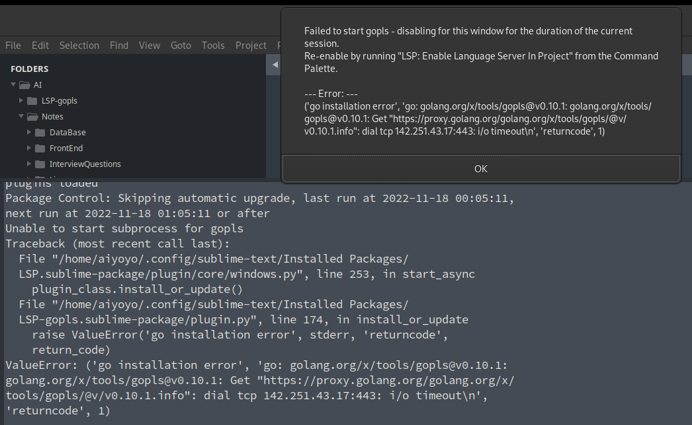
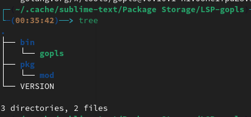

#### 设备信息

Linux  VERSIONS ： Fedora release 36 (Thirty Six)
Sublime  VERSIONS： Sublime Text 4143

#### 简介

1、各个插件的依赖，比如`LSP-pylsp`依赖`python-lsp-server`包，并不需要自己进行安装配置，只需要有基本的环境，比如`go python rust node npm`等，自己安装的无论设置不设置环境变量都不会被应用，依赖是在`~/.cache/sublime-text/Package Storage`相应的目录中。

2、LSP 配置中的各个插件的 "clients" 不再需要自己写，也不再需要自己在配置中开启。

3、安装后会自动安装依赖，打开输出台留意安装进程，有报错进行调整重启会重新尝试安装，直至安装成功，在各格式文件中自动开启适合的插件服务。

4、安装后可以对各自的配置进行调整。

#### 基本环境

`Python 3.10.7`

`node v16.18.0`

`npm 8.19.2`    换源，命令行`npm config set registry https://registry.npmjs.org/`设置后，查看源被改变，但是安装的时候并没有用，`npm install -g vscode-html-languageserver-bin --registry=https://registry.npm.taobao.org` 却可以，修改`~/.npmrc`文件中`registry=https://registry.npm.taobao.org/`可以不使用代理成功安装。

`go version go1.18 linux/amd64`  在设置了环境变量外部测试能找到命令，但是 sublime 中安装`LSP-gopls`一直报错`go binary could not be found in $PATH`,创建软连接在`/bin`或`/usr/bin`中即可。

#### 插件

##### LSP

VERSIONS： 1.20.0

##### LSP-gopls

VERSION	1.2.3

安装报错：


看了源码，安装命令没有问题，但是会指定一些参数，为了安装在`~/.cache/sublime-text/Package Storage/LSP-gopls/`目录下，会指定虚拟环境，因该是该虚拟环境与`GOPATH`冲突导致一直未安装成功。自己安装gopls后将相应的文件复制过去再添加一个`VERSION`文件写入版本号,例如`0.10.1`,重启即可。



##### LSP-json

VERSION	1.9.0

##### LSP-bash

VERSION	1.1.5

提示`change "SHELLCHECK_PATH" to "shellchcek"`，文件未正确添加`shabang`头导致.

##### LSP-pylsp

VERSION	2.6.0

下面的配置根据自己的喜好可进行调整
LSP-pylsp.sublime-settings:

    {
        // "command": ["$server_path"],
        // "env": {
        //     "PYTHONPATH": "${sublime_py_files_dir}${pathsep}${packages}",
        //     "MYPYPATH": "${sublime_py_files_dir}${pathsep}${packages}"
        // },
        "settings": {
            // --- JEDI configuration ---------------------------------------------
            "pylsp.plugins.jedi.extra_paths": ["$sublime_py_files_dir", "$packages"],
            "pylsp.plugins.jedi.environment": null,
            "pylsp.plugins.jedi.env_vars": null,
            "pylsp.plugins.jedi.auto_import_modules": ["numpy"],
            "pylsp.plugins.jedi_completion.enabled": true,
            "pylsp.plugins.jedi_completion.cache_for": ["pandas", "numpy", "tensorflow", "matplotlib"],
            "pylsp.plugins.jedi_completion.eager": false,
            "pylsp.plugins.jedi_completion.fuzzy": true,
            "pylsp.plugins.jedi_completion.include_class_objects": false,
            "pylsp.plugins.jedi_completion.include_function_objects": false,
            "pylsp.plugins.jedi_completion.include_params": true,
            "pylsp.plugins.jedi_completion.resolve_at_most": 25,
            "pylsp.plugins.jedi_definition.enabled": true,
            "pylsp.plugins.jedi_definition.follow_builtin_imports": true,
            "pylsp.plugins.jedi_definition.follow_imports": true,
            "pylsp.plugins.jedi_hover.enabled": true,
            "pylsp.plugins.jedi_references.enabled": true,
            "pylsp.plugins.jedi_signature_help.enabled": true,
            "pylsp.plugins.jedi_symbols.all_scopes": true,
            "pylsp.plugins.jedi_symbols.enabled": true,
            "pylsp.plugins.jedi_symbols.include_import_symbols": true,
            "pylsp.rope.extensionModules": null,
            "pylsp.rope.ropeFolder": null,

            // --- Linters --------------------------------------------------------
            "pylsp.configurationSources": ["pycodestyle"],
            "pylsp.plugins.flake8.enabled": false,
            "pylsp.plugins.pycodestyle.enabled": true,
            "pylsp.plugins.pydocstyle.enabled": false,
            "pylsp.plugins.pyflakes.enabled": false,
            "pylsp.plugins.pylint.enabled": false,
            "pylsp.plugins.pylsp_mypy.enabled": false,

            // --- flake8 settings ---
            "pylsp.plugins.flake8.config": null,
            "pylsp.plugins.flake8.exclude": null,
            "pylsp.plugins.flake8.executable": "flake8",
            "pylsp.plugins.flake8.filename": null,
            "pylsp.plugins.flake8.hangClosing": null,
            "pylsp.plugins.flake8.ignore": null,
            "pylsp.plugins.flake8.maxLineLength": null,
            "pylsp.plugins.flake8.perFileIgnores": null,
            "pylsp.plugins.flake8.select": null,

            // --- mccabe settings ---
            "pylsp.plugins.mccabe.enabled": true,
            "pylsp.plugins.mccabe.threshold": 15,

            // --- preload settings ---
            "pylsp.plugins.preload.enabled": true,
            "pylsp.plugins.preload.modules": null,

            // --- pycodestyle settings ---
            "pylsp.plugins.pycodestyle.aggressive": null,
            "pylsp.plugins.pycodestyle.exclude": null,
            "pylsp.plugins.pycodestyle.filename": null,
            "pylsp.plugins.pycodestyle.hangClosing": null,
            "pylsp.plugins.pycodestyle.ignore": null,
            "pylsp.plugins.pycodestyle.maxLineLength": null,
            "pylsp.plugins.pycodestyle.select": null,

            // --- pydocstyle settings ---
            "pylsp.plugins.pydocstyle.addIgnore": null,
            "pylsp.plugins.pydocstyle.addSelect": null,
            "pylsp.plugins.pydocstyle.convention": null,
            "pylsp.plugins.pydocstyle.ignore": null,
            "pylsp.plugins.pydocstyle.match": "(?!test_).*\\.py",
            "pylsp.plugins.pydocstyle.matchDir": "[^\\.].*",
            "pylsp.plugins.pydocstyle.select": null,

            // --- pylint settings ---
            "pylsp.plugins.pylint.args": null,
            "pylsp.plugins.pylint.executable": "",

            // --- pylsp_mypy settings ---
            "pylsp.plugins.pylsp_mypy.dmypy": false,
            "pylsp.plugins.pylsp_mypy.live_mode": true,
            "pylsp.plugins.pylsp_mypy.strict": false,

            // --- rope_completion settings ---
            "pylsp.plugins.rope_completion.eager": false,
            "pylsp.plugins.rope_completion.enabled": false,

            // --- Formatters -----------------------------------------------------
            // By default, autopep8 is enabled
            "pylsp.plugins.autopep8.enabled": true,
            "pylsp.plugins.yapf.enabled": false,
            "pylsp.plugins.pyls_isort.enabled": false,

            // Enabling black disables the autopep8 and yapf plugins.
            "pylsp.plugins.pylsp_black.enabled": false,
            "pylsp.plugins.pylsp_black.cache_config": false,
            "pylsp.plugins.pylsp_black.line_length": 88,
            "pylsp.plugins.pylsp_black.preview": false,
        },
        "selector": "source.python",
    }

##### LSP-pyright

VERSION	1.1.199

不使用虚拟环境

设置`python.pythonPath`可以使用虚拟环境中的 python，也就能实现对虚拟环境中的包引用和自动补全了。

LSP-pyright.sublime-settings

    {
        "settings": {
            // Path to Python. Leave empty to attempt automatic resolution.
            "python.pythonPath": "/home/aiyoyo/Documents/vir/flask_b/bin/python",
            // Path to folder with a list of Virtual Environments.
            // "python.venvPath": "/home/aiyoyo/Documents/vir",
        }
    }

使用虚拟环境
虚拟环境配置：name.sublime-project

```
{
  "folders": [
    {
      // "folder_exclude_patterns": ["Backup/"],
      "path": ".",
    }
  ],
  "settings": {
    "LSP": {
      "LSP-pyright": {
        "enabled": true,
        "settings": {
          "pyright.dev_environment": "sublime_text_38",
          // python 包的查找路径
          "python.analysis.extraPaths": [
            "/home/aiyoyo/Documents/vir/flask_b/lib/python3.8/site-packages",
          ],
          "python.analysis.logLevel": "Information",
          "python.venvPath": "",
        },
      },
    },
  },
  // 虚拟环境路径，最初可以不用指定,使用 `virtualenv`插件进行环境切换时会自动创建、切换，注释
  "virtualenv": "/home/aiyoyo/Documents/vir/flask_b",
}

```

`Project > Edit Project`会打开相应的项目配置文件编辑即可。为灰色则是没有项目配置文件，`Project > Save Project As`会创建相应的文件，再去编辑即可。
