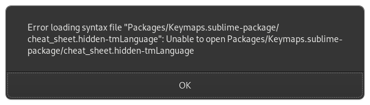

[官网](https://www.sublimetext.com/3)

## 插件：
插件的管理工具在 sublime 3 中的安装方式如下，sublime 4 可以通过 `Ctrl+Shift+P` 查找安装。

按 `ctrl + \` 或者` View > Show Console `，打开 Console 一次性输入如下代码，回车：

```
import urllib.request,os,hashlib; h = '6f4c264a24d933ce70df5dedcf1dcaee' + 'ebe013ee18cced0ef93d5f746d80ef60'; pf = 'Package Control.sublime-package'; ipp = sublime.installed_packages_path(); urllib.request.install_opener( urllib.request.build_opener( urllib.request.ProxyHandler()) ); by = urllib.request.urlopen( 'http://packagecontrol.io/' + pf.replace(' ', '%20')).read(); dh = hashlib.sha256(by).hexdigest(); print('Error validating download (got %s instead of %s), please try manual install' % (dh, h)) if dh != h else open(os.path.join( ipp, pf), 'wb' ).write(by)
```

为 Package Control 设置代理（不设置也可以正常使用，但是在安装插件及更新插件的时候可能会比较慢）

`Prefrences --> Packages Settings  --> Package Control  --> Settngs` 增添下面的代码

```
{
    // proxy setting
    "http_proxy":"http://127.0.0.1:12333",
    "https_proxy":"http://127.0.0.1:12333", 
}

```

### 安装方法：
#### 1、自动安装：
`Ctrl+Shift+P` 打开命令行模式，输入 `Package Control: Install Package`中任意几个字母，会自动模糊匹配出来），然后回车选择：`Package Control: Install Package` 。搜索插件名称即可自动安装，注意留意底部的安装进程，如果安装失败的话可以选择手动下载安装。

这种方法只能一次安装一个插件，`Package Control: Advanced Install Package` 可以一起性安装多个插件，每个插件使用`,`进行分隔，插件名不需要使用`'`、`"`包裹，名字由多个单词如`HTML-CSS-JS Prettify`中间有空格也不需要。

#### 2、手动安装
去 github 上或者你能找到的渠道下载相应的包。
如果插件是打包好的话复制到 `Installed Packages`下，是文件目录的话复制到 `Packages` 文件夹下。


#### AdvancedNewFile
[AdvancedNewFile](https://github.com/SublimeText/AdvancedNewFile)
用 Sublime text 新建文件的快捷键是，ctrl+ N会新建一个名为untitled的文件，CTRL+S 保存，然后在弹出的 Finder 中填写真正需要的文件名，然后点击 Save 。可谓很是麻烦，而且如果需要新建多层次的文件夹，则需要转换到 Finder 进入到相应的工程目录下，一层一层新建，操作步骤十分繁琐而且费事。

然而，如果用 AdvancedNewFile，一切将会变得十分简单。

ctrl+ art + N 即新建，然后 sublime text 底部会弹出一个文本输入框，只要在里面输入文件名，或多层次的路径，然后回车即可。
相应文件或多层次的路径就会立刻在工程目录下新建完成。
另外再输入的时候也支持tab补全操作。

#### All Autocomplete
[AllAutocomplete](https://github.com/alienhard/SublimeAllAutocomplete)
Sublime Text 默认的 Autocomplete 功能只考虑当前的文件，而 AllAutocomplete 插件会搜索所有打开的文件来寻找匹配的提示词。

用此插件替换自带的Autocomplete在使用jedi进行语法补全的时候会有很大的延迟，而且全局搜索反而有时候引用到包外的变量，暂时不用了。

#### BracketHighlighter
括号以及标签层级显示，不用担心选中的代码属于哪个代码块，一目了然。
[查看介绍](https://packagecontrol.io/packages/BracketHighlighter)

#### Keymaps
[Keymaps](https://github.com/MiroHibler/sublime-keymaps)
>Find a keymap for... and show all enabled keymaps in a Cheat Sheet.

很有帮助，之前安装的插件只知道一些快捷键，不能完全发挥插件的作用，而且插件增多后加上自己的快捷键设置，有时候快捷键冲突而不能使用却一直找不出原因。

sublime4 安装遇到的问题：



但是能生效而且结果准确

是使用sublime的插件管理器安装的，安装到了目录`~/.config/sublime-text/Installed\ Packages`下，而sublime对这个包的默认地址是`~/.config/sublime-text/Packages`下，但是如果在一个目录中找不到就会去另一个文件夹中寻找，所以出现了报错但仍然正常使用的情况，觉得别扭的话将其`~/.config/sublime-text/Installed\ Packages`下的`keymaps`解压移动到`~/.config/sublime-text/Packages`并删除`~/.config/sublime-text/Installed\ Packages`下的`keymaps`包即可

#### AutoFileName
文件名自动补全

`IndexError`处理，将`autofilename.py`中的代码做个简单修改即可，其实就算报错也能正常使用，但是看着挺别扭，对这个异常的意见挺多，自己又懒得去细究先这样用着吧。

```
Open autofilename.py, using PackageResourceView. Go to line 162

sel = view.sel()[0].a
txt = view.substr(sublime.Region(sel-4,sel-3))
if (self.showing_win_drives and txt == FileNameComplete.sep):
    self.showing_win_drives = False
    view.run_command('afn_delete_prefixed_slash')

替换为

try:
    sel = view.sel()[0].a
    txt = view.substr(sublime.Region(sel-4,sel-3))
    if (self.showing_win_drives and txt == FileNameComplete.sep):
        self.showing_win_drives = False
        view.run_command('afn_delete_prefixed_slash')

except IndexError:
    pass

```


#### PackageResourceViewer
对安装的插件进行预览、编辑，压缩包形式的也可以，无需自己解压修改后再压缩。


#### FindKeyConflicts
找出所有插件有冲突的快捷键

## 一些配置
```
{
    // 主题、配色相关
    "theme": "Material-Theme.sublime-theme", // 整体界面
    "color_scheme": "Packages/Material Theme/schemes/Material-Theme.tmTheme", // 配色方案
    // "sidebar_no_icon": true,
    "sidebar_size_13": true,
    "sidebar_row_padding_medium": true,
    "folder_no_icon": true,
    "tabs_small": true,
    "tabs_padding_small": true,
    "tabs_padding_medium": true,
    // "tabs_label_not_italic": true,
    "status_bar_brighter": true,
    "color_inactive_tabs": true,

    // "gutter": false, // 显示行号边栏
    // "margin": 0, // 行号边栏和文字的间距
    "line_padding_top": 2, // 行的上间距
    "line_padding_bottom": 2, // 行的下间距
    // "draw_white_space": "all", // 显示空白符
    "show_encoding": true, // 状态栏显示当前文件编码
    "always_show_minimap_viewport": true, // 右侧总是显示代码地图可视区域
    // "draw_minimap_border": true, // 显示可视区域部分的边框
    // "bold_folder_labels": true, // 左侧边栏文字加粗
    "indent_guide_options": [ "draw_normal", "draw_active" ], // 制表位的对齐线
    "remember_open_files": true, // 记忆之前打开的文件
    // "overlay_scroll_bars": "system",
    "dpi_scale": 1.0, // 高分屏必须调整此设置
    "show_full_path": true, // 标题栏显示打开文件的完整路径

    // 编辑行为
    "default_encoding": "UTF-8", // 默认编码格式
    "tab_size": 4,  // Tab键制表符宽度
    "translate_tabs_to_spaces": true, // 设为true时，缩进和遇到Tab键时使用空格替代
    "scroll_past_end": false, // 设置为false时，滚动到文本的最下方时，没有缓冲区
    // "highlight_modified_tabs": true, // 高亮内容有修改的标签
    // "find_selected_text": true, // 匹配选中的文本
    "trim_trailing_white_space_on_save": true, // 保存文件时是否删除每行结束后多余的空格
    // "ensure_newline_at_eof_on_save": false,  // 保存文件时光标是否在文件的最后向下换一行
    // "save_on_focus_lost": false, // 切换到其它文件标签或点击其它非本软件区域，文件是否自动保存
    // "auto_close_tags": true, // 自动闭合标签
    // "tab_completion": true,
    // "auto_complete": true, // 代码提示
    // "auto_complete_delay": 50, // 代码提示延迟显示
    "auto_complete_triggers": [ // 设置触发代码提醒的关键字
        {
            "selector": "text.html",
            "characters": "abcdefghijklmnopqrstuvwxyzABCDEFGHIJKLMNOPQRSTUVWXYZ.<"
        },
        {
            "selector": "text.xml",
            "characters": "abcdefghijklmnopqrstuvwxyzABCDEFGHIJKLMNOPQRSTUVWXYZ.<"
        },
        {
            "selector": "text.php",
            "characters": "abcdefghijklmnopqrstuvwxyzABCDEFGHIJKLMNOPQRSTUVWXYZ.<"
        },
        {
            "selector": "text.css",
            "characters": "abcdefghijklmnopqrstuvwxyzABCDEFGHIJKLMNOPQRSTUVWXYZ.<"
        },
        {
            "selector": "text.js",
            "characters": "abcdefghijklmnopqrstuvwxyzABCDEFGHIJKLMNOPQRSTUVWXYZ.<"
        }
    ],
    // "auto_match_enabled": true, // 自动匹配引号，括号等

    // 光标样式
    "caret_style": "smooth", // 光标闪动方式 "smooth", "phase", "blink", "wide" and "solid"
    "caret_extra_bottom": 1,
    "caret_extra_top": 1,
    "caret_extra_width": 1,

    // Word wrapping - follow PEP 8 recommendations
    // "rulers": [ 82, 92 ],
    // "wrap_width": 80, // 设置窗口内文字区域的宽度
    "word_wrap": false, // true | false | auto

    // 禁止自动更新
    "update_check": false
}
```

## 破解
## 1、
2020-6-6 日测试可用。

```
sudo vim /etc/hosts  #添加如下内容到文件里面
127.0..0.1 www.sublimetext.com
127.0.0.1 license.sublimehq.com
127.0.0.1 45.55.255.55
127.0.0.1 45.55.41.223
```

注册码：

```
  ZYNGA INC.
  50 User License
  EA7E-811825
  927BA117 84C9300F 4A0CCBC4 34A56B44
  985E4562 59F2B63B CCCFF92F 0E646B83
  0FD6487D 1507AE29 9CC4F9F5 0A6F32E3
  0343D868 C18E2CD5 27641A71 25475648
  309705B3 E468DDC4 1B766A18 7952D28C
  E627DDBA 960A2153 69A2D98A C87C0607
  45DC6049 8C04EC29 D18DFA40 442C680B
  1342224D 44D90641 33A3B9F2 46AADB8F
```
由于这个是一个Sublime Text 2的验证码，注册成功后会弹出提示说这个注册码是Sublime Text 2的，是否要升级之类的，选择取消就好了，接下来就可以正常使用了。

条件允许的情况下还是建议购买官方注册码。

## 2、
上面的方法在linux的时候可用，但是在 win 的时候不成功，找了另一个方法
### 改hosts：
加上下面这段代码：

```
127.0.0.1    www.sublimetext.com
127.0.0.1    sublimetext.com
127.0.0.1    sublimehq.com
127.0.0.1    license.sublimehq.com
127.0.0.1    45.55.255.55
127.0.0.1    45.55.41.223
0.0.0.0     license.sublimehq.com
```
### 输入注册码：
一定要改一下hosts在输入注册码，否则可能失败。Help->enter license,复制粘贴下列全部粘贴至打开的对话框。

```
----- BEGIN LICENSE -----
Member J2TeaM
Single User License
EA7E-1011316
D7DA350E 1B8B0760 972F8B60 F3E64036
B9B4E234 F356F38F 0AD1E3B7 0E9C5FAD
FA0A2ABE 25F65BD8 D51458E5 3923CE80
87428428 79079A01 AA69F319 A1AF29A4
A684C2DC 0B1583D4 19CBD290 217618CD
5653E0A0 BACE3948 BB2EE45E 422D2C87
DD9AF44B 99C49590 D2DBDEE1 75860FD2
8C8BB2AD B2ECE5A4 EFC08AF2 25A9B864
------ END LICENSE ------
```
接下来应该是显示激活成功，激活成功后可将之前hosts文件添加内容删掉

## 快捷键：
### 默认快捷键
```
Ctrl+Shift+P：打开命令面板
Ctrl+P：搜索项目中的文件
Ctrl+G：跳转到第几行
Ctrl+W：关闭当前打开文件
Ctrl+Shift+W：关闭所有打开文件
Ctrl+Shift+V：粘贴并格式化
Ctrl+D：选择单词，重复可增加选择下一个相同的单词
Ctrl+L：选择行，重复可依次增加选择下一行
Ctrl+Shift+L：选择多行
Ctrl+Shift+Enter：在当前行前插入新行
Ctrl+X：删除当前行
Ctrl+M：跳转到对应括号
Ctrl+U：软撤销，撤销光标位置
Ctrl+J：选择标签内容
Ctrl+F：查找内容
Ctrl+Shift+F：查找并替换
Ctrl+H：替换
Ctrl+R：前往 method
Ctrl+N：新建窗口
Ctrl+K+B：开关侧栏
Ctrl+Shift+M：选中当前括号内容，重复可选着括号本身
Ctrl+F2：设置/删除标记
Ctrl+/：注释当前行
Ctrl+Shift+/：当前位置插入注释
Ctrl+Alt+/：块注释，并Focus到首行，写注释说明用的
Ctrl+Shift+A：选择当前标签前后，修改标签用的
F11：全屏
Shift+F11：全屏免打扰模式，只编辑当前文件
Alt+F3：选择所有相同的词
Alt+.：闭合标签
Alt+Shift+数字：分屏显示
Alt+数字：切换打开第N个文件
Shift+右键拖动：光标多不，用来更改或插入列内容
鼠标的前进后退键可切换Tab文件
按Ctrl，依次点击或选取，可需要编辑的多个位置
按Ctrl+Shift+上下键，可替换行
```

### 便携版本
安装的时候选择一个比较容易找到的位置，默认的也可以，不过得去找到安装的位置，安装好之后先不要打开，在 Sublime Text 3 文件夹下新建一个  Data (注意大小写) 文件夹并删除原来的的 Sublime Text 3 配置文件夹，这时候启动安装插件就会在Data目录中了，也可以直接复制自己的配置文件到Data目录中，这个文件夹就可以复制进 u 盘随身带着了，但是依赖的 python、node、go 等需要在新设备上进行安装并修改相应 sublime 配置

## 问题
### 连续的输入`gh`或者`gd`会快速显示h、d后消失。
原因是godef定义的快捷键冲突了，更改快捷键或者慢速输入即可。

### path 问题
sublime 默认使用的是`bash`, 默认 path 路径为
```
/usr/local/bin
/usr/local/sbin
/usr/bin
/usr/sbin
```

自己安装的一些软件不在默认 path 中，

这时要么在`.bash_profile`中添加环境变量，但是设置后要重启系统才生效。

要么创建其软链接在`/usr/local/bin`中，创建软链接的位置非强制但建议，这样在删除软件时更方便也不会和其他的系统软件混淆。

