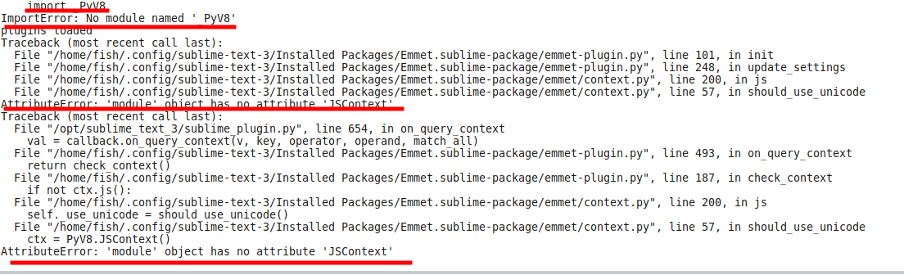
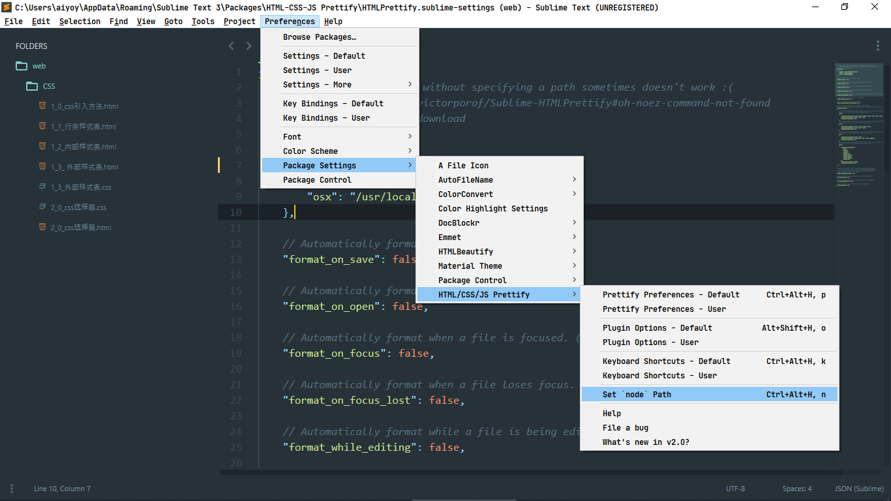

#### emmet：
前端神器。一个可以极大提高 web 开发者 HTML 和 CSS 工作效率的工具箱组件。
[查看介绍](https://packagecontrol.io/packages/Emmet)

问题：
如下报错：


 因为下载下来的 PyV8 的包是一个文件夹，按照正常情况是放在 packages 下的，但是安装之后一直无法使用，以为是快捷键冲突，又是改快捷键、又是删除其余的包、又是重装、又是更换不同版本的 PyV8 的包的都没有解决，然后想着是不是包管理器给安装错误了，调出命令面板想重装一下，然后留意到加载emmet包然后加载 PyV8 插件的时候是报错，也就是包未加载成功。


最后终于找到解决方法：PyV8 包的位置应该是在与 emmet 包同级目录下。也就是` .config/sublime-text-3/Installed Packages/`下，而不是`Reference－－Browser Packages`指定的`.config/sublime-text-3/Packages/`下。

解决方法：
	去提示的网址：https://github.com/emmetio/pyv8-binaries 下载相应的包，解压到里面的文件 `/home/fish/.config/sublime-text-3/Packages/PyV8`下，没有PyV8文件夹就创建一个（比如我的 `pyv8-linux64-p3`，或者我在测试的时候发现把里面的文件复制到 PyV8 里面也是可以的，但直接复制比较方便快捷，也易于下次区分是什么系统的文件），然后重启解决。

做完这些后不会弹窗报错了，但是启动的时候地下的任务栏都会提示加载 PyV8,调出命令板也是每次都会有提示，但那不是错误，而是其默认会在启动时检查并更新 PyV8，阻止PyV8 的更新设置方法是：Preferences->Packages Settings-->Emmet-->Settings User，修改 Emmet 的配置文件即可，内容是：
```
{"disable_pyv8_update":true}
```

使用方法：
https://docs.emmet.io/cheat-sheet/
https://code.z01.com/Emmet/

#### ColorHighLight
[ColorHighLight](https://github.com/Kronuz/ColorHighlight)
可以展示你所选择的颜色代码（
像 ('FFFFFF', 'rgb(255,255,255)', 'white') 的真正颜色。同时它还包含一个颜色选择器让你可以方便地更改颜色。

#### HTML-CSS-JS Prettify
报错:

安装后需要配合nodejs使用所以需要安装nodejs并设置node的位置


改快捷键：
```
{
"keys": ["ctrl+shift+o"],
"command": "htmlprettify"
}
```

为了正常使用建议更改后测试一下是否有效，防止与其他的互相冲突


#### CSS3：
CSS3语法高亮、CSS语法提示，美中不足的是缺少游览器私有属性高亮。
[查看介绍](https://packagecontrol.io/packages/CSS3)

#### CSS Extended Completions：
关联CSS文件，智能提示css文件中的类名，非常好用。
[查看介绍](https://packagecontrol.io/packages/CSS Extended Completions)

#### JavaScript Completions
支持javascript原生语法提示，妈妈再也不用担心我输入document.getElementById(id)。
[查看介绍](https://packagecontrol.io/packages/JavaScript Completions)

#### jQuery
为jQuery的大部分方法提供了示例代码段，让jQuery的API更加容易使用。
[查看介绍](https://packagecontrol.io/packages/jQuery)