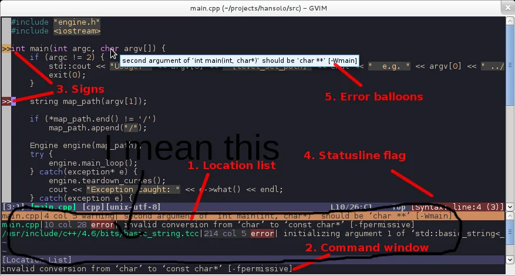

### 插件地址：

[dense-analysis/ale](https://github.com/dense-analysis/ale)

### 简单介绍

代码检查插件，如 python 的 flake8、pycodestyle 等，但是需要注意的是，如果和下面的插件一起用的话，会出现两个结果，且两个结果相同，因为`rhysd/vim-lsp-ale`是调用了 `ale` 的，但是自己又输出了一份，要么想办法解决双结果的问题，要么直接禁用`vim-lsp-ale`，差别个人感觉是 `vim-lsp-ale` 的结果是 `ale` 加配置后的结果，可读性更好，但是 `ale` 可以也可以实现，所以有点困惑这个插件的初衷是什么。

支持多种语言的多种工具，同种语言的多种语言联合增强使用也是可以的

可以指定要使用的 linter，以及 linter 在设备上的地址，就可以不用配置环境变量了

支持多种 fixer，格式化插件，引入的模块调整，去除空行，行尾空格等，这样就是不用新增插件 `vim-autoformat`、`vim-trailing-whitespace`。

目前看到还支持补全和很多 lsp 的功能，是否替换掉`vim-lsp`有空再仔细对比看看。

通过打开文件后使用 `ALEInfo` 查看该文件类型可以使用的 linter，开启的 linter 等配置信息。但是一个方法比较麻烦如果是想要配置多种文件，官方文案中把 linter 和 fixer 一起写了，虽有说明，但是难免混淆，而且 fixer 中有特有的功能，这里指明下自己找到的捷径。linter 去 `ale/tree/ale_linters` 目录中查找，其中的子文件夹比如 python ，go 是按照语言命令的，里面的文件是各个 linter 的调用脚本，其名字也是 linter 名，而 fixer 的在 `ale/autoload/ale/fix/registry.vim` 文件中，搜索 `suggested_filetypes`，后面的列表里就是适用的文件类型即支持的语言，有的工具是支持多种语言的，这样配置时减少安装次数也更方便。

### 功能介绍
在此之前先看个图

如图中所视按照功能划分为 5 个板块：
    
    1. location list
    2. command window
    3. signs
    4. statusline
    5. balloon

1. float window
    从图中可以看到，当屏幕长度不够，后续的显示就变成了 `...`, 使得无法了解到详细的异常信息，而如果在 command line 中查看，有多个异常结果，但是只显示一个，显然也是不对的。
    回去看了下好像是很早之前就有这个实现了，但是一直没发现，视频不多而且都没有这个效果，最先了解到还是在 nvim 中发现这样的实现，以为是 nvim 独有的。之前 ale 好像默认是不开启的，因为查资料看到有人问自己的配置为什么不能实现那样的效果，自己也是早早就安装了 ale，这次是新换了系统，对配置未修改只是更新了一下插件，打开就默认有这种效果了。
2. location list
    在命令行中执行`ALEPopulateLocList` 即可开启 location list，里面有所有的检查结果，而且无论是异常信息过长还是一行多个异常结果，都有详细的信息，而且是一行一条信息。
    虽然文档说可以通过设置`let g:ale_set_loclist = 0`实现自动开启，但我这样去试了并没有成功。
3. signs
    简单的标志提示，只能直到该行的最高级别的异常类型，是错误还是不符合规范等。
    默认开启，但是图标的样子可更换，下面的参数可设置
    `let g:ale_sign_error = '>>'`
    `let g:ale_sign_warning = '--'`
4. statusline
    这个看具体的插件，如果使用的是`airline`，会分别给出异常、错误的起始行。
    如果是使用`airline`，需要开启其服务`let g:airline#extensions#ale#enabled = 1`
5. balloon
    以一个气球弹窗的形式去显示异常，但也只显示一个。
6. 默认关闭，`let g:ale_set_balloons = 1`开启

Todo
图片需要换成自己的图片，内容也还没有写完全
